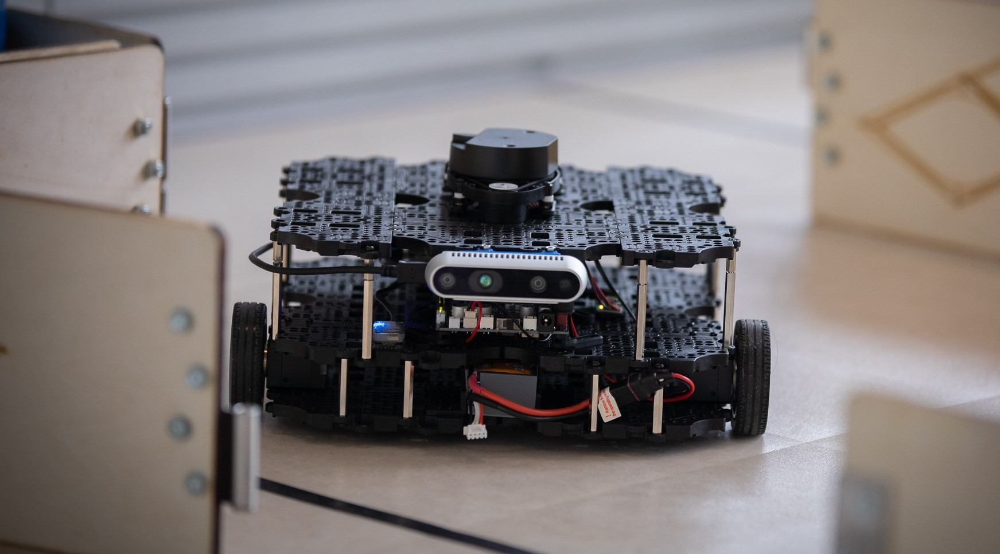

---
hide:
  - toc 
  - navigation
---

# ROS2 Labs

*Practical Robotics Courses at the University of Sheffield with ROS2 and the TurtleBot3 Waffle.* 

{width=1000} 

By Tom Howard  
Department of Multidisciplinary Engineering Education  

*(Image courtesy of [Andy Brown](https://www.andybrownphoto.co.uk/))*

[Find out more...](about.md)

