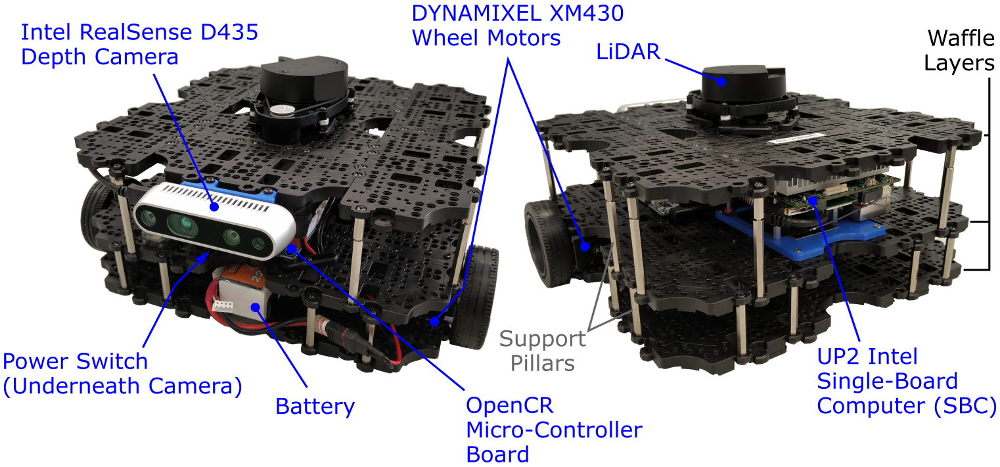

## The TurtleBot3 Waffle

### Turtlebot what?!

To teach ROS here we use the [TurtleBot3 Waffle](https://emanual.robotis.com/docs/en/platform/turtlebot3/overview/) robot, made by Robotis. This is the 3rd Generation Robot in the [TurtleBot family](http://wiki.ros.org/Robots/TurtleBot) (which has been the reference hardware platform for ROS since 2010). The TurtleBot Robot family exists to provide accessible and relatively low-cost hardware and open-source software on a robot platform, to encourage people to learn robotics and ROS and make it as easy as possible to do so.

### The (Free) TurtleBot3 eBook {#ebook}

The TurtleBot3 Waffle developers (Robotis) have written a book on programming robots with ROS. This is available as a *free eBook*, which you can [download here](https://www.pishrobot.com/wp-content/uploads/2021/05/ros-robot-programming-book-by-turtlebo3-developers-en.pdf), and we recommend that you do so! This is a great resource which provides a detailed introduction to what ROS is and how it works, as well as a comprehensive "Beginners Guide" to ROS programming. The other great thing about this is that it is tailored to the TurtleBot3 Robot specifically, providing examples of how to use a range of TurtleBot3 packages along with a detailed description of how they work.

We recommend that you have a look at this book to learn more about the concepts that you are exploring in this course.

### Our Waffles {#tb3}

Here in the Diamond we have a total of 50 *customised* TurtleBot3 Waffles specifically for teaching this course:

<figure markdown>
  {width=500px} 
</figure>

Whether we're working in simulation or with the real thing, the ROS applications that we develop as part of the course are directly transferable between the two (mostly!) 

The robots that we have are slightly different to the standard *TurtleBot3 WafflePi* that you can buy from Robotis. We've made a few adjustments, and the full specifications are as follows:

<figure markdown>
  {width=800px}
</figure>

The robots have the following core hardware elements:

* An OpenCR Micro-Controller Board to power and control the wheel motors, distribute power to other hardware elements and provide an interface for additional sensors.
* An [UP Squared Single-Board Computer (SBC)](https://up-board.org/upsquared/specifications/) with an Intel Processor and 32GB of on-board eMMC storage. This board acts as the "brain" of the robot.
* Independent left and right wheel motors (DYNAMIXEL XM430’s) to drive the robot using a *differential drive* configuration.

This drive configuration allows the robots to move with the following **maximum velocities**: 

| Velocity Component | Upper Limit | Units |
| :--- | :---: | :--- |
| *Linear* | 0.26 | m/s |
| *Angular* | 1.82 | rad/s |

In addition to this, the robots are equipped with the following sensors:

* A Light Detection and Ranging (or *LiDAR*) sensor, which spins continuously when the robot is in operation. This uses light in the form of laser pulses to allow the robot to measure the distance to surrounding objects, providing it with a 360&deg; view of its environment.
* An [Intel RealSense D435 Camera](https://www.intelrealsense.com/depth-camera-d435/) with left and right imaging sensors, allowing depth sensing as well as standard image capture.
* A 9-Axis Inertial Measurement Unit (or *IMU*) on-board the OpenCR Micro Controller board, which uses an accelerometer, gyroscope and magnetometer to measure the robot's specific force, acceleration and orientation. 
* Encoders in each of the DYNAMIXEL wheel motors, allowing measurement of speed and rotation count for each of the wheels.

### ROS Version

Our robots run on the most up-to-date version of ROS1: [ROS Noetic Ninjemys](http://wiki.ros.org/noetic) (or *"ROS Noetic"* for short). Our courses here are therefore based around this version of ROS. ROS1 is best installed on [the Ubuntu Operating System](https://ubuntu.com/) for stability, reliability and ease, and ROS *Noetic* runs on [Ubuntu 20.04 (Focal Fossa)](https://wiki.ubuntu.com/FocalFossa/ReleaseNotes).

## Other Tech in the Diamond

### Laptops

In the Diamond, we have dedicated Robot Laptops running the same OS & ROS version as above (Ubuntu 20.04 and ROS Noetic). We use these when working with the robots in the lab. [See here for more details](../waffles/intro.md#laptops). 

### Simulation Environment

To deliver the simulation-based parts of this course, we've created a custom simulation environment using the [Windows Subsystem for Linux (WSL)](https://docs.microsoft.com/en-us/windows/wsl/). This has been developed primarily to run on University of Sheffield Managed Desktop Computers, which run Windows 10, but it's also possible to run this on other machines too. We call this simulation environment *"WSL-ROS"*. [See here for more details](../software/wsl-ros/README.md).
