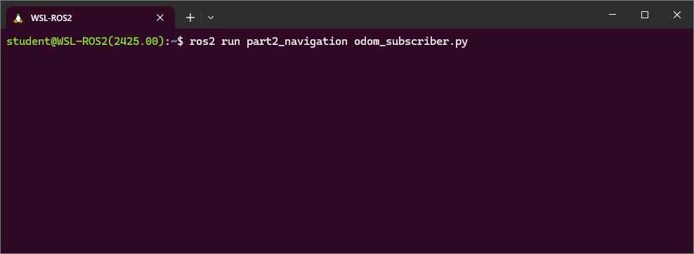

---  
title: "Part 2: Odometry & Navigation"  
description: Learn about Odometry, which informs us of a robot's position and orientation in an environment. Apply both open and closed-loop velocity control methods to a Waffle. 
---

## Introduction

:material-pen: **Exercises**: 6  
:material-timer: **Estimated Completion Time**: 3 hours  
:material-gauge: **Difficulty Level**: Intermediate  

### Aims

In Part 2 you will learn how to control a ROS robot's **position** and **velocity** from both the command line and through ROS Nodes. You will also learn how to interpret the data that allows us to monitor a robot's position in its physical environment (odometry).  The things you will learn here form the basis for all robot navigation in ROS, from simple open-loop methods to more advanced closed-loop control (both of which you will explore).

### Intended Learning Outcomes

By the end of this session you will be able to:

1. Interpret the Odometry data published by a ROS Robot and identify the parts of these messages that are relevant to a 2-wheeled differential drive robot (such as the TurtleBot3).
1. Develop Python nodes to obtain Odometry messages from an active ROS network and *translate* them to provide useful information about a robot's *pose* in a convenient, human-readable way.
1. Implement *open-loop velocity control* of a robot using ROS command-line tools.
1. Develop Python nodes that use open-loop velocity control methods to make a robot follow a pre-defined motion path.
1. Combine both publisher *&* subscriber communication methods into a single Python node to implement closed-loop (odometry-based) velocity control of a robot.
1. Explain the limitations of Odometry-based motion control methods. 

### Quick Links

#### Exercises

* [Exercise 1: Exploring Odometry Data](#ex1)
* [Exercise 2: Creating a Python Node to Process Odometry Data](#ex2)
* [Exercise 3: Controlling Velocity with the ROS2 CLI](#ex3)
* [Exercise 4: Creating a Python Node to Make a Robot Move in a circle](#ex4)
* [Exercise 5: Implementing a Shutdown Procedure](#ex5)
* [Exercise 6: Making our Robot Follow a Square Motion Path](#ex6)

#### Additional Resources

* [An Odometry Subscriber Node](./part2/odom_subscriber.md)
* [A Simple Velocity Control Node (Move Circle)](./part2/move_circle.md)
* [Odometry-based Navigation (Move Square)](./part2/move_square.md)

## Getting Started

**Step 1: Launch your ROS Environment**

If you haven't done so already, launch your ROS environment now:

1. **WSL-ROS2 on a university managed desktop**: follow [the instructions here to launch it](../../ros/using-wsl-ros/man-win.md).
1. **[Running WSL-ROS2 on your own machine](../../ros/wsl-ros/install.md)**: launch the Windows Terminal to access a WSL-ROS2 terminal instance.
1. **Other Users**: follow [the relevant instructions](../../ros/other-options/README.md).

You should now have access to ROS via a Linux terminal instance. We'll refer to this terminal instance as **TERMINAL 1**.

**Step 2: Restore your work (WSL-ROS Managed Desktop Users ONLY)**

Remember that [any work that you do within the WSL-ROS2 Environment will not be preserved between sessions or across different University computers](../../ros/using-wsl-ros/man-win.md#backing-up-and-restoring-your-data). At [the end of Part 1](./part1.md#backup) you should have run the `wsl_ros` tool to back up your home directory to your University `U:\` Drive. Once WSL-ROS2 is up and running, you should be prompted to restore this:

``` { .txt .no-copy }
It looks like you already have a backup from a previous session:
  U:\wsl-ros\ros2-backup-XXX.tar.gz
Do you want to restore this now? [y/n]
```

Enter ++y+enter++ to restore your work from last time. You can also restore your work at any time using the following command:

```bash
wsl_ros restore
```

**Step 3: Launch VS Code** 

It's also worth launching VS Code now, so that it's ready to go for when you need it later on. 

??? warning "WSL Users..."
        
    It's important to launch VS Code within your WSL environment using the "WSL" extension. Always remember to check for this:

    <figure markdown>
      {width=400px}
    </figure>

**Step 4: Make Sure The Course Repo is Up-To-Date**

<a name="course-repo"></a>

In Part 1 you should have [downloaded and installed The Course Repo](./part1.md#course-repo) into your ROS environment. If you haven't done this yet then go back and do it now. If you *have* already done it, then it's worth just making sure it's all up-to-date, so run the following command now to do so:

***
**TERMINAL 1:**
```bash
cd ~/ros2_ws/src/tuos_ros/ && git pull
```

Then build with Colcon: 

```bash
cd ~/ros2_ws/ && colcon build --packages-up-to tuos_ros
```

And finally, re-source your environment:

```bash
source ~/.bashrc
```
***

!!! warning
    If you have any other terminal instances open, then you'll need run `source ~/.bashrc` in these too, in order for any changes made by the Colcon build process to propagate through to these as well.

**Step 5: Launch a Waffle Simulation**

In **TERMINAL 1** enter the following command to launch a simulation of a TurtleBot3 Waffle in an empty world:  
        
***
**TERMINAL 1:**
```bash
ros2 launch turtlebot3_gazebo empty_world.launch.py
```
***

A Gazebo simulation window should open and within this you should see a TurtleBot3 Waffle in empty space:

<figure markdown>
  {width=700px}
</figure>

## Velocity (Motion) {#velocity}

In Part 1 we learnt about ROS Topics, and about how the `teleop_keyboard` node could be used to publish messages to a particular topic in order to control the velocity of the robot (and thus change its *position*).

!!! question "Questions"
    1. Which *topic* is used to control the velocity of the robot?
    1. What *interface* does this topic use?

    [Return here if you need a reminder on how to find the answers to these questions](./part1.md#ex3).

We also learnt how to find out more about this particular interface (using the `ros2 interface show` command): 

``` { .txt .no-copy }
Vector3  linear
        float64 x
        float64 y
        float64 z
Vector3  angular
        float64 x
        float64 y
        float64 z
```

### Velocity Commands

When defining velocity commands for a ROS robot, there are **six** *"fields"* that we can assign values to: **two** velocity *types*, each with **three** velocity *components*: 

<center>

| Velocity Type | Component 1 | Component 2 | Component 3 |
| :--- | :---: | :---: | :---: |
| `linear` | `x` | `y` | `z` |
| `angular` | `x` | `y` | `z` |

</center>

These relate to a robot's **six degrees of freedom**, and the topic messages are therefore formatted to give a ROS Programmer the ability to *ask* a robot to move in any one of its six DOFs. 

<center>

| Component (Axis) | Linear Velocity | Angular Velocity | 
| :---: | :---: | :---: |
| **X** | "Forwards/Backwards" | "Roll" |
| **Y** | "Left/Right" | "Pitch" |
| **Z** | "Up/Down" | "Yaw" |

</center>

### The Degrees of Freedom of a Waffle

The three "axes" in the table above are termed the *"Principal Axes."* In the context of our TurtleBot3 Waffle, these axes and the motion about them are defined as follows:

<a name="principal-axes"></a>

<figure markdown>
  {width=800}
</figure>

As discussed above, a mobile robot can have up to six degrees of freedom *in total*, but this depends upon the robot's design and the actuators it is equipped with. 

Our TurtleBot3 Waffles only have two motors. These two motors can be controlled independently (in what is known as a *"differential drive"* configuration), which ultimately provides it with a total of **two degrees of freedom** overall, as illustrated below.

<figure markdown>
  {width=800}
</figure>

When issuing Velocity Commands therefore, only two (of the six) velocity command fields are applicable: **linear** velocity in the **x**-axis (*Forwards/Backwards*) and **angular** velocity about the **z**-axis (*Yaw*).

<center>

| Principal Axis | Linear Velocity | Angular Velocity | 
| :---: | :---: | :---: |
| **X** | **"Forwards/Backwards"** | ~~"Roll"~~ |
| **Y** | ~~"Left/Right"~~ | ~~"Pitch"~~ |
| **Z** | ~~"Up/Down"~~ | **"Yaw"** |

</center>

<a name="velocity_limits"></a>

!!! note "Maximum Velocity Limits"
    Keep in mind (while we're on the subject of velocity) that our TurtleBot3 Waffles have **maximum velocity limits**:

    <center>

    | Velocity Component | Upper Limit | Units |
    | :--- | :---: | :--- |
    | *Linear (X)* | 0.26 | m/s |
    | *Angular (Z)* | 1.82 | rad/s |

    </center>

## Odometry (Position) {#odometry}

### Odometry In Action

Let's take another look at *all* the topics that can be used to communicate with our robot:

```bash
ros2 topic list
```

Another topic of interest here is `/odom`. This topic contains *Odometry data*, which is also essential for robot navigation, giving us an approximation of a robot's location in its environment.

Let's explore this further now, using `rqt`.

#### :material-pen: Exercise 1: Exploring Odometry Data {#ex1}

1. In **TERMINAL 2** launch `rqt`:

    ***
    **TERMINAL 2:**
    ```bash
    rqt
    ```
    ***

1. From the top menu select `Plugins` > `Topics` > `Topic Monitor`

    *Topic Monitor* should then present you with a list of active topics which matches the topic list from the `ros2 topic list` command that you ran earlier.

1. Check the box next to `/odom` and click the arrow next to it to expand the topic and reveal four *base fields*.

1. Expand the `pose` > `pose` > **`position`** and **`orientation`** fields to reveal the data being published to the *three* position and *four* orientation values of this message.

1. Also expand the `twist` > `twist`, **`linear`** and **`angular`** fields to reveal the *six* values being published here too.

    <figure markdown>
      {width=600}
    </figure>

1. Next, launch a new terminal instance, we'll call this one **TERMINAL 3**. Arrange this next to the `rqt` window, so that you can see them both simultaneously.

1. In **TERMINAL 3** launch the `teleop_keyboard` node [as you did in Part 1](./part1.md#teleop): <a name="teleop"></a>

    ***
    **TERMINAL 3:**
    ```bash
    ros2 run turtlebot3_teleop teleop_keyboard
    ```
    ***

1. Enter ++a++ a couple of times to make the robot rotate on the spot. Observe how the odometry data changes in Topic Monitor.

    !!! question "Questions"
        1. Which `pose` fields are changing?
        1. Is there anything in the `twist` part of the message that corresponds to the *angular* velocity that is being published by the `teleop_keyboard` node in **TERMINAL 3**? 

1. Now press the ++s++ key to halt the robot, then press ++w++ a couple of times to make the robot drive forwards.

    !!! question "Questions"
        1. Which `pose` fields are changing *now*? How does this relate to the position of the robot in the simulated world?
        1. How does the `twist` part of the message now correspond with the *linear* velocity setting in **TERMINAL 3**?

1. Now press ++d++ a couple of times and your robot should start to move in a circle.

    !!! question "Questions"
        1. What linear and angular velocities are you requesting in **TERMINAL 3**, and how are these represented in the `twist` part of the `/odom` message?
        1. What about the `pose` part of the message? How is this data changing as your robot moves in a circular path.
        1. **What are `twist` and `pose` actually telling us?**
    
1. Press ++s++ in **TERMINAL 3** to stop the robot (but leave the `teleop_keyboard` node running).  Then, press ++ctrl+c++ in **TERMINAL 2** to close down `rqt`. 

1. Let's look at the Odometry data differently now. With the robot stationary, use `ros2 run` to run a Python node from the `tuos_examples` package: 

    ***
    **TERMINAL 2:**
    ```bash
    ros2 run tuos_examples robot_pose.py
    ```
    ***
        
1. Now (using the `teleop_keyboard` node in **TERMINAL 3**) drive your robot around again, keeping an eye on the outputs that are being printed by the `robot_pose.py` node in **TERMINAL 2** as you do so.

    The output of the `robot_pose.py` node shows you how the robot's *position* and *orientation* (i.e. *"pose"*) are changing in real-time as you move the robot around. The `"initial"` column tells us the robot's pose when the node was first launched, and the `"current"` column show us what its pose currently is. The `"delta"` column then shows the difference between the two.
    
    !!! question
        Which pose parameters *haven't* changed, and is this what you would expect (considering [the robot's principal axes, as illustrated above](#principal-axes))?
    
1. Press ++ctrl+c++ in **TERMINAL 2** and **TERMINAL 3**, to stop the `robot_pose.py` and `teleop_keyboard` nodes. 

### Odometry: Explained

Hopefully you have a good idea of what Odometry is now, but let's dig a little deeper using some key ROS command line tools again:

***
**TERMINAL 2:**
```bash
ros2 topic info /odom
```
***

This provides information about the interface used by this topic:

``` { .txt .no-copy }
Type: nav_msgs/msg/Odometry
```

We can find out more about this interface using the `ros2 interface show` command:

***
**TERMINAL 2:**
```bash
ros2 interface show nav_msgs/msg/Odometry
```
***

Look down the far left-hand side to identify the four *base fields* of the interface (i.e. the fields that are not indented):

<a name="odom-base-fields"></a>

<center>

| # | Field *Name* | Field *Type* |
| :---: | :---: | :---: |
| 1 | `header` | `std_msgs/Header` |
| 2 | `child_frame_id` | `string` |
| **3** | **`pose`** | **`geometry_msgs/PoseWithCovariance`** |
| **4** | **`twist`** | **`geometry_msgs/TwistWithCovariance`** |

</center>

We saw all these in `rqt` earlier. As before, its items 3 and 4 that are of most interest to us...

#### Pose

``` { .txt .no-copy }
# Estimated pose that is typically relative to a fixed world frame.
geometry_msgs/PoseWithCovariance pose
        Pose pose
                Point position
                        float64 x
                        float64 y
                        float64 z
                Quaternion orientation
                        float64 x
                        float64 y
                        float64 z
                        float64 w
        float64[36] covariance
```

As you can see above, there are two key components to Pose:

1. `position`: Tells us where our robot is located in 3-dimensional space. This is expressed in units of **meters**.
1. `orientation`: Tells us which way our robot is pointing in its environment. This is expressed in units of **Quaternions**, which is a mathematically convenient way to store data related to a robot's orientation (it's a bit hard for us humans to understand and visualise this though, so we'll talk about how to convert it to a different format later).

Pose is defined relative to an arbitrary reference point (typically where the robot was when it was turned on), and is determined from:

* Data from the Inertial Measurement Unit (IMU) on the OpenCR board
* Data from both the left and right wheel encoders
* A *kinematic model* of the robot

All the above information can then be used to calculate (and keep track of) the distance travelled by the robot from its pre-defined reference point using a process called *"dead-reckoning."*

#### What are Quaternions?

Quaternions use **four values** to represent the orientation of something in 3 dimensional space[^quaternions], as we can observe from the structure of the `nav_msgs/msg/Odometry` ROS interface:

[^quaternions]: [Quaternions are explained very nicely here](https://automaticaddison.com/how-to-convert-a-quaternion-to-a-rotation-matrix/#What_is_a_Quaternion){target="_blank"}, if you'd like to learn more.

``` { .txt .no-copy }
Quaternion orientation
        float64 x
        float64 y
        float64 z
        float64 w
```

For us, it's easier to think about the orientation of our robot in a *"Euler Angle"* representation, which tell us the degree of rotation about the *three principal axes* ([as discussed above](#principal-axes)):

* $\theta_{x}$, aka: **"Roll"**
* $\theta_{y}$, aka: **"Pitch"**
* $\theta_{z}$, aka: **"Yaw"**

Fortunately, the maths involved in converting between these two orientation formats is fairly straight forward ([see here](https://automaticaddison.com/how-to-convert-a-quaternion-into-euler-angles-in-python/){target="_blank"}).

Recall from above however, that our TurtleBot3 can only move in a 2D plane (unfortunately, it can't fly!) and so, actually, its pose can be fully represented by just 3 terms: 

* $x$ & $y$: the 2D coordinates of the robot in the `X-Y` plane
* $\theta_{z}$: the angle of the robot about the `z` (*yaw*) axis

#### Twist

The fourth *base field* within the `nav_msgs/msg/Odometry` interface is **Twist**:

``` { .txt .no-copy }
# Estimated linear and angular velocity relative to child_frame_id.
geometry_msgs/TwistWithCovariance twist
        Twist twist
                Vector3  linear
                        float64 x
                        float64 y
                        float64 z
                Vector3  angular
                        float64 x
                        float64 y
                        float64 z
        float64[36] covariance
```

This might look familiar from [earlier](#velocity)! This tells us the current linear and angular velocities of the robot. These velocities are *set* by messages published to `/cmd_vel`, but are then *monitored* by data coming directly from the robot's wheel encoders, and are provided here as a *feedback signal*.

### Odometry Data as a Feedback Signal

Odometry data can be really useful for robot navigation, allowing us to keep track of where a robot is, how it's moving and how to get back to where we started. We therefore need to know how to use odometry data effectively within our Python nodes, and we'll explore this now.

#### :material-pen: Exercise 2: Creating a Python Node to Process Odometry Data {#ex2}

In Part 1 we learnt how to create a package and build simple Python nodes to publish and subscribe to messages on a topic (called `/my_topic`). In this exercise we'll build a new subscriber node, much like we did previously, but this one will subscribe to the `/odom` topic that we've been talking about above. We'll also create a new package called `part2_navigation` for this node to live in!

1. First, head to the `src` folder of your ROS2 workspace in your terminal and into the `tuos_ros` Course Repo:

    ```bash
    cd ~/ros2_ws/src/tuos_ros/
    ```

1. Then, use the `create_pkg.sh` helper script to create your new package:

    ```bash
    ./create_pkg.sh part2_navigation
    ```

1. Then navigate into the `scripts` folder of the new package using the `cd` command again:

    ```bash
    cd ../part2_navigation/scripts/
    ```

1. The subscriber that we will build here will be structured in much the same way as the subscriber that we built in Part 1. 
    
    As a starting point, copy across the `subscriber.py` file from your `part1_pubsub` package:

    ```bash
    cp ~/ros2_ws/src/part1_pubsub/scripts/subscriber.py ./odom_subscriber.py
    ```

1. Next, follow **[the steps for converting this into an Odometry subscriber](./part2/odom_subscriber.md)**. <a name="odom_sub_ret"></a>

1. You'll need to add a new dependency to your package's `package.xml` file now. Below the `#!xml <exec_depend>rclpy</exec_depend>` line, add an execution dependency for `nav_msgs`:

    ```xml title="package.xml"
    <exec_depend>rclpy</exec_depend>
    <exec_depend>nav_msgs</exec_depend>
    ```

1. Next, declare the `odom_subscriber.py` node as an executable. Replace `minimal_node.py` with `odom_subscriber.py` in the `CMakeLists.txt`:

    ```txt title="CMakeLists.txt"
    # Install Python executables
    install(PROGRAMS
      scripts/odom_subscriber.py
      DESTINATION lib/${PROJECT_NAME}
    )
    ```

1. Head back to the terminal and use Colcon to build the package again (which now contains the new `odom_subscriber.py` node):

    ```bash
    cd ~/ros2_ws/ && colcon build --packages-select part2_navigation --symlink-install
    ```

1. And then, finally, don't forget to re-source:

    ```bash
    source ~/.bashrc
    ```

1. Now we're ready to run this! Do so using `ros2 run` and see what it does:

    ```bash
    ros2 run part2_navigation odom_subscriber.py
    ```

1. Having followed all the steps, the output from your node should be similar to that shown below:
    
    <figure markdown>
      {width=700px}
    </figure>

1. Observe how the output (the formatted odometry data) changes whilst you move the robot around using the `teleop_keyboard` node in a new terminal instance (**TERMINAL 3**).
1. Stop your `odom_subscriber.py` node in **TERMINAL 2** and the `teleop_keyboard` node in **TERMINAL 3** by entering ++ctrl+c++ in each of the terminals.

## Basic Navigation: Open-loop Velocity Control

#### :material-pen: Exercise 3: Controlling Velocity with the ROS2 CLI {#ex3}

!!! warning
    Make sure that you've stopped the `teleop_keyboard` node before starting this exercise!

<a name="rostopic_pub"></a>We can use the `ros2 topic pub` command to *publish* data to a topic from a terminal by using the command in the following way:

``` { .bash .no-copy }
ros2 topic pub {topic_name} {message_type} {message_data}
```

[As we discovered earlier](#velocity-commands), the `/cmd_vel` topic is expecting messages containing *linear* and *angular* velocity data, each with an `x`, `y` and `z` component. When publishing topic messages in a terminal the commands can get quite long and complicated, but we can use *autocomplete* functionality to help us format the full command correctly.

1. In **TERMINAL 3** *type* the following, using the ++tab++ key where indicated to invoke autocompletion...

    1. First, type the text as shown below and then press the ++tab++ key where indicated to complete the *topic name* for you:

        ``` { .txt .no-copy }
        ros2 topic pub /cmd_[TAB]
        ```

    1. Then, type **`g`** and then press ++tab++ again to format the rest of the *message type* for you: 

        ``` { .txt .no-copy }
        ros2 topic pub /cmd_vel g[TAB]
        ```

    1. The message data then needs to be entered inside quotation marks, type **`"l`** and then press ++tab++ again to obtain the format of the *message data*:

        ``` { .txt .no-copy }
        ros2 topic pub /cmd_vel geometry_msgs/msg/Twist "l[TAB]
        ```

        The full command will then be presented:

        ```txt
        ros2 topic pub /cmd_vel geometry_msgs/msg/Twist "linear:
          x: 0.0
          y: 0.0
          z: 0.0
        angular:
          x: 0.0
          y: 0.0
          z: 0.0"
        ```
        
        !!! tip 
            You can use ++tab++ to autocomplete lots of terminal commands, experiment with it - it'll save you lots of time! 

1. Scroll back through the message using the ++left++ key on your keyboard and then edit the values of the various fields, as appropriate.

    First, define some values that would make the robot **rotate on the spot**.  
    
1. Enter ++ctrl+c++ in **TERMINAL 3** to stop the message from being published.

    What happens to the robot when you stop the `ros2 topic pub` command?

    ... it keeps on moving at the requested velocity!

    In order to make the robot actually stop, we need to publish a *new* message containing alternative velocity commands.

1. In **TERMINAL 3** press the ++up++ key on your keyboard to recall the previous command, but don't press ++enter++ just yet! Now press the ++left++ key to track back through the message and change the velocity field values in order to now make the robot **stop**.

1. Once again, enter ++ctrl+c++ in **TERMINAL 3** to stop the publisher from actively publishing new messages, and then follow the same steps as above to compose *another* new message to now make the robot **move in a circle**.

1. Enter ++ctrl+c++ to again stop the message from being published, publish a further new message to stop the robot, and then compose (and publish) a message that would make the robot **drive in a straight line**.

1. Finally, **stop** the robot again!

#### :material-pen: Exercise 4: Creating a Python Node to Make a Robot Move in a circle {#ex4}

Controlling a robot from the terminal (or by using the `teleop_keyboard` node) is all well and good, but what about if we need to implement some more advanced control or *autonomy*?

We'll now learn how to control the velocity of our robot *programmatically*, from a Python Node. We'll start out with a simple example to achieve a simple velocity profile (a circle), but this will provide us with the basis on which we can build more complex velocity control algorithms (which we'll look at in the following exercise).

In Part 1 we built [a simple publisher node](./part1/publisher.md), and this one will work in much the same way, but this time however, we need to publish `Twist` type messages to the `/cmd_vel` topic instead... 

1. In **TERMINAL 2**, ensure that you're located within the `scripts` folder of your `part2_navigation` package (you could use `pwd` to check your current working directory).

    If you aren't located here then navigate to this directory using `cd`.

1. Create a new file called `move_circle.py`:

    ***
    **TERMINAL 2:**
    ```bash
    touch move_circle.py
    ```
    ... and make this file executable using the `chmod` command ([as we did in Part 1](./part1.md#chmod)).
    ***

1. The task is to make the robot move in a **circle** with a path **radius** of approximately **0.5 meters**.
    
    Follow **[the steps here for building this](./part2/move_circle.md)** (using the Part 1 Publisher Node as a starting point). <a name="move_circle_ret"></a>

1. Our `move_circle.py` node has a new dependency:

    ```py
    from geometry_msgs.msg import Twist
    ```
    
    We therefore need to add this dependency to our package's `package.xml` file.
    
    Earlier on we added `nav_msgs` to this. Below this, add a new `#!xml <exec_depend>` for `geometry_msgs`:

    ```xml title="package.xml"
    <exec_depend>rclpy</exec_depend>
    <exec_depend>nav_msgs</exec_depend>
    <exec_depend>geometry_msgs</exec_depend>  <!-- (1)! -->
    ```

    1. ADD THIS LINE!

1. Next (hopefully you're getting the idea by now!), declare the `move_circle.py` node as an executable in the `CMakeLists.txt`:

    ```txt title="CMakeLists.txt"
    # Install Python executables
    install(PROGRAMS
      scripts/odom_subscriber.py
      scripts/move_circle.py
      DESTINATION lib/${PROJECT_NAME}
    )
    ```

1. Finally, head back to the terminal and use Colcon to build the new node alongside everything else in the package:

    ```bash
    cd ~/ros2_ws/ && colcon build --packages-select part2_navigation --symlink-install
    ```

    ... and re-source again:

    ```bash
    source ~/.bashrc
    ```

1. Run this node now, using `ros2 run` and see what happens:

    ```bash
    ros2 run part2_navigation move_circle.py
    ```

    Head back to the Gazebo simulation and watch as the robot moves around in a circle of 0.5 meter radius!

1. Once you're done, enter ++ctrl+c++ in **TERMINAL 2** to stop the `move_circle.py` node. **Notice what happens to the robot when you do this**...

    !!! question
        What *does* happen to the robot when you hit ++ctrl+c++ to stop the node?

        **Answer**: It carries on moving :open_mouth:!

#### :material-pen: Exercise 5: Implementing a Shutdown Procedure {#ex5}

Clearly, our work on the `move_circle.py` node isn't quite done. When we terminate our node we'd expect the robot to stop moving, but this (currently) isn't the case. 

You may have also noticed (with all the nodes that we have created so far) an error traceback in the terminal, every time we hit ++ctrl+c++. 

None of this is very good, and we'll address this now by modifying the `move_circle.py` file to incorporate a proper (and *safe*) shutdown procedure.

1. Return to the `move_circle.py` file in VS Code. 

1. First, we need to add an import to our Node:

    ```py
    from rclpy.signals import SignalHandlerOptions
    ```

    You'll see what this is for shortly...

1. Then move on to the `__init__()` method of your `Circle()` class.

    Add in a boolean flag here called `shutdown`:

    ```py
    self.shutdown = False
    ```

    ... to begin with, we want this to be set to `False`.

1. Next, add a new method to your `Circle()` class, called `on_shutdown()`:

    ```py
    def on_shutdown(self):
        self.get_logger().info(
            "Stopping the robot..."
        )
        self.my_publisher.publish(Twist()) # (1)!
        self.shutdown = True # (2)!
    ```

    1. All velocities within the `Twist()` message class are set to zero by default, so we can just publish this as-is, in order to ask the robot to stop.
    2. Set the `shutdown` flag to true to indicate that a stop message has now been published.

1. Finally, head to the `#!py main()` function of the script. This is where most of the changes need to be made...

    ```py
    def main(args=None):
        rclpy.init(
            args=args,
            signal_handler_options=SignalHandlerOptions.NO
        ) # (1)!
        move_circle = Circle()
        try:
            rclpy.spin(move_circle) # (2)!
        except KeyboardInterrupt: # (3)!
            print(
                f"{move_circle.get_name()} received a shutdown request (Ctrl+C)."
            )
        finally: 
            move_circle.on_shutdown() # (4)!
            while not move_circle.shutdown: # (5)!
                continue
            move_circle.destroy_node() # (6)!
            rclpy.shutdown()
    ```
    
    1. When initialising `rclpy`, we're requesting for our `move_circle.py` node to handle *"signals"* (i.e. events like a ++ctrl+c++), rather than letting `rclpy` handle these for us. Here we're using the `SignalHandlerOptions` object that we imported from `rclpy.signals` earlier.

    2. We set our node to spin inside a Try-Except block now, so that we can catch a `#!py KeyboardInterrupt` (i.e. a ++ctrl+c++) and act accordingly when this happens.

    3. On detection of the `#!py KeyboardInterrupt` we print a message to the terminal. After this, the code will move on to the `#!py finally` block...

    4. Call the `on_shutdown()` method that we defined earlier. This will ensure that a STOP command is published to the robot (via `/cmd_vel`).

    5. This `#!py while` loop will continue to iterate until our boolean `shutdown` flag has turned `True`, to indicate that the STOP message has been published.

    6. The rest is the same as before...
    
        ... destroy the node and then shutdown `rclpy`.

1. With all this in place, run the node again now (`ros2 run ...`).
    
    Now, when you hit ++ctrl+c++ you should find that the robot actually stops moving. Ah, much better!

## Odometry-based Navigation

Over the course of the previous two exercises we've created a Python node to make your robot move using *open-loop control*. To achieve this we published velocity commands to the `/cmd_vel` topic to make the robot follow a circular motion path.

!!! question "Questions"
    1. How do we know if our robot actually achieved the motion path that we asked for?
    1. In a *real-world* environment, what external factors might result in the robot *not* achieving its desired trajectory?

Earlier on we also learnt about [Robot Odometry](#odometry), which is used by the robot to keep track of its **position** and **orientation** (aka **Pose**) in the environment.  As explained earlier, this is determined by a process called *"dead-reckoning,"* which is only really an approximation, but it's a fairly good one in any case, and we can use this as a feedback signal to understand if our robot is moving in the way that we expect it to.

We can therefore build on the techniques that we used in the `move_circle.py` exercise, and now also build in the ability to *subscribe* to a topic too and obtain some *real-time feedback*. To do this, we'll need to subscribe to the `/odom` topic, and use this to implement some basic *closed-loop control*.

#### :material-pen: Exercise 6: Making our Robot Follow a Square Motion Path {#ex6}

1. Make sure your `move_circle.py` node is no longer running in **TERMINAL 2**, stopping it with ++ctrl+c++ if necessary.

1. Make sure **TERMINAL 2** is still located inside your `part2_navigation` package.
        
1. Navigate to the package `scripts` directory and use the Linux `touch` command to create a new file called `move_square.py`:
    
    ***
    **TERMINAL 2:**
    ```bash
    touch move_square.py
    ```
    ***

1. Then make this file executable using `chmod`:

    ***
    **TERMINAL 2:**
    ```bash
    chmod +x move_square.py
    ```
    ***

1. Define `move_square.py` as a package executable in your `CMakeLists.txt` file (you should know how to do this by now?!) 

1. Use the VS Code File Explorer to navigate to this `move_square.py` file and open it up, ready for editing.
1. **[There's ^^a template here^^ to help you with this exercise](./part2/move_square.md)**. Copy and paste the template code into your new `move_square.py` file to get you started. <a name="move_square_ret"></a>

1. Re-build your `part2_navigation` package, to include your new `move_square.py` node:

    ```bash
    cd ~/ros2_ws/ && colcon build --packages-select part2_navigation --symlink-install
    ```

    ... and don't forget to re-source again:

    ```bash
    source ~/.bashrc
    ```

1. Run the code as it is to see what happens... <a name="blank-2"></a>

    !!! warning "Fill in the Blank!"
        Something not quite working as expected? Did we [forget something very crucial](./part1/publisher.md#shebang) on **the very first line** of the code template?!

1. Fill in the blank as required and then adapt the code to make your robot follow a **square** motion path of **1 x 1 meter** dimensions.

1. Perform the necessary steps to re-build your package once more (with `colcon`), as you have done each time you've created a new node in the previous exercises. 

1. Having built your package again (and re-sourced) you should now be able to run the `move_square.py` node with `ros2 run`
    
    After following a square motion path a few times, your robot *should* return to the same location that it started from.

    !!! tip "Advanced feature"
        Adapt the node to make the robot automatically stop once it has performed two complete loops.

## Wrapping Up

In this session we've learnt how to control the velocity and position of a robot from both the command-line (using ROS command-line tools) and from ROS Nodes by publishing correctly formatted messages to the `/cmd_vel` topic.  

We've also learnt about *Odometry*, which is published by our robot to the `/odom` topic.  The odometry data tells us the current linear and angular velocities of our robot in relation to its 3 principal axes.  In addition to this though, it also tells us where in physical space our robot is located and oriented, which is determined based on *dead-reckoning*. 

!!! question "Questions" 
    1. What information (sensor/actuator data) is used to do this?
    1. Do you see any potential limitations of this?
    
Consider reading Chapter 11.1.3 ("Pose of Robot") in [the ROS Robot Programming eBook that we mentioned here](../../about/robots.md#ebook).

In the final exercise we explored the development of odometry-based control to make a robot follow a *square* motion path. You will likely have observed some degree of error in this which could be due to the fact that Odometry data is determined by dead-reckoning and is therefore subject to drift and accumulated error. Consider how other factors may impact the accuracy of control too.

!!! question "Questions"
    1. How might the rate at which the odometry data is sampled play a role?
    1. How quickly can your robot receive new velocity commands, and how quickly can it respond?

Be aware that we did all this in simulation here too. In fact, in a real world environment, this type of navigation might be *less effective*, since things such as measurement noise and calibration errors can also have considerable impact. You will have the opportunity to experience this first hand in the labs.

Ultimately then, we've seen a requirement here for additional information to provide more confidence of a robot's location in its environment, in order to enhance its ability to navigate effectively and avoid crashing into things! We'll explore this further later in this course.

### WSL-ROS2 Managed Desktop Users: Save your work! {#backup}

Remember, the work you have done in the WSL-ROS2 environment during this session **will not be preserved** for future sessions or across different University machines automatically! To save the work you have done here today you should now run the following script in any idle WSL-ROS2 Terminal Instance:

```bash
wsl_ros backup
```

This will export your home directory to your University `U:\` Drive, allowing you to restore it on another managed desktop machine the next time you fire up WSL-ROS2.  