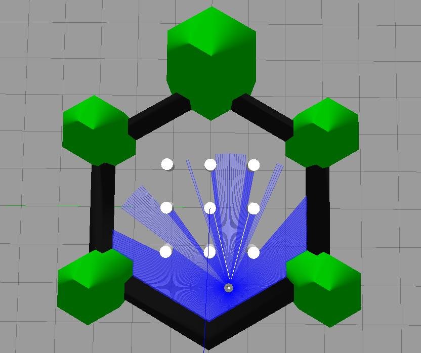

---  
title: "Part 3: Beyond the Basics"  
description: Execute ROS applications more efficiently using launch files. Learn about the LiDAR sensor, the data that it generates, and see the benefits of this for tools like "SLAM".
---

## Introduction

:material-pen: **Exercises**: 5  
:material-timer: **Estimated Completion Time**: 2 hours  
:material-gauge: **Difficulty Level**: Intermediate  

### Aims

In this part of the course we'll look at some more advanced ROS concepts, and explore another of our robot's on-board sensors: the LiDAR sensor. From the work you did in Part 2 you may have started to appreciate the limitations associated with using odometry data alone as a feedback signal when trying to control a robot's position in its environment. The LiDAR sensor can provide further information about an environment, thus enhancing a robot's knowledge and capabilities. To begin with however, we'll look at how to launch ROS applications more efficiently by creating our own *launch files* and executing these with the `ros2 launch` command. 

### Intended Learning Outcomes

By the end of this session you will be able to:

1. Create launch files to allow the execution of multiple ROS Nodes simultaneously with `ros2 launch`.
1. Learn about the robot's LiDAR sensor and the measurements obtained from this.
1. Interpret the `LaserScan` data that is published to the `/scan` topic and use existing ROS tools to visualise this.
1. Perform numeric analysis on data arrays (using the `numpy` Python library) to process `LaserScan` data for use in ROS applications.
1. Use existing ROS tools to implement SLAM and build a map of an environment. 

### Quick Links

* [Exercise 1: Creating a Launch File](#ex1)
* [Exercise 2: Launching Another Launch File](#ex2)
* [Exercise 3: Using RViz to Visualise LaserScan Data](#ex3)
* [Exercise 4: Building a LaserScan Callback Function](#ex4)
* [Exercise 5: Building a map of an environment with SLAM](#ex5)

### Additional Resources

* [A Basic LaserScan Subscriber Node (for Exercise 4)](./part3/lidar_subscriber.md)

## Getting Started

**Step 1: Launch your ROS Environment**

If you haven't done so already, launch your ROS environment now:

1. **Using WSL-ROS2 on a university managed desktop machine**: follow [the instructions here to launch it](../../ros/using-wsl-ros/man-win.md).
1. **[Running WSL-ROS2 on your own machine](../../ros/wsl-ros/install.md)**: launch the Windows Terminal to access a WSL-ROS2 terminal instance.
1. **Other Users**: Follow [the relevant steps](../../ros/other-options/README.md) to launch a terminal instance into your local ROS installation.

You should now have access to a Linux terminal instance, and we'll refer to this terminal instance as **TERMINAL 1**.

**Step 2: Restore your work (WSL-ROS2 Managed Desktop Users ONLY)**

Remember that any work that you do within the WSL-ROS2 Environment will not be preserved between sessions or across different University computers. At [the end of Part 2](./part2.md#backup) you should have run the `wsl_ros` tool to back up your home directory to your University `U:\` Drive. Once WSL-ROS2 is up and running, you should be prompted to restore this:

``` { .txt .no-copy }
It looks like you already have a backup from a previous session:
  U:\wsl-ros\ros2-backup-XXX.tar.gz
Do you want to restore this now? [y/n]
```

Enter ++y+enter++ to restore your work from last time. You can also restore your work at any time using the following command:

```bash
wsl_ros restore
```

**Step 3: Launch VS Code**  

It's also worth launching VS Code now, so that it's ready to go for when you need it later on. 

??? warning "WSL Users..."
        
    It's important to launch VS Code within your ROS environment using the "WSL" extension. Always remember to check for this: 
    
    <figure markdown>
      {width=400px}
    </figure>

**Step 4: Make Sure The Course Repo is Up-To-Date**

In Part 1 you should have [downloaded and installed The Course Repo](./part1.md#course-repo) into your ROS environment. Hopefully you've done this by now, but if you haven't then go back and do it now (you'll need it for some exercises here). If you *have* already done it, then (once again) it's worth just making sure it's all up-to-date, so run the following command now to do so:

***
**TERMINAL 1:**
```bash
cd ~/ros2_ws/src/tuos_ros/ && git pull
```

Then run `colcon build` 

```bash
cd ~/ros2_ws/ && colcon build --packages-up-to tuos_ros
```

And finally, re-source your environment:

```bash
source ~/.bashrc
```
***

!!! warning "Remember"
    If you have any other terminal instances open, then you'll need run `#!bash source ~/.bashrc` in these too, in order for the changes to propagate through to these as well!

## Launch Files

So far (in Parts 1 & 2) we've used the `ros2 run` command to execute a variety of ROS nodes, such as `teleop_keyboard`, as well as a number of nodes that we've created of our own. You may also have noticed that we've used a `ros2 launch` command now and again too, mainly to launch Gazebo Simulations of our robot, but why do we have these two commands, and what's the difference between them?

Complex ROS applications typically require the execution of multiple nodes at the same time. The `ros2 run` command only allows us to execute a single node, and so this isn't that convenient for such complex applications, where we'd have to open multiple terminals, use `ros2 run` multiple times *and* make sure that we ran everything in the correct order without forgetting anything! `ros2 launch`, on the other hand, provides a means to launch multiple ROS nodes *simultaneously* by defining exactly what we want to launch within *launch files*. This makes the execution of complex applications more reliable, repeatable and easier for others to launch these applications correctly. 

#### :material-pen: Exercise 1: Creating a Launch File {#ex1}

In order to see how launch files work, let's create some of our own!

In Part 1 we created `publisher.py` and `subscriber.py` nodes that could talk to one another via a topic called `/my_topic`. We launched these independently using the `ros2 run` command in two separate terminals. Wouldn't it be nice if we could have launched them both at the same time, from the *same terminal* instead?

To start with, let's create another new package, this time called `part3_beyond_basics`. 

1. In **TERMINAL 1**...
    
    1. Head to the `src` folder of your ROS workspace, and into the `tuos_ros` Course Repo from there:

        ***
        **TERMINAL 1:**
        ```bash
        cd ~/ros2_ws/src/tuos_ros/
        ```
       
    1. Use the `create_pkg.sh` helper script to create a new package once again:

        ```bash
        ./create_pkg.sh part3_beyond_basics
        ```
    
    1. And navigate into the *root* of this new package, using `cd`:

        ```bash
        cd ../part3_beyond_basics/
        ```
        ***

1. Launch files should be located in a `launch` directory at the root of the package directory, so use `mkdir` to do this:

    ***
    **TERMINAL 1:**
    ```bash
    mkdir launch
    ```
    ***

1. Use the `cd` command to enter the `launch` folder that you just created, then use the `touch` command to create a new empty file called `pubsub.launch.py`.

    ***
    **TERMINAL 1:**
    ```bash
    cd launch && touch pubsub.launch.py
    ```

1. Open this launch file in VS Code and enter the following:

    ```py title="pubsub.launch.py"
    from launch import LaunchDescription # (1)!
    from launch_ros.actions import Node # (2)!

    def generate_launch_description(): # (3)!
        return LaunchDescription([ # (4)!
            Node( # (5)!
                package='part1_pubsub', # (6)!
                executable='publisher.py', # (7)!
                name='my_publisher' # (8)!
            )
        ])
    ```

    1. Everything that we want to execute with a launch file must be encapsulated within a `LaunchDescription`, which is imported here from the `launch` module.
    2. In order to execute a *node* from a launch file we need to define it using the `Node` class from `launch_ros.actions` (not to be confused with the ROS Action *communication method* covered in Part 5!)
    3. We encapsulate a *Launch Description* inside a `generate_launch_description()` function.
    4. Here we define everything that we want this launch file to execute: in this case a Python *list* `[]` containing a single `Node()` item (for now).
    5. Here we describe the node that we want to launch.
    6. The name of the package that the node is part of.
    7. The name of the actual node that we want to launch from the above package.
    8. A name to register this node as on the ROS network. While this is also defined in the node itself: 
        
        ``` { .py .no-copy }
        super().__init__("simple_publisher")
        ```
        
        ...we can override this here with something else. 


1. We need to make sure we tell `colcon` about our new `launch` directory, so that it can build the launch files within it when we run `colcon build`. To do this, we need to add a *directory* install instruction to our package's `CMakeLists.txt`:

    Open up the `CMakeLists.txt` file and add the following text **just above** the `ament_package()` line at the very bottom:

    ```txt title="part3_beyond_basics/CMakeLists.txt"
    install(DIRECTORY
      launch
      DESTINATION share/${PROJECT_NAME}
    )
    ```

1. Now, let's build the package... <a name="colcon-build"></a>

    1. Navigate back to the root of the ROS workspace:

        ***
        **TERMINAL 1:**
        ```bash
        cd ~/ros2_ws/
        ```
    
    1. Run `colcon build` on your new package *only*:

        ```bash
        colcon build --packages-select part3_beyond_basics --symlink-install
        ``` 

    1. And finally, re-source the `.bashrc`:

        ```bash
        source ~/.bashrc
        ```
        ***

1. Use `ros2 launch` to launch this file and test it out as it is:

    ***
    **TERMINAL 1:**
    ```bash
    ros2 launch part3_beyond_basics pubsub.launch.py
    ```
    ***
    
1. The code that we've given you above will launch the `publisher.py` node from the `part1_pubsub` package, but not the `subscriber.py` node.  We therefore need to add another `Node()` object to our `LaunchDescription`:

    ```py title="pubsub.launch.py"
    from launch import LaunchDescription 
    from launch_ros.actions import Node

    def generate_launch_description():
        return LaunchDescription([
            Node(
                package='part1_pubsub',
                executable='publisher.py',
                name='my_publisher'
            ),
            Node(
                # TODO: define the subscriber.py node...
            )
        ])
    ```

    Using the same methods as above, add the necessary definitions for the `subscriber.py` node into your launch file.

1. Once you've made these changes [you'll need to run `colcon build` again](#colcon-build).

    !!! warning

        You'll need to run `colcon build` *every time* you make changes to a launch file, even if you use the `--symlink-install` option (as this only applies to nodes in the `scripts` directory)
        
1. Once you've completed this, it should be possible to launch both the publisher and subscriber nodes with `ros2 launch` and the `pubsub.launch.py` file. Verify this in **TERMINAL 1** by executing the launch file. Soon after launching this, you should see the following messages to indicate that both nodes are alive:

    ``` { .txt .no-copy }
    [subscriber.py-2] [INFO] [###] [my_subscriber]: The 'my_subscriber' node is initialised.
    [publisher.py-1] [INFO] [###] [my_publisher]: The 'my_publisher' node is initialised.
    ```

    ... and following this, the outputs of both nodes should be printed to the screen continually:

    ``` { .txt .no-copy }
    [publisher.py-1] [INFO] [###] [my_publisher]: Publishing: 'The ROS time is 1737545960 (seconds).'
    [subscriber.py-2] [INFO] [###] [my_subscriber]: The 'my_subscriber' node heard:
    [subscriber.py-2] [INFO] [###] [my_subscriber]: 'The ROS time is 1737545960 (seconds).' 
    ```

1. We can further verify this in a new terminal (**TERMINAL 2**), using commands that we've use in Parts 1 & 2 to *list* all nodes and topics that are active on our ROS network:

    ***
    **TERMINAL 2:**

    ```bash
    ros2 node list
    ```
    ```bash
    ros2 topic list
    ```

    Do you see what you'd expect to see in the output of these two commands?

    ***

#### :material-pen: Exercise 2: Launching Another Launch File {#ex2}

Using the processes above, we can develop launch files to execute as many nodes as we want on a ROS network simultaneously. *Another* thing we can do with launch files is launch *other* launch files! 

To illustrate this, think back to the `move_circle.py` node that we developed in Part 2, as part of our `part2_navigation` package. In order to launch this node we must first launch a robot simulation, e.g.: 

``` { .bash .no-copy }
ros2 launch turtlebot3_gazebo empty_world.launch.py
```

In this exercise we'll look at how we can launch the above launch file *and* our `move_circle.py` node simultaneously from a single `ros2 launch` command...

1. Make sure you're in the `launch` directory of your `part3_beyond_basics` package, we can actually use a `colcon` command to get us to the root of the package directory:

    ***
    **TERMINAL 1:**
    ```bash
    colcon_cd part3_beyond_basics
    ```

    ... and `cd` to get us into the `launch` directory from there:

    ```bash
    cd launch/
    ```
    ***

1. Make a new launch file in here, called `circle.launch.py`:

    ***
    **TERMINAL 1:**
    ```bash
    touch circle.launch.py
    ```

1. Open this up in VS Code and enter the following:

    ```py title="circle.launch.py"
    from launch import LaunchDescription
    from launch_ros.actions import Node

    import os
    from launch.actions import IncludeLaunchDescription
    from launch.launch_description_sources import PythonLaunchDescriptionSource
    from ament_index_python.packages import get_package_share_directory

    def generate_launch_description():
        return LaunchDescription([
            IncludeLaunchDescription( # (1)!
                PythonLaunchDescriptionSource( # (2)!
                    os.path.join( # (3)!
                        get_package_share_directory("turtlebot3_gazebo"), 
                        "launch", "empty_world.launch.py" # (4)!
                    )
                )
            )
        ])
    ``` 

    1. To include another launch file in a launch description, we use a `IncludeLaunchDescription()` class instance (imported from a module called `launch.actions`).
    2. We want to launch the "Empty World" simulation from the `turtlebot3_gazebo` package, which (as we know) can be done *from a terminal* with the following command:

        ``` { .bash .no-copy }
        ros2 launch turtlebot3_gazebo empty_world.launch.py
        ```

        Based on the above, we know that the launch file itself is a *Python* launch file, due to the `.py` file extension at the end.

        As such, the launch description that we want to include is a *Python* launch description, which must therefore be defined using a `PythonLaunchDescriptionSource()` instance (imported from a module called `launch.launch_description_sources`)
        
    3. The `os.path.join()` method (from the standard Python `os` library) can be used to build file paths. 
    4. The *Python Launch Description Source* is defined by providing the full path to the launch file that we want to include. We don't necessarily know where this file is on our filesystem, but ROS does!
    
        We can therefore use a function called `get_package_share_directory()` (from a module called `ament_index_python.packages`) to provide us with the path to the *root* of this package directory.
        
        From there, we know that the launch file itself must exist in a `launch` directory, so we use the `os.path.join()` method to construct this full file path for us.
    
    ... Currently, the launch file above contains *only* the code necessary to include the `empty_world.launch.py` launch file into our `circle.launch.py` launch description. There's a few new things that have been introduced here to achieve this, so click on the :material-plus-circle: icons in the code above to find out what all these things are doing.

1. Now, add a `Node()` item to the launch description so that the `move_circle.py` node (from your `part2_navigation` package) is launched *after* the "Empty World" simulation has been launched.

    Refer back to Exercise 1 for a reminder on how to do this.

1. When you're ready, remember to [run `colcon build` again](#colcon-build) *before* attempting to execute your new `circle.launch.py` launch file:

    ***
    **TERMINAL 1:**
    ```bash
    ros2 launch part3_beyond_basics circle.launch.py
    ```
    ***

If you've done this successfully, on launching the above command the Gazebo Empty World simulation should launch and, once it's loaded up, the robot should instantly start moving around in a circle (while printing information to **TERMINAL 1** at the same time).

We've learnt some key launch file techniques now, so let's move on to another more advanced and very important topic...

## Laser Displacement Data and The LiDAR Sensor {#lidar}

As you'll know from Part 2, odometry is really important for robot navigation, but it can be subject to drift and accumulated error over time. You may have observed this in simulation during [Part 2 Exercise 5](./part2.md#ex5), and you would most certainly notice it if you were to do the same on a real robot. Fortunately, The Waffles have another sensor on-board which provides even richer information about the environment, and we can use this to supplement the odometry information and enhance the robot's navigation capabilities.

### Introducing the LaserScan Interface

#### :material-pen: Exercise 3: Using RViz to Visualise LaserScan Data {#ex3}

<a name="rviz"></a>We're now going to place the robot in a more interesting environment than the "empty world" that we've been working with so far...

1. In **TERMINAL 1** enter the following command to launch this:

    ***
    **TERMINAL 1:**
    ```bash
    ros2 launch turtlebot3_gazebo turtlebot3_world.launch.py
    ```
    ***

    A Gazebo simulation should now be launched with a TurtleBot3 Waffle in a new environment:

    <figure markdown>
      {width=600px}
    </figure>

1. Open a new terminal instance (**TERMINAL 2**) and enter the following:

    ***
    **TERMINAL 2:**
    ```bash
    ros2 launch tuos_simulations rviz.launch.py
    ```
    ***
    
    On running the command a new window should open:

    <figure markdown>
      {width=600px}
    </figure>

    This is *RViz*, which is a ROS tool that allows us to *visualise* the data being measured by a robot in real-time. 
    
    The green dots scattered around the robot represent *laser displacement data* which is measured by the LiDAR sensor located on the top of the robot, allowing it to measure the *distance* to any obstacles in its surroundings. 
    
    The LiDAR sensor spins continuously, sending out laser pulses as it does so. These laser pulses are reflected from any objects and sent back to the sensor. Distance can then be determined based on the time it takes for the pulses to complete the full journey (from the sensor, to the object, and back again), by a process called *"time of flight"*. Because the LiDAR sensor spins and performs this process continuously, a full 360&deg; scan of the environment can be generated.
    
    In this case (because we are working in simulation here) the data represents the objects surrounding the robot in its *simulated environment*, so you should notice that the green dots produce an outline that resembles the objects in the world that is being simulated in Gazebo (or partially at least).
    
1. Next, open up a new terminal instance (**TERMINAL 3**). Laser displacement data from the LiDAR sensor is published by the robot to the `/scan` topic. We can use the `ros2 topic info` command to find out more about the nodes that are publishing and subscribing to this topic, as well as the *type of interface* used to transmit this topic data:

    ***
    **TERMINAL 3:**
    ```bash
    ros2 topic info /scan
    ```
    ```{ .txt .no-copy }
    Type: sensor_msgs/msg/LaserScan
    Publisher count: 1
    Subscription count: 0
    ```
    ***

1. As we can see from above, `/scan` data is of the `sensor_msgs/msg/LaserScan` type, and we can find out more about this interface using the `ros2 interface show` command:

    ***
    **TERMINAL 3:**
    ```bash
    ros2 interface show sensor_msgs/msg/LaserScan
    ```
    ```{ .txt .no-copy }
    # Single scan from a planar laser range-finder

    std_msgs/Header header # timestamp in the header is the acquisition time of
            builtin_interfaces/Time stamp
                    int32 sec
                    uint32 nanosec
            string frame_id
                                 # the first ray in the scan.
                                 #
                                 # in frame frame_id, angles are measured around
                                 # the positive Z axis (counterclockwise, if Z is up)
                                 # with zero angle being forward along the x axis

    float32 angle_min            # start angle of the scan [rad]
    float32 angle_max            # end angle of the scan [rad]
    float32 angle_increment      # angular distance between measurements [rad]

    float32 time_increment       # time between measurements [seconds] - if your scanner
                                 # is moving, this will be used in interpolating position
                                 # of 3d points
    float32 scan_time            # time between scans [seconds]

    float32 range_min            # minimum range value [m]
    float32 range_max            # maximum range value [m]

    float32[] ranges             # range data [m]
                                 # (Note: values < range_min or > range_max should be discarded)
    float32[] intensities        # intensity data [device-specific units].  If your
                                 # device does not provide intensities, please leave
                                 # the array empty.
    ```
    ***

### Interpreting LaserScan Data

The `LaserScan` interface is a standardised ROS message interface (from the `sensor_msgs` package) that any ROS Robot can use to publish data that it obtains from a Laser Displacement Sensor such as the LiDAR on the TurtleBot3.  

`ranges` is an array of `float32` values (array data-types are suffixed with `[]`). This is the part of the message containing all the *actual distance measurements* that are being obtained by the LiDAR sensor (in meters).

<a name="fig_lidar"></a>Consider a simplified example here, taken from a TurtleBot3 robot in a different environment:

<figure markdown>
  
</figure>

<a name="echo_scan_variables"></a>As illustrated in the figure, we can associate each data-point of the `ranges` array to an *angular position* by using the `angle_min`, `angle_max` and `angle_increment` values that are also provided within the `LaserScan` message.  We can use the `ros2 topic echo` command to find out what their values are:

```{ .txt .no-copy }
$ ros2 topic echo /scan --field angle_min --once
0.0
---
```
```{ .txt .no-copy }
$ ros2 topic echo /scan --field angle_max --once
6.28000020980835
---
```
```{ .txt .no-copy }
$ ros2 topic echo /scan --field angle_increment --once
0.01749303564429283
---
```

!!! question
    What do these values represent? (Compare them with [the figure above](#fig_lidar))

!!! tip 
    Notice how we were able to access *specific variables* within the `/scan` data using the `--field` flag, and ask the command to only provide us with a single message by using `--once`?

The `ranges` array contains 360 values in total, i.e. a distance measurement at every 1&deg; (an `angle_increment` of 0.0175 radians) around the robot. The first value in the `ranges` array (`ranges[0]`) is the distance to the nearest object directly in front of the robot (i.e. at &theta; = 0 radians, or `angle_min`). The last value in the `ranges` array (`ranges[359]`) is the distance to the nearest object at 359&deg; (i.e. &theta; = 6.283 radians, or `angle_max`) from the front of the robot, i.e.: 1 degree to the *right* of the X-axis. `ranges[65]`, for example, would represent the distance to the closest object at an angle of 65&deg; (1.138 radians) from the front of the robot (*anti-clockwise*), as shown in [the figure](#fig_lidar).

<a name="range_max_min"></a>The `LaserScan` message also contains the parameters `range_min` and `range_max`, which represent the *minimum* and *maximum* distances (again, in meters) that the LiDAR sensor can detect, respectively. Use the `ros2 topic echo` command to report these directly too.  

!!! question "Questions"
    1. What *is* the maximum and minimum range of the LiDAR sensor? Use [the same technique as we used above](#echo_scan_variables) to find out.
    1. Consider the note against `ranges` in the `ros2 interface show` output earlier:

        ``` { .txt .no-copy }
        float32[] ranges    # range data [m]
                            # (Note: values < range_min or > range_max should be discarded)
        ```

        (this might be worth thinking about).

Finally, use the `ros2 topic echo` command again to display the `ranges` portion of the `LaserScan` data. There's a lot of data here (360 data points per message in fact, as you know from above!):

```txt
ros2 topic echo /scan --field ranges
```

We're dropping the `--once` option now, so that we can see the data as it comes in, in *real-time*.  You might need to expand the terminal window so that you can see all the data points; data will be bound by square brackets `[]`, and there should be a `---` at the end of each message too, to help you confirm that you are viewing the whole thing.

The main thing you'll notice here is that there's lots of information, and it changes rapidly! As you have already seen though, it is the numbers that are flying by here that are represented by green dots in RViz.  Head back to the RViz screen to have another look at this now. As you'll no doubt agree, this is a much more useful way to visualise the `ranges` data, and illustrates how useful RViz can be for interpreting what your robot can *see* in real-time.

What you may also notice is several `inf` values scattered around the array.  These represent sensor readings that are outside the sensor's measurement range (i.e. *greater than* `range_max` or *less than* `range_min`), so the sensor can't report a distance measurement in such cases. Remember from above: 

``` { .txt .no-copy }
(Note: values < range_min or > range_max should be discarded)
```

!!! note
    This behaviour is different on the real robots! **Be aware of this when developing code for real robots**!!

Stop the `ros2 topic echo` command from running in the terminal window by entering ++ctrl+c++ in **TERMINAL 3**. Also close down the RViz process running in **TERMINAL 2** now as well, but leave the simulation (in **TERMINAL 1** running). 

#### :material-pen: Exercise 4: Building a LaserScan Callback Function {#ex4}

LaserScan data presents us with a new challenge: processing large datasets. In this exercise we'll look at some basic approaches that can be taken to deal with this data, and get something meaningful out of it that can be used in your robot applications.

1. Navigate into the `scripts` folder of your `part3_beyond_basics` package:

    ***
    **TERMINAL 2:**
    ```bash
    colcon_cd part3_beyond_basics && cd scripts/
    ```
    ***

1. Create a new node called `lidar_subscriber.py`:
    
    ***
    **TERMINAL 2:**
    ```bash
    touch lidar_subscriber.py
    ``` 

    and give this *execute* permissions:

    ```bash
    chmod +x lidar_subscriber.py
    ```
    ***

1. Declare this as a package executable by opening up your package's `CMakeLists.txt` in VS Code, and replacing `minimal_node.py` with `lidar_subscriber.py` as shown below:

    ```txt title="CMakeLists.txt"
    # Install Python executables
    install(PROGRAMS
      scripts/lidar_subscriber.py
      DESTINATION lib/${PROJECT_NAME}
    )
    ```

1. Then, add some new dependencies to your package's `package.xml` file, so open this up in VS Code too. Below the `#!xml <exec_depend>rclpy</exec_depend>` line, add the following:

    ```xml title="package.xml"
    <exec_depend>rclpy</exec_depend>
    <exec_depend>sensor_msgs</exec_depend>
    <exec_depend>python3-numpy</exec_depend>
    ```

1. Head back to the terminal and use Colcon to build this (even though `lidar_subscriber.py` is still just an empty file at this stage):

    ***
    **TERMINAL 2:**
    ```bash
    cd ~/ros2_ws/ && colcon build --packages-select part3_beyond_basics --symlink-install
    ```

    And after that, re-source your `.bashrc`:

    ```bash
    source ~/.bashrc
    ```
    ***

1. With all of that out of the way, it's time to start building the `lidar_subscriber.py` Python Node! Open up the file in VS Code, then **[follow ^^the steps here^^ to construct it](./part3/lidar_subscriber.md)**. <a name="ex4_ret"></a>

1. Once you're happy with what's going on with this, run the node using `ros2 run`:

    ***
    **TERMINAL 2:**
    ```bash
    ros2 run part3_beyond_basics lidar_subscriber.py
    ```
    ***

1. Open another terminal (so you can still see the outputs from your `lidar_subscriber.py` node). Launch the `teleop_keyboard` node, and drive the robot around, noting how the outputs from your `lidar_subscriber.py` node change as you do so.

1. Close everything down now (including the simulation running in **TERMINAL 1**). Then launch the "empty world" simulation again:

    ***
    **TERMINAL 1:**
    ```bash
    ros2 launch turtlebot3_gazebo empty_world.launch.py
    ```
    ***

1. Go back to **TERMINAL 2** and launch your `lidar_subscriber.py` node again:

    ***
    **TERMINAL 2:**
    ```bash
    ros2 run part3_beyond_basics lidar_subscriber.py
    ```
    ***

    What output do you see from this now?

    You should notice that your `lidar_subscriber.py` node reports `nan meters` now. That's because there's nothing in the environment for the LiDAR sensor to detect, so *all* readings are out of range and hence our analysis of the 40&deg; arc of LiDAR readings at the front of the robot has filtered out *everything* and therefore returned `nan` (not a number).

1. Use the **Box** tool in Gazebo to place a box in the environment. 

    <figure markdown>
      {width=800px}
    </figure>

1. Click the **Translate** tool to move the box around until the `lidar_subscriber.py` node returns some reading that *aren't* `nan` again.

1. Move the box around some more to observe what our analysis of the `LaserScan` data *can* detect, and where the box falls out of the detectable range.

1. Think about how you could adapt the callback function of the `lidar_subscriber.py` node so that it picks up on more than one `LaserScan` subset, so that it could detect situations such as this (for example):

    <figure markdown>
      {width=800px}
    </figure>


## Simultaneous Localisation and Mapping (SLAM) {#slam}

In combination, the data from the LiDAR sensor and the robot's odometry (the robot *pose* specifically) are really powerful, and allow some very useful conclusions to be made about the environment a robot is operating within.  One of the key applications of this data is *"Simultaneous Localisation and Mapping"*, or *SLAM*.  This is a tool that's built into ROS, and allows a robot to build up a map of its environment and locate itself within that map at the same time!  We'll now look at how easy it is to leverage this in ROS.

#### :material-pen: Exercise 5: Building a map of an environment with SLAM {#ex5}

1. Close down all ROS processes that are running now by entering ++ctrl+c++ in each terminal. 

1. We're going to launch our robot into *another* new simulated environment now, which we'll be creating a map of using SLAM! To launch the simulation enter the following command in **TERMINAL 1**:

    ***
    **TERMINAL 1:**
    ```bash
    ros2 launch tuos_simulations nav_world.launch.py
    ```
    ***

    The environment that launches should look like this:

    <figure markdown>
      {width=800px}
    </figure>

1. Now launch SLAM to start building a map of this environment. In **TERMINAL 2**, launch SLAM as follows:
        
    ***
    **TERMINAL 2:**
    ```bash
    ros2 launch tuos_simulations cartographer.launch.py
    ```
    ***

    This will launch RViz again, where you should see a top-down view of an environment with a model of the robot, surrounded by some red/green dots representing the real-time LiDAR data. 
    
    <figure markdown>
      {width=600px}
    </figure>

    SLAM has already started building a map of the boundaries that are currently visible to the robot, based on its starting position in the environment. 

    If you leave this for a minute the walls of the arena will start to become visible in RViz, and the floor will start to turn a lighter grey. As time passes the SLAM algorithms are becoming more certain of what is being observed in the environment, and are starting to determine what is free space, and where the boundaries are.

    <figure markdown>
      {width=600px}
    </figure>

1. In **TERMINAL 3** launch the `teleop_keyboard` node ([you should know how to do this by now](./part2.md#teleop)). Re-arrange and re-size your windows so that you can see Gazebo, RViz *and* the `teleop_keybaord` terminal instances all at the same time:
    
    <figure markdown>
      {width=800px}
    </figure>

1. Drive the robot around the arena slowly, using the `teleop_keyboard` node, and observe the map being updated in the RViz window as you do so. 

1. As you're doing this open up *another* terminal instance (**TERMINAL 4**) and run the `odom_subscriber.py` node that you created back in Part 2:
    
    ***
    **TERMINAL 4:**
    ```bash
    ros2 run part2_navigation odom_subscriber.py
    ```
    ***
    
    This will provide you with the robot's `X` and `Y` coordinates (in meters) within the environment, as you are driving it around, and you can use this to determine the centre coordinates of the four circles (A, B, C & D) that are printed on the arena floor. 
    
    Drive your robot into each of these circular zones and stop the robot inside them.    

    <a name="goal_coords"></a>Record the zone marker coordinates in a table such as the one below.

    <center>

    | Zone | X Position (m) | Y Position (m) |
    | :---: | :---: | :---: |
    | START | 0.5   | -0.04 |
    | A     |       |       |
    | B     |       |       |
    | C     |       |       |
    | D     |       |       |

    </center>

1. Drive the robot around until a full map of the environment has been generated.
    
    <figure markdown>
      {width=800px}
    </figure>

1. Once you're happy that your robot has built a complete map of the environment (and you've got the coordinates of all the circles), you can then save your map for later use. We do this using a ROS `map_server` package.  First, stop the robot by pressing ++s++ in **TERMINAL 3** and then enter ++ctrl+c++ to shut down the `teleop_keyboard` node.

1. Then, remaining in **TERMINAL 3**, navigate to the root of your `part3_beyond_basics` package directory and create a new folder in it called `maps`:

    ***
    **TERMINAL 3:**
    ```bash
    cd ~/ros2_ws/src/part3_beyond_basics/
    ```
    ```bash
    mkdir maps
    ```
    ***

1. Navigate into this new directory:

    ***
    **TERMINAL 3:**
    ```bash
    cd maps/
    ```
    ***
    
1. Then, run the `map_saver_cli` node from the `map_server` package to save a copy of your map: <a name="map-saver-cli"></a>

    ***
    **TERMINAL 3:**
    ```{ .bash .no-copy }
    ros2 run nav2_map_server map_saver_cli -f MAP_NAME
    ```
    Replacing `MAP_NAME` with a name of your choosing. 
    ***

    This will create two files: a `MAP_NAME.pgm` and a `MAP_NAME.yaml` file, both of which contain data related to the map that you have just created.  The `.pgm` file contains an *Occupancy Grid Map (OGM)*, which is used for *autonomous navigation* in ROS.  Have a look at the map by launching it in an Image Viewer Application called `eog`:
    
    ***
    **TERMINAL 3:**
    ```{ .bash .no-copy }
    eog MAP_NAME.pgm
    ```
    ***

    A new window should launch containing the map you have just created with SLAM and the `map_saver_cli` node: 
    
    <figure markdown>
      {width=300px}
    </figure>

    White regions represent the area that your robot has determined is open space and that it can freely move within.  Black regions, on the other hand, represent boundaries or objects that have been detected.  Any grey area on the map represents regions that remain unexplored, or that were inaccessible to the robot.
    
1. Compare the map generated by SLAM to the real simulated environment. In a simulated environment this process should be pretty accurate, and the map should represent the simulated environment very well (unless you didn't allow your robot to travel around and see the whole thing!)  In a real environment this is often not the case.  

    !!! question "Questions"
        * How accurately did your robot map the environment?
        * What might impact this when working in a real-world environment?
    
1. Close the image using the :material-close-circle: button on the right-hand-side of the *eog* window.

#### Summary of SLAM

See how easy it was to map an environment in the previous exercise? This works just as well on a real robot in a real environment too (as you will observe in [one of the Real Waffle "Getting Started Exercises" for Assignment #2](../../waffles/basics.md#exSlam)). 

This illustrates the power of ROS: having access to tools such as SLAM, which are built into the ROS framework, makes it really quick and easy for a robotics engineer to start developing robotic applications on top of this. Our job was made even easier here since we used some packages that had been pre-made by the manufacturers of our TurtleBot3 Robots to help us launch SLAM with the right configurations for our exact robot.  If you were developing a robot yourself, or working with a different type of robot, then you might need to do a bit more work in setting up and tuning the SLAM tools to make them work for your own application.

## Wrapping Up

As we learnt in Part 2, a robot's odometry is determined by dead-reckoning and control algorithms based on this alone (like the `move_square.py` node) may be subject to drift and accumulated error. 

Ultimately then, a robot needs additional information to pinpoint its precise location within an environment, and thus enhance its ability to navigate effectively and avoid crashing into things!

This additional information can come from a LiDAR sensor, which you learnt about in this session. We explored where this data is published to, how we access it, and what it tells us about a robot's immediate environment.  We then looked at some ways odometry and laser displacement data can be combined to perform advanced robotic functions such as the mapping of an environment. This is all complicated stuff but, using ROS, we can leverage these tools with relative ease, which illustrates just how powerful ROS can be for developing robotic applications quickly and effectively without having to re-invent the wheel!
    
### WSL-ROS2 Managed Desktop Users: Save your work! {#backup}

Remember, the work you have done in the WSL-ROS2 environment during this session **will not be preserved** for future sessions or across different University machines automatically! To save the work you have done here today you should now run the following script in any idle WSL-ROS2 Terminal Instance:

```bash
wsl_ros backup
```

This will export your home directory to your University `U:\` Drive, allowing you to restore it on another managed desktop machine the next time you fire up WSL-ROS2.  