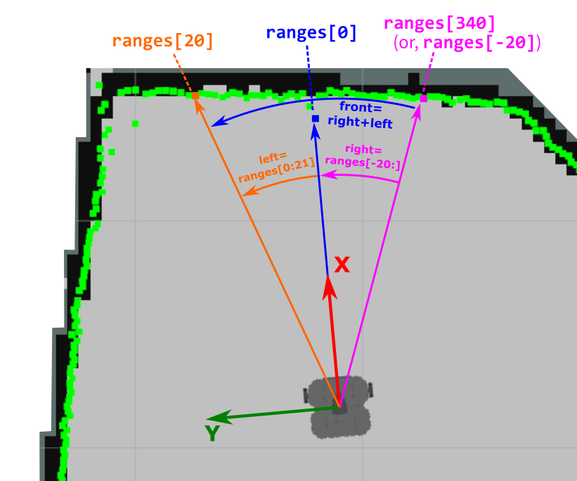

---  
title: "Building a Basic LaserScan Subscriber Node"
---

Copy **all** the code below into your `lidar_subscriber.py` file and then **review the annotations** to understand how it all works.

```python title="lidar_subscriber.py"
--8<-- "code_templates/lidar_subscriber.py"
```

1. None of this should be new to you by now. [Remember from Part 2](../part2.md#ex5) that we're using `SignalHandlerOptions` to handle shutdown requests (triggered by ++ctrl+c++).
2. We're building a `/scan` subscriber here, and we know that this topic uses the `sensor_msgs/msg/LaserScan` interface type, so we import this here.
3. `numpy` is a Python library that allows us to work with numeric data, very useful for big arrays like `ranges`.
4. We construct a subscriber in much the same way as we have done in Parts 1 and 2, this time targetting the `/scan` topic though.
5. From the front of the robot, we obtain a 20&deg; arc of scan data either side of the x-axis (see the figure below).

6. Then, we combine the `left` and `right` data arrays, and convert this from a Python list to a `numpy` array (see the figure below).

7. This illustrates one of the great features of `numpy` arrays: we can filter them.

    Remember that `front` is now a `numpy` array containing 40 data points.
    
    Remember *also*, that there will typically be several `inf` values scattered around the LaserScan array, resulting from sensor readings that are outside the sensor's measurement range (i.e. *greater than* `range_max` or *less than* `range_min`). We need to get rid of these, so we ask `numpy` to filter our array as follows:

    1. Of all the values in the `front` array, determine which ones are **not equal** to `inf`: 
        
        `#!py front != float("inf")`

    1. Use this *filter* to remove these `inf` values from the `front` array:
        
        `#!py front[front != float("inf")]`
    
    1. Return this as a *new* `numpy` array called `valid_data`:

        `#!py valid_data = front[front != float("inf")]`

8. In certain situations (i.e. in very sparse environments) *all* values could be equal to`inf` (imagine the "empty world" simulation). Here we're checking the size of the `valid_data` array to make sure that we haven't just removed *all* values through the above filtering process!

9. If the array is not empty, then use the `mean()` method to determine the *average* of all readings within the dataset
10. If the array *is* empty, then return *"not a number"* (aka "nan") instead 
11. Print this value to the terminal, but throttle the messages so that only one is displayed every second

    !!! question
        If we *didn't* throttle this, what rate would the messages be printed at?

The data processing is illustrated in the figure below:

<figure markdown>
  {width=600px}
</figure>

<p align="center">
  <a href="../../part3#ex4_ret">&#8592; Back to Part 3</a>
</p>