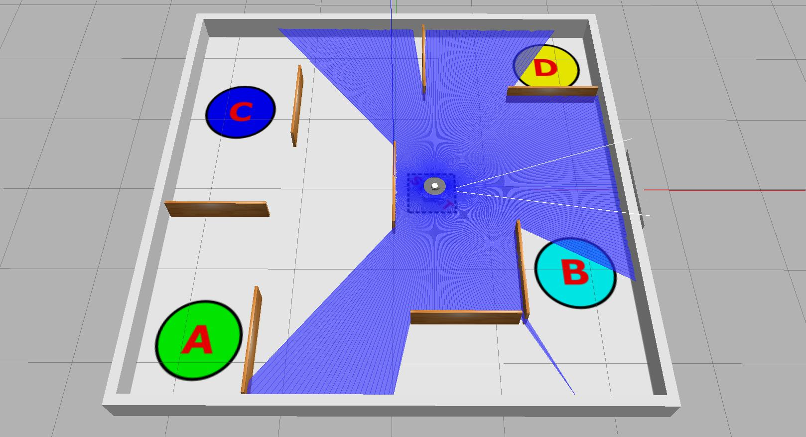

---  
title: "Part 4: Services"  
description: Learn about an alternative way that ROS nodes can communicate across a ROS network, and the situations where this might be useful.  
---

## Introduction

:material-pen: **Exercises**: 6  
:material-timer: **Estimated Completion Time**: 2 hours  
:material-gauge: **Difficulty Level**: Intermediate  

### Aims

In this part you'll learn about *Services*: an alternative communication method that can be used to transmit data/information or invoke actions on a ROS Network. You'll learn how this works, and why it might be useful. You'll also look at some practical applications of this.

### Intended Learning Outcomes

By the end of this session you will be able to:

1. Recognise how ROS Services differ from the standard topic-based publisher-subscriber approach, and identify appropriate use-cases for this type of messaging system.
1. Identify the services that are available on a ROS network, and use ROS command-line tools to interrogate and *call* them.
1. Develop Python Service Client Nodes.
1. Invoke different services using various service-type interfaces.

### Quick Links

* [Exercise 1: Using Command-line Tools to Interrogate a Service and its Interface](#ex1)
* [Exercise 2: Playing the Number Game (from the Command-line)](#ex2)
* [Exercise 3: Creating a Service Interface](#ex3)
* [Exercise 4: Adapting the Number Game Server](#ex4)
* [Exercise 5: Creating a Python Service Client](#ex5)
* [Exercise 6: Developing A Map Saver Service Client](#ex6)

### Additional Resources

* [The `number_game_client.py` Node (for Exercise 5)](./part4/number_game_client.md)

## Getting Started

**Step 1: Launch your ROS2 Environment**

If you haven't done so already, launch your ROS environment now. Having done this, you should now have access to a Linux terminal instance (aka **TERMINAL 1**).

**Step 2: Restore your work (WSL-ROS2 Managed Desktop Users ONLY)**

Remember that any work you do within the WSL-ROS2 Environment will not be preserved between sessions or across different University computers, so you should be backing up your work to your `U:\` drive regularly. When prompted (on first launch of WSL-ROS2 in **TERMINAL 1**) enter ++y+enter++ to restore your data[^1].

``` { .txt .no-copy }
It looks like you already have a backup from a previous session:
  U:\wsl-ros\ros2-backup-XXX.tar.gz
Do you want to restore this now? [y/n]
```

[^1]: Remember: you can also use the `wsl_ros restore` command at any time.

**Step 3: Launch VS Code**  

It's also worth launching VS Code now. *WSL users* remember to check for this:

<figure markdown>
  {width=400px}
</figure>

**Step 4: Make Sure The Course Repo is Up-To-Date**

Once again, it's worth quickly checking that the Course Repo is up-to-date before you start on the Part 4 exercises. Go back to [Part 1](./part1.md#course-repo) if you haven't installed it yet (really?!) or - alternatively - [see here for how to update](../extras/course-repo.md#updating).

## An Introduction to Services

So far, we've learnt about ROS *topics* and the *message*-type interfaces that we use to transmit data on them. We've also learnt how individual nodes can access data on a robot by simply *subscribing* to topics that another node on the ROS network is publishing messages to. In addition to this, we know that any node can *publish* messages to any topic, which broadcasts data across the ROS network, making it available to any other node on the network that may wish to access it.

Another way to pass data between ROS Nodes is by using *Services*. These are based on a *call and response* type of communication:

* A Service **Client** sends a **Request** to a Service **Server**.
* The Service **Server** processes that request and sends back a **Response**.

<figure markdown>
  {width=600px}
</figure>

This is a bit like a transaction: one node requests something, and another node fulfils that request and responds. This is good for **quick, short duration tasks**, e.g.:

1. Turning a device on or off.
1. Grabbing some data and saving it to a file (a map for example).
1. Performing a calculation and returning a result.
1. Making a sound[^tb3_sound].

[^tb3_sound]: On the real Waffles, there's a service called `/sound`. Have a look at this next time you're in the lab... Once you've worked through the whole of Part 4 you'll know exactly how to interrogate this service and leverage the functionality that it provides!

A single service can have many clients, but you can only have a *single* Server providing that particular service at any one time.

<figure markdown>
  
  <figcaption>Multiple Clients to a single Service Server</figcaption>
</figure>

Let's see how this all works in practice now, by playing a number game! We don't need a simulation up and running for this one, so in **TERMINAL 1** use the following command to launch the *Guess the Number* Service: 

***
**TERMINAL 1:**
```bash
ros2 run tuos_examples number_game.py
```

Having launched the service successfully, you should be presented with the following:

``` { .txt .no-copy }
[INFO] [#####] [number_game_service]: The '/guess_the_number' service is active.
[INFO] [#####] [number_game_service]: A secret number has been set... Game on!
```
***

We need to interrogate this now, in order to work out how to play the game...

## Interrogating a Service

#### :material-pen: Exercise 1: Using Command-line Tools to Interrogate a Service and its Interface {#ex1}

1.  Open up a new terminal instance (**TERMINAL 2**) and use the `ros2 service` command to list all active ROS services:

    ***
    **TERMINAL 2:**
    ```bash
    ros2 service list
    ```
    ***

    There'll be a few items in this list, most of them with the prefix: `/number_game_service`. This is the name of the *node* that is providing the service (i.e. the **Server**) and these items are all automatically generated by ROS. What we're really interested in is the service itself, which should be listed as `/guess_the_number`. 

1. Next, we need to find the *interface type* used by this service, which we can do a couple of ways:

    ***
    **TERMINAL 2:**
    
    1. Use the `type` sub-command:

        ```
        ros2 service type /guess_the_number
        ```

    1. Use the `list` sub-command again, but with the `-t` flag:

        ```bash
        ros2 service list -t
        ```

        The latter will provide the same list of services as before, but each one will now have its interface type provided alongside it.

    ***

1. Regardless of the method that you used above, you should have discovered that the interface type used by the `/guess_the_number` service is:
    
    ``` { .txt .no-copy }
    tuos_interfaces/srv/NumberGame
    ```

    Notice how ([much like with message interfaces used by *topics*](./part1.md#msg-interface-struct)), there are three fields to this type definition:
        
    1. `tuos_interfaces`: the name of the ROS package that this interface belongs to.
    1. `srv`: that this is a *service* interface, the second interface type we've covered now (we'll learn about the third and final one in Part 5).
    1. `NumberGame`: the data structure.

    We need to know the data structure in order to make a call to the service, so let's identify this next.

1. We can use the `ros2 interface list` command to list *all* interface types available to us on our ROS system, but this will provide us with a long list!

    ***
    **TERMINAL 2:**

    1. We can use the `-m` flag to filter for *message* interfaces, or the `-s` flag to filter for *service* interfaces. Try the latter:

        ```bash
        ros2 interface list -s
        ```
    
        <a name="grep"></a>

    1. Still quite a lot there, right!? Let's filter this further with [Grep](https://en.wikipedia.org/wiki/Grep){target="_blank"} to identify *only* interfaces that belong to the `tuos_interfaces` package:

        ```bash
        ros2 interface list -s | grep tuos_interfaces
        ```

        Hopefully, the `srv/NumberGame` interface is now listed.

    1. Use the `show` sub-command to *show* the message structure:

        ```bash
        ros2 interface show tuos_interfaces/srv/NumberGame
        ``` 
        
    ***

    The interface structure should be shown as follows:

    ``` { .txt .no-copy }
    int32 guess
    ---
    int32 guesses
    string hint
    bool success
    ```

## The Format of Service Interfaces

Service interfaces have two parts to them, separated by three hyphens (`---`). Above the separator is the Service **Request**, and below it is the Service **Response**:

``` { .txt .no-copy }
int32 guess      <-- Request
---
int32 guesses    <-- Response (1 of 3)
string hint      <-- Response (2 of 3)
bool success     <-- Response (3 of 3)
```

In order to *Call* a service, we need to provide data to it in the format specified in the **Request** section of the interface. A service *Server* will then send data back to the caller in the format specified in the **Response** section of the interface.

The `tuos_interfaces/srv/NumberGame` service interface has only **one** request parameter:

1. `guess`: a `int32` (32-bit integer)  
    ...which is the only thing we need to send to the `/number_game_service` Service Server in order to call it.

There are then **three** response parameters:

1. A *32-bit integer* called `guesses`
1. A text *string* called `hint`  
1. A *boolean* flag called `success`

    ...all of which will be returned by the server, once it has processed our request.

#### :material-pen: Exercise 2: Playing the Number Game (from the Command-line) {#ex2}

We're now ready to make a call to the service, and we can do this using the `ros2 service` command again (from **TERMINAL 2**):

1. To start, let's send an initial guess of `0` and see what happens:

    ```bash
    ros2 service call /guess_the_number tuos_interfaces/srv/NumberGame "{guess: 0}"
    ```

    The request will be echoed back to us, followed by a response, which will likely look something like this, and which shows us the value of the three response parameters that we identified above:

    ``` { .txt .no-copy }
    response:
    tuos_interfaces.srv.NumberGame_Response(guesses=1, hint='Higher', success=False)
    ```

    1. `guesses`: tells us how many times we've tried to guess the number in total (just once so far)
    1. `hint`: tells us if we should go "higher" or "lower" on our next guess in order to get closer to the *secret number*
    1. `success`: tells us if we guessed the right number or not (unlikely on the first attempt!)

1. Make another service call, this time changing the value of your `guess`, e.g.:
    
    ```bash
    ros2 service call /guess_the_number tuos_interfaces/srv/NumberGame "{guess: 10}"
    ```

1. Try making a guess of 500 next.

    The service should respond with the hint `'Error'` now. Have a look back in **TERMINAL 1** (where the Server is running) to get more information on this.

1. Keep going until you guess the magic number, how many guesses does it take you?! 

1. Stop the server, by entering ++ctrl+c++ in **TERMINAL 1**.

## Creating Our Own Services

Over the next three exercises, we'll learn how to create a service interface of our own, and build a Server and Client (in Python) that use this.

First though, we need to create a new package, so follow the same procedure as you have in the previous parts of this course to create one called `part4_services`.

***
**TERMINAL 1:**
```bash
cd ~/ros2_ws/src/tuos_ros/
```

```
./create_pkg.sh part4_services
```
***

#### :material-pen: Exercise 3: Creating a Service Interface {#ex3}

Let's create a service interface now which has a *similar* structure to the one used by the `/guess_the_number` service, but this time with *two* request parameters, rather than just one...

1. In **TERMINAL 1**, navigate into the root of your `part4_services` package directory:

    ```bash
    cd ~/ros2_ws/src/part4_services/
    ```

1. Create a new directory there called `srv`:

    ```bash
    mkdir srv
    ```

1. Create a new file in this directory called `MyNumberGame.srv`:

    ```bash
    touch srv/MyNumberGame.srv
    ```

    In here is where we will define the structure of our own `MyNumberGame` service interface.

1. Open up this file in VS Code, enter the following content and save the file:

    ```txt title="MyNumberGame.srv"
    int32 guess
    bool cheat
    ---
    int32 num_guesses
    string hint
    bool correct
    ```

    The **Request** will therefore have two fields now:

    <center>

    | # | Field Name | Data Type |
    | :---: | :---: | :---: |
    | 1 | `guess` | `int32` |
    | 2 | `cheat` | `bool` |

    </center>

1. The rest of the process now is very similar to creating a *message* interface, [like we did in Part 1](./part1.md#ex7). 
    
    First, we need to declare the interface in our `CMakeLists.txt` file, by adding the following above the `ament_package()` line:

    ```txt title="part4_services/CMakeLists.txt"
    find_package(rosidl_default_generators REQUIRED)
    rosidl_generate_interfaces(${PROJECT_NAME}
      "srv/MyNumberGame.srv" 
    )
    ```

1. Next, we need to modify the `package.xml` file. Add the following lines to this one, just above the `#!xml <export>` line:

    ```xml title="package.xml"
    <buildtool_depend>rosidl_default_generators</buildtool_depend>
    <exec_depend>rosidl_default_runtime</exec_depend>
    <member_of_group>rosidl_interface_packages</member_of_group>
    ```

1. And finally, we use Colcon to generate the necessary source code for the service interface:

    1. Navigate to the root of the ROS2 Workspace:
        
        ```bash
        cd ~/ros2_ws/
        ```
    
    1. Run `colcon build`:

        ```bash
        colcon build --packages-select part4_services --symlink-install 
        ```
    
    1. And re-source the `.bashrc`:

        ```bash
        source ~/.bashrc
        ```

1. Let's verify that this worked, using the `ros2` CLI (the same way as we did earlier when interrogating `tuos_interfaces/srv/NumberGame`):

    1. First, *list* all the ROS service interfaces that are available on the system (`-s` to filter for *service* interface types remember!):

        ```bash
        ros2 interface list -s
        ```

        Scroll through this list and see if you can find `part4_services/srv/MyNumberGame` (or, [use `grep` again](#grep)).

    1. If it's there, use the `show` sub-command to *show* the data structure:

        ```bash
        ros2 interface show part4_services/srv/MyNumberGame
        ```

    Does it match with the definition in our `MyNumberGame.srv` file?

#### :material-pen: Exercise 4: Adapting the Number Game Server {#ex4}

We're going to take a copy of the `tuos_examples/number_game.py` server node now, and adapt it to use the service interface that we created above.

1. In **TERMINAL 1** still, navigate into the `part4_services/scripts` directory:

    ```bash
    cd ~/ros2_ws/src/part4_services/scripts/
    ```

1. Copy the `number_game.py` script from the course repo into here, renaming it to `my_number_game.py` at the same time:

    ```bash
    cp ../../tuos_ros/tuos_examples/scripts/number_game.py ./my_number_game.py
    ```

    This file should already have *execute* permissions, but [it's always worth checking](./part1.md#chmod)...

1. Declare this as a package executable by going back to the `CMakeLists.txt` file, and adding `my_number_game.py` below `minimal_node.py` (or just replacing `minimal_node.py` entirely):

    ```txt title="CMakeLists.txt"
    # Install Python executables
    install(PROGRAMS
      scripts/my_number_game.py
      DESTINATION lib/${PROJECT_NAME}
    )
    ```

1. Build and re-source now: <a name="colcon-build-steps"></a>

    ```bash
    cd ~/ros2_ws/
    ```
    ```bash
    colcon build --packages-select part4_services --symlink-install
    ```
    ```bash
    source ~/.bashrc 
    ```

1. Now, let's look at the code, and see what needs to be adapted:

    1. Open up the `my_number_game.py` node in VS Code and review it.

    1. As it stands, the node imports the `NumberGame` service interface from `tuos_interfaces`, so you'll need to change this to use the interface from our own package:

        ```py
        from part4_services.srv import MyNumberGame
        ```

        You'll also need to change the `srv_type` definition, when the service is created in the `#!py __init__()`:

        ```py
        self.srv = self.create_service(
            srv_type=MyNumberGame,
            srv_name='guess_the_number',
            callback=self.srv_callback
        )
        ```
    
    1. Everything that this service *does* (when a **Request** is sent to it), is contained within the `srv_callback()` method. 

        In here, `request` parameters are processed, `response` parameters are defined and the overall `response` is returned once the callback tasks have been completed.
    
    1. You may have noticed that when we created our `MyNumberGame` interface in the previous exercise, the **Response** parameters were the same as the originals from Exercise 1 & 2, *except* that some of their names were changed slightly!

        Work through the `srv_callback()` method and make sure that all `response` attributes are renamed to match the new names that we've given them in `MyNumberGame.srv`. 

    1. Remember that our `MyNumberGame` interface has an additional **Request** parameter too: 

        ``` { .txt .no-copy } 
        bool cheat
        ```

        ... i.e. a *boolean* flag with the attribute name `cheat`.

        Adapt the `srv_callback()` method further now to read this value as well. 
            
        * If (when a **request** is made to the server) the value of `cheat` is `True` the hint that the server returns should contain the actual secret number! E.g.:

            ``` { .txt .no-copy } 
            hint='The answer is 67!'
            ```

        * In such situations, the value of `response.num_guesses` should still go up by one, and the `correct` flag should still return `False`.
    
1. Once you've adapted the node, test it out by running it:

    ***
    **TERMINAL 1:**
    ```bash
    ros2 run part4_services my_number_game.py
    ```
    ***

    You should then be able to make calls to this from **TERMINAL 2** using the `ros2 service call` sub-command, as we did in [Exercise 2](#ex2).
    
    !!! hint
        There are **two** request parameters now, so when sending a request from the command-line **both** need to be supplied. Do this by including them both within the braces (`{}`) and separated with a comma, e.g.

        ```bash
        ros2 service call /guess_the_number part4_services/srv/MyNumberGame "{guess: X, cheat: Y}" 
        ```

#### :material-pen: Exercise 5: Creating a Python Service Client {#ex5}

So far we've been making service calls from the command-line, but we can also call services from within Python Nodes. When a node *calls* (i.e. *requests*) a service, it becomes a Service *"Client"*.

1. Make sure your `my_number_game.py` node is still active in **TERMINAL 1** for this exercise.

1. In **TERMINAL 2**, create a new file in the `part4_services/scripts` directory called `number_game_client.py`.

    ```bash
    touch ~/ros2_ws/src/part4_services/scripts/number_game_client.py
    ```

1. [Make this executable (with `chmod`)](./part1.md#chmod).

1. Add this to your package's *Python executables* list in `CMakeLists.txt`:

    ```txt title="CMakeLists.txt"
    # Install Python executables
    install(PROGRAMS
      scripts/my_number_game.py
      scripts/number_game_client.py
      DESTINATION lib/${PROJECT_NAME}
    )
    ```

1. Re-build your package (as before), remembering that there are [three steps to this](#colcon-build-steps):

    1. Navigate to the **root** of the ROS2 workspace,
    1. Run `colcon build` (with the necessary additional arguments), 
    1. Re-source your `~/.bashrc`.

    <a name="ex_srv_cli_ret"></a>

1. Now, open up the `number_game_client.py` file in VS Code. **[Have a look at ^^the code here^^, review it (including all the annotations), then copy and paste it and save the file](./part4/number_game_client.md)**.

1. You should now be able to run the code with `ros2 run`. To begin with, run it without supplying any additional command-line arguments:

    ***
    **TERMINAL 2:**
    ```bash
    ros2 run part4_services number_game_client.py
    ```
    ***

    You'll probably then get an output like this:

    ``` { .txt .no-copy }
    [INFO] [#####] [number_game_client]: Sending the request:
     - guess: 0
     - cheat: False
       Awaiting response...
    [INFO] [#####] [number_game_client]: The server has responded with:
     - Incorrect guess :(
     - Number of attempts so far: 1
     - A hint: 'Higher'.
    ```

    Notice how the request parameters `guess` and `cheat` have defaulted to `0` and `False` respectively?

1. Supply a guess now, using our node's CLI:

    ***
    **TERMINAL 2:**
    ```bash
    ros2 run part4_services number_game_client.py --guess GUESS
    ```
    ***

    ... replacing `GUESS` with an actual number!

1. Have a go at cheating now too:

    ***
    **TERMINAL 2:**
    ```bash
    ros2 run part4_services number_game_client.py --cheat
    ```
    ***

    ... notice how we only need to supply the `--cheat` flag, no actual value is required.

## The Map Saver Service

Clearly the examples that we've been working with here so far have been fairly trivial: it's unlikely that you'll *ever* need to program a robot to play the number game! The aim however has been to illustrate how ROS Services work, and how to develop your own. 

One application that you *might* find useful however is *map saving*. In Part 3 we learnt about SLAM, where we drove a robot around in an environment while SLAM algorithms were working in the background to generate a map of the world using data from the robot's LiDAR sensor and its odometry system:

<figure markdown>
  {width=500px}
</figure>

Having mapped out the environment, we called up a node called `map_saver_cli` from the `nav2_map_server` package, to save a copy of that map to a file:

``` { .bash .no-copy }
ros2 run nav2_map_server map_saver_cli -f MAP_NAME
```

... wouldn't it be nice if there was a way to be able to do this *programmatically* (i.e. from within a Python node, for example) rather than having to run the above command manually? Well, there is a way, and guess what - it involves *Services*!

#### :material-pen: Exercise 6: Developing A Map Saver Service Client {#ex6}

1. Make sure everything in **TERMINALS 1** and **2** from the previous exercises are closed down now.

1. In **TERMINAL 1**, let's fire up the *Nav World* again, like we did in Part 3:

    ***
    **TERMINAL 1:**
    ```bash
    ros2 launch tuos_simulations nav_world.launch.py
    ```
    ***

    <figure markdown>
      {width=500px}
    </figure>

1. In **TERMINAL 2**, let's also fire up *Cartographer* again (the SLAM algorithms):

    ***
    **TERMINAL 2:**
    ```bash
    ros2 launch tuos_simulations cartographer.launch.py
    ```
    ***

    <figure markdown>
      {width=500px}
    </figure>

1. Open up *another* terminal instance now (**TERMINAL 3**), and use this one to fire up the *Map Saver Service* (wouldn't it be nice if we could [launch all of these launch files at once](./part3.md#ex2)?!):

    ***
    **TERMINAL 3:**
    ```bash
    ros2 launch nav2_map_server map_saver_server.launch.py
    ```
    ***

    This will add a number of `/map_saver` services to our ROS network.

1. Use a `ros2 service` sub-command to identify all the `/map_saver` services (like we did in [Exercise 1](#ex1)).

    !!! question
        Do you see an item in this list that could be related to saving a map? (It has a `/map_saver` prefix[^save-map]!)

    [^save-map]: There should be one in the list called `/map_saver/save_map`

1. Use another `ros2 service` sub-command to determine the type of interface used by this service (again, like we did in Exercise 1).

1. Next, use a `ros2 interface` command to discover the structure of this service interface.

    !!! question "Questions"
        1. How many **Request** parameters does this interface have?
        1. How many **Response** parameters are there too?[^save-map-interface]
        1. What are their data types?
    
    [^save-map-interface]: The `nav2_msgs/srv/SaveMap` Service Interface has **6** Requests (`map_topic`, `map_url`, `image_format`, `map_mode`, `free_thresh`, `occupied_thresh`) and **1** Response (`result`).

1. **Develop a Python Service Client to make calls to this service**:

    1. Create a new Node in your `part4_services` package called `map_saver_client.py` for this. 
        
        Things to remember when doing this:
        
        * [ ] Create this in your `part4_services/scripts` directory.
        * [ ] Make sure it has *execute* permissions.
        * [ ] Declare it as a package executable in your `CMakeLists.txt`.
        * [ ] Re-build your package with `colcon`, making sure you follow [the full **three-step** process](#colcon-build-steps) 
    
    1. Use [the `number_game_client.py` Node from Exercise 5](./part4/number_game_client.md) as a starting point when building your new `map_saver_client.py` node... all the same principals will apply here, you are just applying them to a different service (and therefore you need to account for a different service interface).

    1. Use `argparse` again to build a CLI for your `map_saver_client.py` node.

        In this case, your CLI should only need one argument though (where, in `number_game_client.py` there were two). This should be used to pass in a filename for a map, e.g.:
        
        ```bash
        ros2 run part4_services map_saver_client.py --map-file my_amazing_map
        ```
        
        You should ensure that this argument is optional though, i.e. if the argument isn't provided when your node is called, then a default value is applied instead.
    
    1. When constructing service requests, consider the following tips:
        
        1. The SLAM map data (as generated by Cartographer) is published to a topic called `/map`. 
        1. When providing a name for the map file:
            * You don't need to include a file extension
            * File names are interpreted relative to your home directory, so:
                
                 `my_amazing_map` would result in a map file at `~/my_amazing_map.yaml`
                 
                 `my/amazing/map` would result in a map file at `~/my/amazing/map.yaml` (assuming the directory structure already exists!)

        1. For further guidance [see here for a usage example](https://github.com/ros-navigation/navigation2/blob/main/nav2_map_server/README.md#services){target="_blank"}.
        1. The server will apply [its own defaults to certain parameters](https://docs.nav2.org/configuration/packages/configuring-map-server.html){target="_blank"}, if they aren't set in the **request**.
    
### Summary of the Map Saver Service

[Back in Part 3](./part3.md#map-saver-cli) we saved our SLAM map once via a command-line call after we had *fully explored and mapped out the environment*:

``` { .bash .no-copy }
ros2 run nav2_map_server map_saver_cli -f MAP_NAME
```

... which resulted in something like:

<figure markdown>
  {width=300px}
  <figcaption>The <code>MAP_NAME.pgm</code> file</figcaption>
</figure>


In real-world tasks however (i.e. tasks that you might need to complete in [Assignment #2](../assignment2/README.md) for example), your robot might be exploring an environment *autonomously*, and you don't necessarily know when the full environment has been explored, nor are you always going to be there to run the `map_saver_cli` node manually! You might therefore want to program your robot with the ability to save a map *incrementally* and *periodically* as more and more of the environment is explored.

The process that we explored in the previous exercise allows you to do just that! In the example, our client node was programmed to make only one request to the server and then stop. It *could* however be programmed to make regular service requests (say, once every 5 or 10 seconds) in order to continuously update its map as the robot explores further and further.

Think about how you might adapt the `map_saver_client.py` node to achieve this, drawing upon other exercises that you have worked through in previous parts of this course.  

## Wrapping Up

In Part 4 we've learnt about ROS Services and why they might be useful for robot applications:

* Services differ from standard topic-based communication methods in ROS in that they are a *call and response* type of communication, taking place between one node and another.  
* Typically, a service *Caller* will **request** a service, and then wait for a **response** (although it is possible to do other things in the meantime).
* In general however, Services are useful for controlling *quick*, *short-duration* tasks or *calculations*.

### WSL-ROS2 Managed Desktop Users: Save your work! {#backup}

Remember, to save the work you have done in WSL-ROS2 during this session so that you can restore it on a different machine at a later date. Run the following script in any idle WSL-ROS2 Terminal Instance now:

```bash
wsl_ros backup
```

You'll then be able to restore it to a fresh WSL-ROS2 environment next time you fire one up (`wsl_ros restore`).  