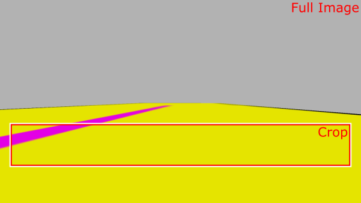
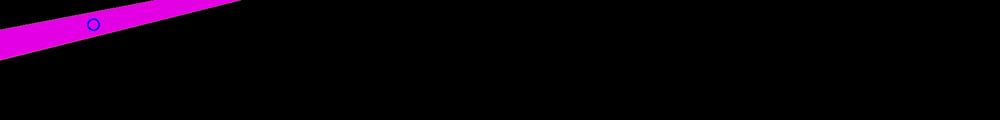

# Part 6 Line Following (Setup)

Use this code as a starting point for Part A of the Line Following exercise.

```py title="line_follower.py"
--8<-- "code_templates/line_follower.py"
```

1. **Image Cropping** 

    Apply some cropping to the raw camera image (`cv_img`). 
    
    Crop it to around 1/5 of its original **height**, and to a **width** so that the pink line is just visible at the edge of the image. 

    Call your new cropped image something like `cropped_img`. You could then use the `cv2.imshow()` method to display this in an additional pop-up window when the node is run: 
    
    ```python
    cv2.imshow("cropped_image", cropped_img)
    ``` 

    <figure markdown>
      
    </figure>

2. **Colour Detection**

    Filter the cropped image by selecting appropriate HSV values so that the pink line can be isolated from the rest of the image.
    
    You may need to use the `tuos_examples\image_colours.py` node again to help you identify the correct Hue and Saturation value range.

    Use `cv2.cvtColor()` to convert your `cropped_img` into an HSV colour representation:

    ```python
    hsv_img = cv2.cvtColor(cropped_img, cv2.COLOR_BGR2HSV)
    ```

    Use `cv2.inRange()` to create a mask with the HSV value range that you have determined:

    ```python
    line_mask = cv2.inRange(
        hsv_img, {lower_hsv_values}, {upper_hsv_values}
    )
    ```
    
    And then use `cv2.bitwise_and()` to create a new image with the mask applied, so that the coloured line is isolated:

    ```python
    line_isolated = cv2.bitwise_and(
        cropped_img, cropped_img, mask = line_mask
    )
    ``` 

    <figure markdown>
      
    </figure>

3. **Locating the line**

    Finally, find the horizontal position of the line in the robot's viewpoint.
    
    Calculate the image moments of the pink colour blob that represents the line (`line_mask`) using the `cv2.moments()` method. Remember that it's the $c_{y}$ component that we're interested in here:
    
    $$
    c_{y}=\dfrac{M_{10}}{M_{00}}
    $$

    Ultimately, this will provide us with the feedback signal that we can use for a **proportional controller** that we will implement in the next part of the exercise.

    Once you've obtained the image moments (and `cy`), use `cv2.circle()` to mark the centroid of the line on the filtered image (`line_isolated`) with a circle. For this, you'll also need to calculate the $c_{z}$ component of the centroid:

    $$
    c_{z}=\dfrac{M_{01}}{M_{00}}
    $$

    Remember that once you've done all this you can display the filtered image of the isolated line (with the circle to denote the centroid location) using `cv2.imshow()` again:
    
    ```python
    cv2.imshow("filtered line", line_isolated)
    ```

    <figure markdown>
      
    </figure>

<p align="center">
  <a href="../../part6#ex4a_ret">&#8592; Back to Part 6 - Exercise 4 (Part A)</a>
</p>