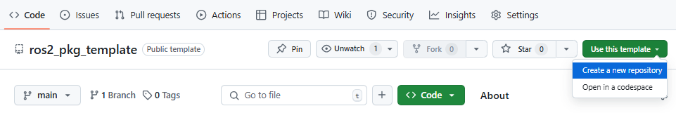
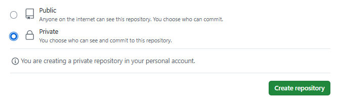
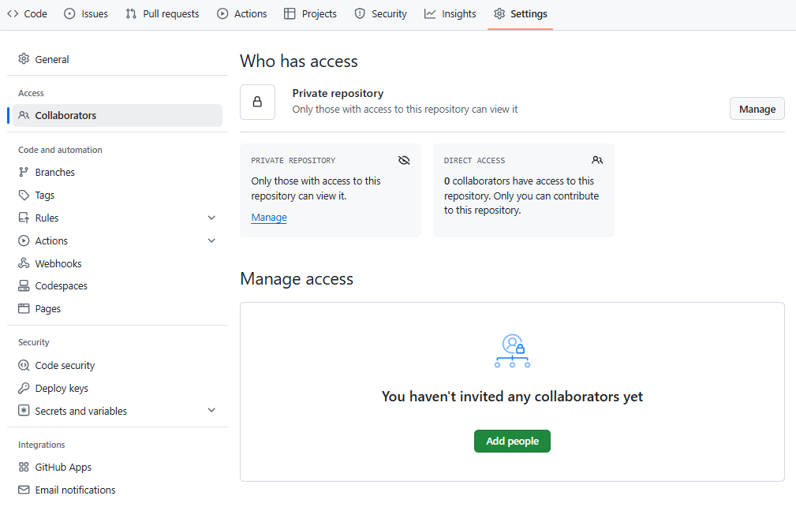
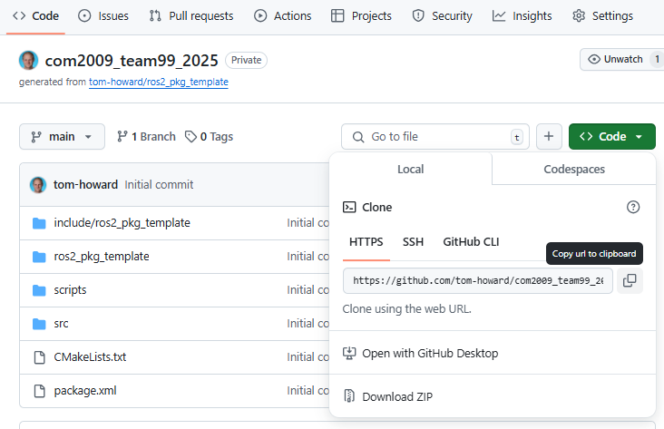

---  
title: Getting Started (Week 1)
---  

Before you get started on Assignment #2 (as detailed in the pages that follow), you should work through the following tasks in your teams during the first lab in Week 1. 

* [ ] Set Up Your Team's ROS Package
* [ ] Get to Know the Robots

The instructions below will guide you through these key first steps.

## Set Up Your Team's ROS Package

As discussed on [the Assignment #2 Overview](./README.md), everything that your team submit for this lab assignment must be contained within a single ROS package. Inside this you will develop all the necessary nodes to make a TurtleBot3 Waffle complete each of the assignment tasks, as well as some documentation to describe your approach. Each task will be assessed by the Teaching Team via *launch files* that you must also provide within your package. 

The first step however is to create your team's ROS Package.

Your team's package will need to be hosted on GitHub, so each team member will need a GitHub account. Head to [GitHub](https://github.com) and set up an account if you don't already have one. Use your Sheffield email address (ending in `@sheffield.ac.uk`) to register[^github-pro].

[^github-pro]: As a University of Sheffield student, you can apply for the [GitHub Student Developer Pack](https://education.github.com/pack), which gives you access to a range of developer tools including *GitHub Pro*. GitHub Pro allows you to have unlimited collaborators on your repositories, which might help you to collaborate on your ROS package with your team.

### Creating Your Team's Package Repo (on GitHub)

Nominate **only one member of your team** to do this bit.

1. Ensure that you are signed in to your account on GitHub, then go to [the `ros2_pkg_template` Repo](https://github.com/tom-howard/ros2_pkg_template). 
1. Click on the green `Use this template` button, and then select `Create a new repository` from the dropdown menu. 

    <figure markdown>
      {width=700px}
    </figure>

    You should then be presented with a **Create a new repository** screen.

1. In the `Repository name` box enter `com2009_teamXX_2025`, replacing `XX` with your COM2009 Assignment #2 Team Number.

    **If your team number is less than 10**: put a zero before the number, so that it's 2 digits long
    
    e.g.: `com2009_team08_2025` for **Team 8**.

1. Select the option to **make the repository private**, then click the green `Create repository` button. 

    <figure markdown>
      {width=500px}
    </figure>

1. You'll then be directed to your main repository page. From here, click on `Settings`, then under `Access` click `Collaborators`:

    <figure markdown>
      {width=700px}
    </figure>

    (You may be prompted for 2FA.)

1. In the `Manage access` area, click the green `Add people` button and add `tom-howard`: 

    <figure markdown>
      {width=150px}
    </figure>

1. Finally, click on the `Add people` button and add the rest of your team members as collaborators to this repo too.

### Register Your ROS Package URL with the Teaching Team

Having created your package, you'll need to tell us your GitHub username and the URL to your team's GitHub repository, so that we can access it and pull download your work when the submissions are due.

There is a form available on Blackboard that **you must complete** (as a team), to register your ROS package with us for Assignment #2. The team member who created the Repo (in the step above) should now head to Blackboard and fill in this form.

!!! warning
    Failure to do this (and do it properly) could result in you receiving **0 marks** for the assignment tasks!

### Initialising Your Team's ROS Package (Locally)

Nominate **only one member of your team** to do this bit too.

You should do this from within your own ROS installation (or WSL-ROS2), rather than on the robotics laptop that you will use to work with the real robots in the lab. Select a team member who has access to their own ROS installation in the lab now (i.e. via a personal laptop), or access WSL-ROS2 using one of the "WSL-ROS laptops" that are also available in the lab.

1. On GitHub, go back to your repository's main page by clicking the `<> Code` tab at the top-left.

1. Click the green `Code` button and then, from the dropdown menu, click the :material-clipboard-outline: button to copy the remote **HTTPS** URL of your repo. 

    <figure markdown>
      {width=600px}
    </figure>

1. From your local ROS installation, open a terminal instance and navigate to the `src` directory of the ROS Workspace:

    ```bash
    cd ~/ros2_ws/src
    ```

1. Clone your repo here using the remote HTTPS URL:

    ```bash
    git clone REMOTE_HTTPS_URL
    ```

1. Navigate into the package directory using the `cd` command:

    ```bash
    cd com2009_teamXX_2025
    ```
    
    (...replacing `XX` with your COM2009 Assignment #2 Team Number.)

1. Then, run an initialisation script to configure your ROS package appropriately:

    ```bash
    ./init_pkg.sh
    ``` 

### Configure Git {#git}

Next, you'll need to make sure Git is configured properly in your local ROS installation before you do anything else.

1. From the same terminal instance as above run the following commands to update your personal details in the global Git config file on your machine:

    ``` { .bash .no-copy }
    git config --global user.name "your_name"
    ```
    ...replacing `your_name` with your actual name! E.g.: `#!bash git config --global user.name "John Smith"`
    
    ``` { .bash .no-copy }
    git config --global user.email "your_email_address"
    ```
    ...replacing `your_email_address` with your actual email address!

2. If you're working in WSL-ROS2 on a University machine, don't forget to run `wsl_ros backup` to save these changes to your external WSL-ROS2 backup file, so that they will always be restored whenever you run `wsl_ros restore` in a fresh WSL-ROS2 instance on another machine. 

    !!! note
        **All team members will actually need to do this bit before interacting with Git!**

        Regardless of which team member is setting up your team's ROS package to begin with, you'll **all** need to interact with Git for this assignment, and you should therefore *each* set up your own individual Git configurations (via the steps above) before working individually on your team's ROS package.

### Push Your Local ROS Package Back to GitHub {#git-push}

Again, **only one member of your team** needs to do this bit.

Having initialised your team's ROS package, it's now ready for you to start populating with code for the Assignment #2 Tasks! The first step though is to push the changes made in the initialisation step (above) back to GitHub, so that everyone in your team is working from the right starting point. 

1. From the same terminal as above, use the `git status` command to show you all the changes that have been made to the repo in the initialisation process:

    ```bash
    git status
    ```

1. Use `git add` to *stage* all these changes for an initial commit:

    ```bash
    git add .
    ```

    !!! warning
        Don't forget the `.` at the end there!

1. Then commit them:

    ```bash
    git commit -m "ROS package initialisations complete."
    ```

1. Finally, *push* the local changes back up the "remote" repository on GitHub:

    ```bash
    git push origin main
    ```

    You'll then be asked to enter your GitHub username, followed by a password. **This password is not your GitHub account password**!  

    !!! warning
        **Your GitHub account password won't work here!** You'll need to [generate a personal access token (classic)](https://docs.github.com/en/authentication/keeping-your-account-and-data-secure/creating-a-personal-access-token#creating-a-personal-access-token-classic) and use this instead!

1. All team members should then be able to pull the remote repo into their own ROS Workspaces (`#!bash cd ~/ros2_ws/src/ && git clone REMOTE_HTTPS_URL`), make contributions and push these back to the remote repo as required (using their own GitHub account credentials and personal access tokens).

You'll need to copy your ROS package onto the Robot Laptops when working on the Real-Robot based tasks, which we'll cover in more detail later. 

## Getting to Know the Real Robots

Assignment #2 involves extensive work with our real robots, and you'll therefore have access to the robots for every lab session so that you can work on these tasks as you wish. All the details on how the robots work, how to get them up and running and start programming them can be found in the "Waffles" section of this course site. You should proceed now as follows (**in your teams**):

1. Everyone **must** complete a health and safety quiz (on Blackboard) before you (or your team) work with the real robots for the first time. Head to Blackboard and do this now, if you haven't already.
1. Each team has been assigned a specific robot (there's a list on Blackboard). When you're ready, speak to a member of the teaching team who will provide you with the robot that has been assigned to you.
1. Work through each page of [the "Waffles" section of this site](../../waffles/README.md) (**in order**):
   
    * [ ] Read about [the hardware](../../waffles/intro.md).
    * [ ] Learn how to [launch ROS and get the robots up and running](../../waffles/launching-ros.md).
    * [ ] Work through the [Waffle (& ROS) Basics](../../waffles/basics.md), which will help to get you started and understand how ROS and the robots work.
    * [ ] There is also some [Essential Information](../../waffles/key-info.md) that you must all be aware of when working with the real robots. Work through the further exercises on this page now.

    * [ ] Finally, review the [Shutdown Procedures](../../waffles/shutdown.md) and follow the steps here to shut down the robot and power off the robotics laptop at the end of each lab session.
    