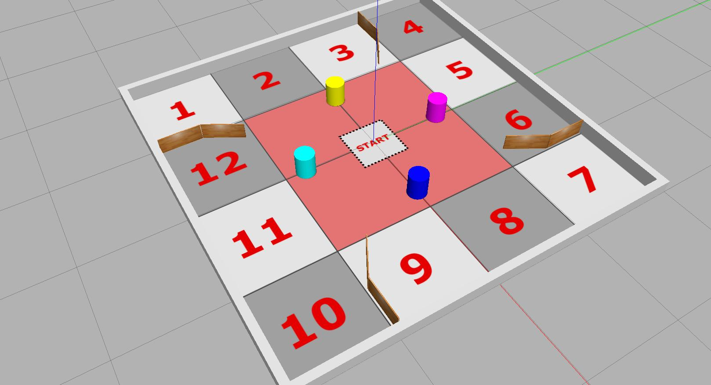

---  
title: "Task 2: Avoiding Obstacles" 
---  

Develop the ROS node(s) to allow a TurtleBot3 Waffle to autonomously explore an environment containing various obstacles. The robot must explore as much of the environment as possible in 90 seconds without crashing into anything!

!!! success "Course Checkpoints"
    
    You should aim to have completed the following *additional* parts of the COM2009 ROS Course to support your work on this task: 

    * **Assignment #1**: Up to and including [Part 5](../../assignment1/part5.md) (in full).
    * **Real Waffle Essentials**:
        * [Exercise 1 (Publishing Velocity Commands)](../../../waffles/essentials.md#ex1),
        * [Exercise 2 (Out of Range LiDAR Data)](../../../waffles/essentials.md#ex2).

## Summary

Assignment #1 Part 3 introduces [the Waffle's LiDAR sensor](../../assignment1/part3.md#lidar). This sensor is very useful, as it tells us the distance to any objects that are present in the robot's environment. In [Assignment #1 Part 5](../../assignment1/part5.md#explore) we look at how this data, in combination with the *ROS Action framework*, can be used as the basis for a basic exploration strategy that would incorporate obstacle avoidance. Building on this in [Part 5 Exercise 6](../../assignment1/part5.md#ex6), we discuss how this could be developed further by developing an action *client* that could make successive calls to the action server to keep the robot moving randomly, and indefinitely, around an arena whilst avoiding obstacles.

This is one approach that you could use for this task, but there are other (and potentially simpler) ways that this could be achieved too. 

In COM2009 Lecture 3 ("Sensing, Actuation & Control"), for instance, you are introduced to *Cybernetic Control Principles* and some of *Braitenberg's "Vehicles,"* which are discussed and implemented on a Lego robot during the lecture! In particular, *"Vehicle 3b"* might well be relevant to consider as a simple method to achieve an obstacle avoidance behaviour.

Another aspect of this task is *exploration*: your robot will be awarded more marks for navigating around more of the environment. Consider the search strategies that are discussed in Lecture 8 ("Local Guidance Strategies"), such as *"Brownian Motion"* and *"Levy Walks."* Could something along these lines be implemented on the 
Waffle?

## Details

The environment that your robot will need to explore for this will (again) be the Diamond Computer Room 5 Robot Arena, which is a square arena of 4x4m. For the task, the arena will contain a number of *"obstacles,"* i.e.: short wooden walls and coloured cylinders. Your robot will need to be able to detect these obstacles and navigate around them in order to fully explore the space.

1. The robot will start in the centre of the arena, perpendicular to one of the four *outer* arena walls.
1. It must explore the environment for 90 seconds without touching **any** of the arena walls or the obstacles within it.

    **Note**: *The 90-second timer will start as soon as the robot starts moving within the arena.*

1. If the robot makes contact with **anything** before the time has elapsed then the attempt is over, and this time will be recorded to determine the *"Run Time"* mark ([see below](#run-time)).
1. The arena floor will be divided into 16 equal-sized zones and the robot must enter as many of the **outer 12 zones** as possible during the attempt.
1. The robot must be moving for the entire duration of the task. Simply just turning on the spot for the whole time doesn't count!

    * What we want to see here is that the robot is constantly making an effort to explore.
    * It is however OK for the robot to stop moving and turn on the spot for a few seconds whenever required though.
    * If the robot explores for a while and then stops and doesn't move again for the remainder of the 90-second run, then *Run Time* marks will be awarded up to the point at which the robot ceased to be active.
    * Further details on the eligibility for *Run Time* marks are provided in [the Marking Section below](#marking).

## Executing Your Code {#launch}

The ROS package that you submit must contain a launch file called `task2.launch.py`, such that the functionality that you develop for Task 2 can be launched from your package via the command:

```bash
ros2 launch com2009_teamXX_2025 task2.launch.py
```

... where `XX` will be replaced with *your team number*.

!!! note
    ROS will already be running on the robot before we attempt to execute your launch file, and [a bridge between the robot and laptop will have already been established](../../../waffles/launching-ros.md#step-4-robot-laptop-bridging).

## Simulation Resources

Within the `com2009_simulations` package there is an example arena which can be used to develop and test out your team's obstacle avoidance node(s) for this task.

!!! info 
    Make sure you [check for updates to the Course Repo](../../extras/course-repo.md#updating) to ensure that you have the most up-to-date version of these simulations.

The simulation can be launched using the following `ros2 launch` command:

```bash
ros2 launch com2009_simulations task2.launch.py
```

<a name="avoid_arena"></a>

<figure markdown>
  
  <figcaption>The Obstacle Avoidance development arena.</figcaption>
</figure>

This is an *example* of what the real-world environment *might* look like. **ALL** objects (i.e. the four coloured cylinders and the four inner wooden wall assemblies) could be in *different positions entirely*. The wooden walls *may not be touching the outer edges of the arena*! The only things that will remain the same are the arena size, the location of the outer arena walls and the floor layout (i.e. the location of the exploration zones).

## Marking

There are **20 marks** available for Task 2 in total, awarded as follows:

<center>

| Criteria | Marks | Details |
| :--- | :---: | :--- |
| **A**: Run Time | 8/20 | You will be awarded marks for the amount of time that your robot spends exploring the environment before 90 seconds has elapsed, **or** the robot makes contact with anything in its environment ([as per the table below](#run-time)). **The robot must leave the central red zone** (a 1x1m area) in order to be eligible for any of these marks. If the robot does not explore beyond **the central orange zone** then a $0.5\times$ multiplication factor will be applied to the run time marks. |
| **B**: Exploration | 12/20 | You will be awarded 1 mark for each of the outer 12 arena zones that the robot manages to enter (i.e. excluding the four zones in the middle). The robot only needs to enter each of the 12 zones once, but its full body must be inside the zone marking to be awarded the mark. |

</center>

### Criterion A: Run Time {#run-time}

**Marks:** 8/20

Marks will be awarded as follows:

<center>

| Time (Seconds) | Marks |
| :---: | :---: |
| 0-9 | 0 |
| 10-19 | 1 |
| 20-29 | 2 |
| 30-39 | 3 |
| 40-49 | 4 |
| 50-59 | 5 |
| 60-89 | 6 |
| The full 90! | 8 |

</center>