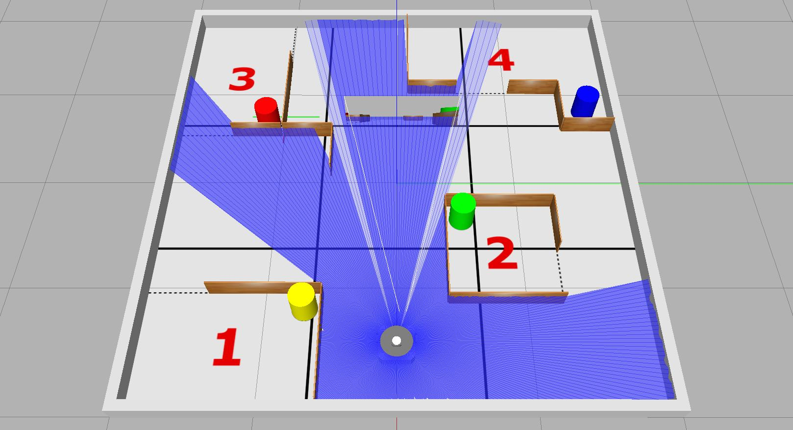
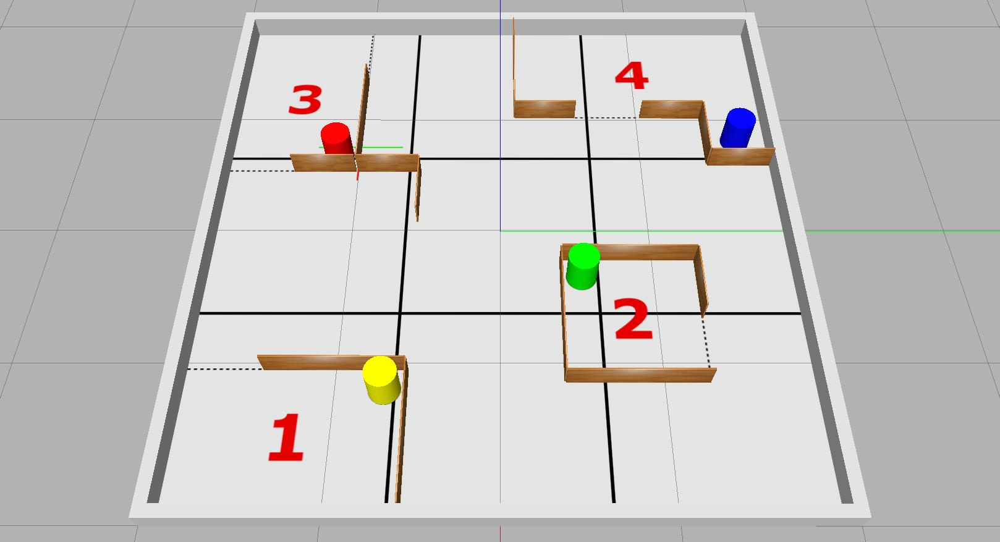

---  
title: "Task 3: Exploration & Search"  
---  

Develop the ROS node(s) to allow a TurtleBot3 Waffle to autonomously explore the full Computer Room 5 robot arena, navigating through a series of rooms as quickly as possible whilst documenting its exploration with a photo of a beacon and a map of the environment as it goes! 

!!! success "Course Checkpoints"
    
    You should aim to have completed the following *additional* parts of the COM2009 ROS Course to support your work on this task: 

    * **Assignment #1**: [All of it](../../assignment1/README.md), *in full!*
    * **Real Waffle Essentials**: [Exercises 1-5](../../../waffles/essentials.md) (i.e. *all of them!*)

## Summary

For this task the robot arena will contain a series of "rooms" each with a coloured, cylindrical beacon in it. The main aim is to *safely* explore each of the rooms in the shortest time possible (emphasis on *"safely"* here, meaning you need to also try not to crash into anything in the process!) At the same time, you'll need to search for a beacon of a particular colour as well as documenting your exploration by building a map of the environment (with SLAM).

## Simulation Resources

As with Tasks 1 & 2, there's a simulation to help you develop your code for this task outside the lab sessions. This also helps to illustrate the nature of the task.

!!! warning "Remember"
    Just because it works in simulation **^^DOESN'T^^** mean it will work in the real world!

    ... Make sure you **test things out thoroughly** during the lab sessions!

You can launch the simulation from the `com2009_simulations` package with the following `ros2 launch` command:

=== "With Robot"

    ```bash
    ros2 launch com2009_simulations task3.launch.py
    ```

    <figure markdown>
      {width=700px}
    </figure>

=== "Without Robot"

    ```bash
    ros2 launch com2009_simulations task3.launch.py with_robot:=false
    ```

    <figure markdown>
      {width=700px}
    </figure>

Make sure you [check for updates to the course repo](../../extras/course-repo.md#updating) to ensure that you have the most up-to-date version of this.

Once again, this is just an *example* of what the real-world environment *could* look like:

* Like the simulation, "rooms" will be constructed of wooden walls 180 mm tall, 10 mm thick and either 440 mm or 880 mm in length
* Each room will contain a cylindrical beacon of 200 mm diameter and 250 mm height
* Rooms will be different shapes and sizes and in different locations (but there will always be four of them)
* The robot might not necessarily be located at the same starting point as in the simulation, it could start *anywhere* in the arena
* Beacons will be the same shape, size and colour as those in the simulation (yellow, red, green and blue). 
    
    **But**: detecting colours is a lot harder in the real-world than it is in simulation, so you'll need to do a lot of testing on a real robot if you want to get this working robustly (you will have access to all the beacons during the lab sessions).

## Details

1. The robot will have **3 minutes (180 seconds) in total** to complete this task. The timer will start as soon as the robot starts moving within the arena.
1. The arena floor will be marked out into **9 equal-sized zones**. You will be awarded marks for each of the zones that the robot enters within the time available (excluding the one it starts in).
1. In addition to this, the robot will need to try to explore the **four rooms** that will also be present in the arena. There will be marks available not only for the *number* of rooms that the robot manages to explore, but also the *speed* at which it manages to explore them all (see [the marking section below](#marking) for more details).
1. Your robot will need to do this whilst avoiding contact with *anything* in the environment. 
    
    Any contact with the environment is referred to as an *"incident."* Once an incident has taken place, we'll move the robot away slightly so that it is free to move again, but after **five** incidents have occurred the assessment will be stopped.

Having developed the core functionality for the task, you'll then need to think about a couple of more **advanced features**...

### Advanced Feature 1: A photo of a beacon

As with the previous 2 tasks, we will launch the ROS node(s) from within your package for this task using `ros2 launch` ([as discussed below](#launch)). For this one however, we will *also* attempt to supply an additional argument when we make the command-line call:

``` { .bash .no-copy }
ros2 launch com2009_teamXX_2025 task3.launch.py target_colour:=COLOUR
```

...where `COLOUR` will be replaced with either `yellow`, `red`, `green` or `blue` (the target colour will be selected randomly). Based on this input, your robot will need to capture an image of the beacon in the arena of the same colour!

!!! warning 
    * You should know from [Essential Exercise 3](../../../waffles/essentials.md#ex3) that the camera image topic name is different on the real robot!
    * You should also consider the fact that [images are captured at a different resolution](../../../waffles/essentials.md#ex4): consider how this might impact any image processing that you do. 

At the root of your package there must be a directory called `snaps`, and the image must be saved into this directory with the file name: `target_beacon.jpg`. The image *that is saved* must be the *raw image* from the robot's camera, and should not include any filtering that you may have applied in post-processing.  

You will therefore need to define your launch file to accommodate the `target_colour` command-line argument. In addition to this, inside your launch file you'll *also* need to pass the *value* of this to a ROS node within your package, so that the node knows which beacon to actually look for (i.e. your node needs to know whether to look for a yellow, red, green or blue beacon). This kind of launch file functionality wasn't covered in Assignment #1, so **[there are some ^^additional resources^^ available here](../../extras/launch-file-args.md)**, to help you with this.

<a name="args_test"></a>

We will test whether your launch file has been correctly built to accept the `target_colour` command-line argument using the `-s` option with `ros2 launch`, which provides a list of all arguments that may be given to the launch file: 

``` { .bash .no-copy }
ros2 launch com2009_teamXX_2025 task3.launch.py -s
```

Having built your `task3.launch.py` file correctly, the `target_colour` argument should be listed in the output of the above command, e.g.:

``` { .txt .no-copy }
$ ros2 launch com2009_teamXX_2025 task3.launch.py -s
Arguments (pass arguments as '<name>:=<value>'):

    'target_colour':
        The colour of the beacon to search for (yellow|red|green|blue). 

```

<a name="arg_parsing"></a>

To illustrate that the value of the `target_colour` command-line argument has been correctly passed to a ROS Node within your package, you should configure your Node (or any one of your nodes, if you have multiple) to print a message to the terminal as soon as your launch file is called. 

The message should be formatted *exactly* as follows:

```txt
TARGET BEACON: Searching for COLOUR.
```

...where `COLOUR` must be replaced with the actual colour that was passed to your `task3.launch.py` file (either `yellow`, `red`, `green` or `blue`). You should use a `#!py get_logger().info()` method call to print this terminal message.

### Advanced Feature 2: Mapping with SLAM

Marks are also available if, whilst your robot is completing this task, you can use SLAM to generate a map of the environment in the background.

In [Part 3 of Assignment #1](../../assignment1/part3.md#ex5) we launched SLAM using the following `ros2 launch` command:

``` { .bash .no-copy }
ros2 launch tuos_simulations cartographer.launch.py
```

!!! danger "Note"
    When using Cartographer with the *real* robots, you'll need to set `use_sim_time` to `false`:

    ```txt
    ros2 launch tuos_simulations cartographer.launch.py use_sim_time:=false
    ``` 

    [See here for how to do this within a launch file](../../extras/launch-file-args.md#passing-launch-arguments).

[Also in Part 3](../../assignment1/part3.md#ex2) we discussed how to use launch files to launch *other* launch files! Consider how you could take a similar approach to run SLAM from your `task3.launch.py` file.

When it comes to saving the map that has been generated by SLAM, recall how we did this from the command-line in Part 3 Exercise 5, using the following command: 

``` { .bash .no-copy }
ros2 run nav2_map_server map_saver_cli -f MAP_NAME
```

It is also possible however to do this *programmatically* using the ROS 2 Service framework. Consider [Assignment #1 Part 4 Exercise 6](../../assignment1/part4.md#ex6) for how this could be done from within your Task 3 application.

The root of your package directory must contain a directory called `maps`, and the map file that you obtain must be saved into this directory with the name: `arena_map.png`.

## Executing Your Code {#launch}

Your team's ROS package must contain a launch file named `task3.launch.py`, such that (for the assessment) we are able to launch all the nodes that you have developed for this task via the following command:
  
```bash
ros2 launch com2009_teamXX_2025 task3.launch.py target_colour:=COLOUR
```
... where `XX` will be replaced with your team number and `COLOUR` will be replaced with either `yellow`, `red`, `green` or `blue`.

!!! note
    ROS will already be running on the robot before we attempt to execute your launch file, and [a bridge between the robot and laptop will have already been established](../../../waffles/launching-ros.md#step-4-robot-laptop-bridging).

## Marking

There are **40 marks** available for this task in total, awarded based on the criteria outlined below.

<center>

| Criteria | Marks | Details |
| :--- | :---: | :--- |
| **A**: *Arena* exploration | 8/40 | For this task, the arena will be divided into **nine** equal-sized zones. You will be awarded 1 mark for each zone that your robot manages to enter, excluding the one it starts within. The robot only needs to enter each zone once, but its full body must be inside the zone marking to be awarded the associated mark. |
| **B**: *Room* exploration | 12/40 | Marks will be awarded based on the maximum number of rooms that your robot manages to explore within the 180-second time limit **and** the speed by which it does this. [The marking details are outlined here](#room-explore). |
| **C**: An *'incident-free run'* | 5/40 | If your robot completes the task (or the 180 seconds elapses) without it making contact with anything in the arena then you will be awarded full marks here for an *incident-free-run!* You will however be deducted 1 mark per unique "incident" that occurs during the assessment. Your robot must *at least* leave the zone that it starts in to be eligible for these marks and once five incidents have been recorded in total then the assessment will be stopped. |
| **D1**: A Photo of a Beacon | 10/40 | [Further details below](#crit-d1). |
| **D2**: Mapping with SLAM | 5/40 | [Further details below](#crit-d2). | 

</center>

### Criterion B: *Room* exploration {#room-explore}

The marks available per room explored will be awarded as follows:

<center>

| Time (seconds) | 1 room | 2 rooms | 3 rooms | 4 rooms |
|  :---:  | :---: | :---: | :---: | :---: |
| 150-180 |  1.0  |  4.0  |  7.0  |  12.0 |
| 120-149 |  1.5  |  4.5  |  7.5  |  12.0 |
|  90-129 |  2.0  |  5.0  |  8.0  |  12.0 |
|   60-89 |  2.5  |  5.5  |  9.0  |  12.0 |
|     <60 |  3.0  |  6.0  |  9.0  |  12.0 |

</center>

*The 180-second timer starts as soon as the robot starts moving within the arena*.

### Criterion D1: A Photo of a Beacon {#crit-d1}

<center>

| Criteria | Details | Marks|
| :--- | :--- | :--- |
| **D1.a** | Your `task3.launch.py` file has been built to accept `target_colour` argument (assessed by [running `ros2 launch -s` on your launch file](#args_test)) **and** a message is printed to the terminal (using a `#!py get_logger().info()` method call) to indicate that the **correct** target colour has been passed to a node in your package (this must occur straight away on executing your launch file and [the message format must be exactly as specified here](#arg_parsing)). | 2 |
| **D1.b** | At the end of the assessment a **single** image file, called `target_beacon.jpg`, has been obtained from the robot's camera (during the course of the assessment), and this is located in a folder called `snaps` at the root of your package directory i.e.: `com2009_teamXX_2025/snaps/target_beacon.jpg`. | 2 | 
| **D1.c** | Your `com2009_teamXX_2025/snaps/target_beacon.jpg` image file contains **any part** of the **correct** beacon. | 3 |
| **D1.d** | Your `com2009_teamXX_2025/snaps/target_beacon.jpg` image file has captured the **full width** of the correct beacon. | 3 |

</center>

### Criterion D2: Mapping with SLAM {#crit-d2}  

<center>

| Criteria | Details | Marks|
| :--- | :--- | :--- |
| **D2.a** | By the end of the assessment a map of the robot arena (or any part of it) must have been generated. Two files should exist: a `.png` and a `.yaml`, both of which must be called `arena_map`, and both must be located in a `maps` folder at the root of your package directory i.e. `com2009_teamXX_2025/maps/arena_map.png` and `com2009_teamXX_2025/maps/arena_map.yaml`. | 2 |
| **D2.b** | Your `com2009_teamXX_2025/maps/arena_map.png` file that is created *during the assessment* is a map that depicts **at least one** of the rooms of the arena, **in full**. | 3 |   

</center>
