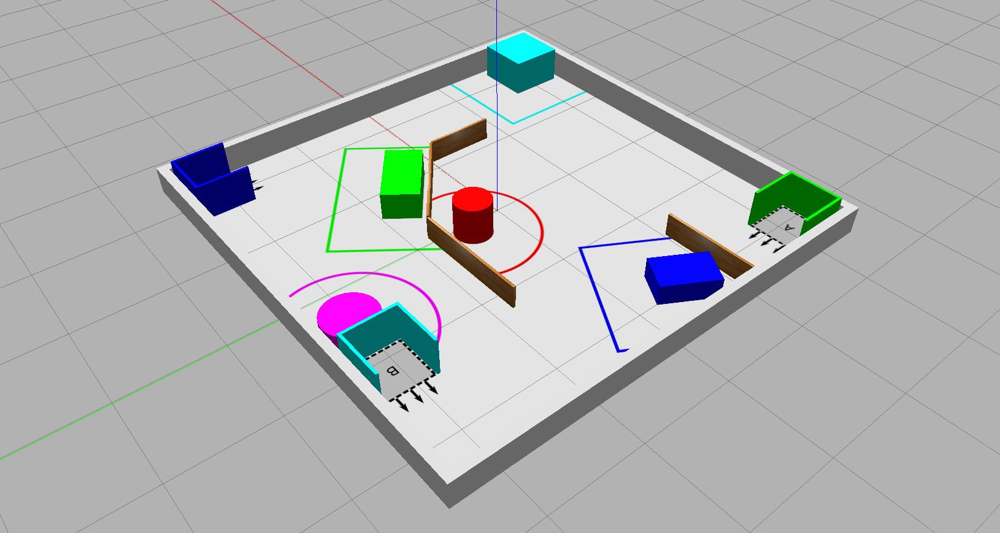

---  
title: "Assignment #3 (COM3009 only)"  
description: "In Simulation, program a Waffle to search an environment, detect a coloured object and beacon towards it."
---  

Develop ROS node(s) that enable a TurtleBot3 Waffle to search an environment, detect a coloured object and beacon towards it, stopping in proximity without crashing into it!

This is an **individual** assignment, which will be assessed **in simulation** ^^NOT^^ on a real robot.

**Deadline**: Week 12, Friday 22:00. 

## Summary

For this task your robot will be placed in a *"Search Arena"* containing a number of different coloured objects (*"beacons"*). Building on the exploration behaviours that you will have developed in your team for the Assignment #2 Tasks, the robot will need to search the arena for a beacon of a particular *"Target Colour"* (each beacon in the arena will have a unique colour). The arena will contain three *"Start Zones"* (also uniquely coloured) and your robot will be located in one of these three zones to begin with (selected at random). The colour of the Start Zone indicates the Target Colour for the search task (the colour of the beacon that the robot needs to find). Once the target object has been detected, the robot will need to move towards it (i.e. *"beaconing"*) and stop within a *"Stop Zone"* printed on the floor surrounding it. The robot must stop in the Stop Zone without touching the beacon!

The first thing that your robot will need to do in this task is detect the colour of the zone that it starts in. You learnt about colour-based object detection in [Part 6 of Assignment #1](./assignment1/part6.md#ex2), where we used OpenCV to analyse the images published to the `/camera/image_raw` topic. Use what you did here, as well as the further work that we did in [Part 6 Exercise 3](./assignment1/part6.md#ex3), as a starting point for achieving the desired behaviour for this initial part of the task. Note that in the Part 6 exercises you developed algorithms to detect an object of a certain colour, but here you need to work the other way around and actually establish the colour of the object instead, so you will have to reverse the logic a bit. 

You'll then need to explore the arena for the target object. Remember that both the start zone and the target object will share the same colour, so take care not to detect the start zone as the beacon! Odometry might be useful here to inform your robot of where it started from so that it knows to rule out anything in that vicinity as a potential target. 

Having located the target object within the environment your robot will then need to move towards it and stop within the allocated stop zone. This technique is known as *Beaconing*, and some strategies for this are discussed in COM2009/3009 Lecture 8. Perhaps you could consider an implementation of Braitenberg's Vehicle 3a as a way to control your robot's trajectory and approach to the target object?

The concept of *Visual Homing* (also discussed in COM2009/3009 Lecture 8) might also be worth considering as a method to control the position and trajectory of a robot based on images from its camera. Distance measurements from the LiDAR sensor might also be helpful for this.

## Creating a Package

You'll need to create your own individual ROS package for this assignment. This is *an individual assignment*, and is entirely separate from the Assignment #2 team project, so you must create your own individual ROS package repo for this. Follow the steps below to do so:

### Creating Your Individual Package Repo (on GitHub)

1. Ensure that you are signed in to your GitHub account, then go to [the `ros2_pkg_template` Repo](https://github.com/tom-howard/ros2_pkg_template){target="_blank"}. 
1. Click on the green `Use this template` button, and then select `Create a new repository` from the dropdown menu. 

    <figure markdown>
      {width=700px}
    </figure>

    You should then be presented with a **Create a new repository** screen.

1. Enter a name for your repository in the `Repository name` box. This name **must** be formatted as follows:

    ``` { .txt .no-copy }
    com3009_xxxxxx_2025
    ```

    ... where `xxxxxx` should be replaced with your **Sheffield University Username**.

    !!! warning "Important"
        All characters should be **lower case** (e.g. `com3009`, **NOT** `COM3009`)


1. Select `Private` to **make the repository private**, then click the green `Create repository` button. 

1. You'll then be directed to your main repository page. From here, click on `Settings`, then under `Access` click `Collaborators` (you may be prompted for 2FA).

1. In the `Manage access` area, click the green `Add people` button and add `tom-howard`: 

    <figure markdown>
      {width=150px}
    </figure>

### Register Your ROS Package

Having created your package, you'll need to tell us your GitHub username, and your repo's GitHub URL. There is a form that **you must complete** in order to do this. [Access the form here](https://forms.gle/qPJjB6YhyDHW3na66){target="_blank"}. You **must** be signed in to your university email account (`...@sheffield.ac.uk`) to access this. 

### Initialising Your Package

You should do this from within your own ROS installation (or WSL-ROS2). [See here for more details on how to access a ROS environment](../ros/README.md).

1. On GitHub, go back to your repository's main page by clicking the `<> Code` tab at the top-left.

1. Click the green `Code` button and then, from the dropdown menu, click the :octicons-copy-16: button to copy the remote **HTTPS** URL of your repo. 
    
1. From your local ROS installation, open a terminal instance and navigate to the `src` directory of the ROS Workspace:

    ```bash
    cd ~/ros2_ws/src
    ```

1. Clone your repo here using the remote HTTPS URL:

    ``` { .bash .no-copy }
    git clone REMOTE_HTTPS_URL
    ```

    You'll then be asked to enter your GitHub username, followed by a password. You'll need to [generate a personal access token](https://docs.github.com/en/authentication/keeping-your-account-and-data-secure/creating-a-personal-access-token#creating-a-personal-access-token-classic){target="_blank"} and use this here (or [use SSH keys](https://docs.github.com/en/authentication/connecting-to-github-with-ssh){target="_blank"} instead).

1. Navigate into your package directory using the `cd` command:

    ```bash
    cd com3009_xxxxxx_2025
    ```
    
    ...replacing `xxxxxx` accordingly.

1. Then, run the `init_pkg.sh` script to configure your ROS package appropriately:

    ```bash
    ./init_pkg.sh
    ``` 

### Push Your Local Changes Back to GitHub {#git-push}

You'll need to make sure Git is configured properly with your name and email address in your local ROS installation before you do this. [See here for details](./assignment2/getting-started.md#git).

1. From the same terminal as above, use the `git status` command to show you all the changes that have been made to the repo in the initialisation process:

    ```bash
    git status
    ```

1. Use `git add` to *stage* all these changes for an initial commit:

    ```bash
    git add .
    ```

1. Then commit them:

    ```bash
    git commit -m "ROS package initialisations complete."
    ```

1. Finally, *push* the local changes back up the "remote" repository on GitHub:

    ```bash
    git push origin main
    ```

    You'll then be asked to enter your GitHub username and password again. (Remember that this is **not** your GitHub account password... Use the personal access token that you created earlier!)

## Details

The arena used for this task will be 5.0 m x 5.0 m and the beacons that you'll be searching for will be coloured boxes or cylinders, all between 200 mm and 400 mm in height. The *Stop Zone* surrounding each beacon will be 500 mm greater than the beacon's dimensions in the `X` and `Y` axis.

There are only **six** possible target colours that will be used in this task, so your ROS application will only need to accommodate these six. The colours are listed below, and there is also a simulation environment in the `tuos_simulations` package called `beacon_colours` to illustrate these too[^update-course-repo].

[^update-course-repo]: Make sure you have [the most up-to-date version of the Course Repo](./extras/course-repo.md#updating).

```bash
ros2 launch tuos_simulations beacon_colours.launch.py
```

<figure markdown>
  {width=600px}
  <figcaption>The range of possible beacon colours that could be used in this assignment.</figcaption>
</figure>

As for the task itself:

1. Your robot will first need to determine the *"Target Colour"* by analysing the *"Start Zone"* that it has been placed in within the simulated arena (see below).
1. The arena will contain three Start Zones, each of a different colour, and your robot could be launched into any of these (selected at random).
1. Once the colour of the start zone has been determined by the robot a ROS *log* message **must** be printed to the terminal to indicate which beacon colour will be targetted. This log message **must** be formatted *exactly* as follows:

    <a name="target_beacon"></a>

    ``` { .txt .no-copy }
    SEARCH INITIATED: The target beacon colour is {}.
    ```

    Where `{}` is replaced by the *name* of the target colour as defined in the table inset in the figure above.

    !!! note
        You must use `.get_logger().info()` method calls within your node in order to print **ALL** log messages for this assignment. 

1. The robot then needs to navigate the arena, avoiding contact with any of the objects that are located within it whilst searching for the beacon of the correct colour.
1. Once the target beacon has been detected, a message **must** be printed to the terminal to indicate that this has happened. The terminal message needs to be clearly visible and readable, and *the robot must be facing the target beacon when it is printed*. This terminal message should be formatted as follows:

    <a name="beacon_detected"></a>

    ``` { .txt .no-copy }
    TARGET DETECTED: Beaconing initiated.
    ```

    !!! note "Remember"
        Use `.get_logger().info()` method calls within your node to print this. 

1. The robot then needs to start moving towards the beacon, stopping when it is close enough to be within the stop zone surrounding it, but not close enough to actually make contact. As discussed above, the stop zone surrounding each object will be 500 mm greater than the beacon dimensions in the `X-Y` plane.
1. A further message must be printed to the terminal to indicate that the robot has successfully and *intentionally* stopped within the designated area. This terminal message should be formatted as follows:

    <a name="beaconing_complete"></a>

    ``` { .txt .no-copy }
    BEACONING COMPLETE: The robot has now stopped.
    ```

    !!! note "Remember"
        Use `.get_logger().info()`!

1. The robot will have a maximum of 90 seconds to complete this task. 

    *Timing will be determined using the "Sim Time" indicator in Gazebo*.

1. Your ROS package must contain a launch file called `assignment3.launch.py`, such that the functionality that you develop can be launched from your package via the command:

    ```bash
    ros2 launch com3009_xxxxxx_2025 assignment3.launch.py
    ```

    The robot will already have been launched into the simulated environment before we attempt to execute your launch file.

## Simulation Resources

Within the `tuos_simulations` package there is an environment called `beaconing`, which can be used to develop and test out your ROS node(s) for this task:

```bash
ros2 launch tuos_simulations beaconing.launch.py
```

The arena contains three start zones: **A**, **B** & **C**; each of a different colour, as well as a number of uniquely coloured beacons.  There is one beacon in the arena to match each of the three start zones, plus a couple more to act as decoys! 

<figure markdown>
  {width=600px}
  <figcaption>The "beaconing" arena.</figcaption>
</figure>

You can launch the robot into any of the three start zones by supplying an optional `start_zone` argument to the `beaconing.launch.py` file, as illustrated below:

```bash
ros2 launch com2009_simulations beaconing.launch.py start_zone:={}
```

...where `{}` can be replaced with either `a`, `b` or `c` to select the start zone that you want the robot to be located in when the simulation launches. You can therefore develop and test out your beaconing algorithms in three unique scenarios.

!!! note
    1. The same arena will be used to assess your submission for this assignment.
    1. The colour of the start zones and beacons will change, but the shape, size and location of all the objects will stay the same.
    1. Once again, the start zone that your robot is launched in for the assessment will be selected at random.

## Marking

There are **15 marks** available for this assignment in total, awarded based on the criteria below. No partial credit will be awarded unless specifically stated against any of the criteria.

<centre>

| Criteria | Marks | Details |
| :--- | :---: | :--- |
| **A**: Identifying the target colour | 2/15 | Whilst the robot is still located within the start zone a ROS node within your package must print a **log message** to the terminal to indicate the target colour that has been determined and that will subsequently be used to identify the target beacon. You will receive the full marks available here provided the message is presented using a `get_logger().info()` method call, **and** [formatted as specified here](#target_beacon). |
| **B**: Detecting the correct beacon | 3/15 | You will receive the full marks available here for printing a **log message** to the terminal to indicate that the target beacon has been identified within the environment. The message must again be presented using a `get_logger().info()` method call, it must be [formatted as specified here](#beacon_detected), **and** the robot must be looking directly at the beacon when this message is printed. | 
| **C**: Stopping in the correct stop zone | 5/15 | Your robot must **stop** inside the correct stop zone within the 90-second time limit **and** a **log** message must be printed to the terminal to indicate that this has been done intentionally. You will receive the full marks available here provided this is achieved successfully, and the log message (again using a `get_logger().info()` call) is [formatted as specified here](#beaconing_complete). If your robot manages to stop, but part of its body lies outside the stop zone then you will be awarded half-marks. |
| **D**: An "incident-free-run" | 5/15 | If your robot completes the task (or the 90 seconds elapses) without it making contact with anything in the arena then you will be awarded the maximum marks here. Marks will be deducted for any contact made, to a minimum of 0 (i.e. no negative marking). Your robot must be moving within the arena continually to be eligible for these marks though, simply turning on the spot for 90 seconds is not enough! |

</center>

## Submission

Your work will be pulled from GitHub on the deadline listed above, so it's important that you register your ROS package with us ([via the form above](#register-your-ros-package)) so that we can access this.

Your work must be located on the `main` branch of your package repo.