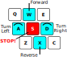
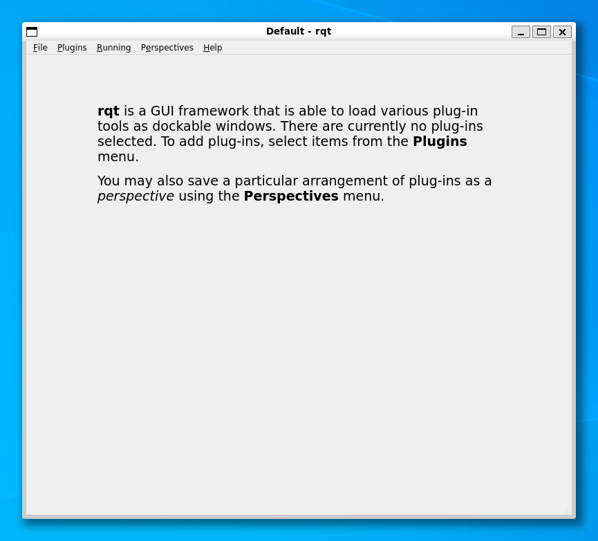
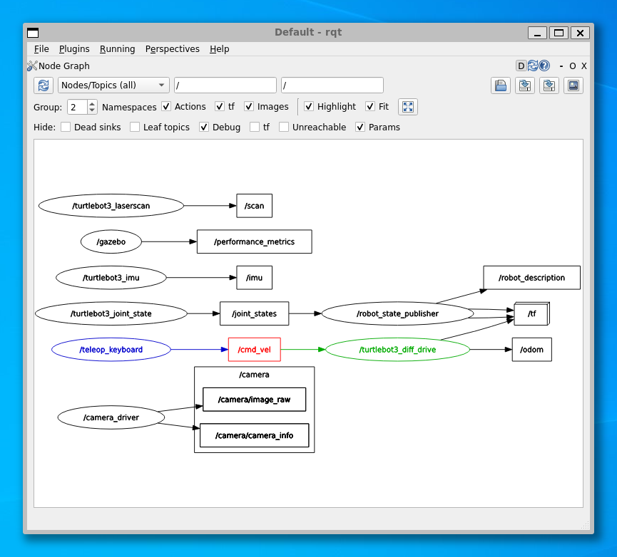

## Introduction

:material-pen: **Exercises**: 8  
:material-timer: **Estimated Completion Time**: 2 hours

### Aims

In the first part of this lab course you will learn the basics of ROS and become familiar with some key tools and principles of the framework which will allow you to program robots and work with ROS applications effectively.  For the most part, you will interact with ROS using the *Linux command line* and so you will also become familiar with some key Linux command line tools that will help you.  Finally, you will learn how to create some basic ROS Nodes using Python and get a taste of how ROS topics and messages work.

### Intended Learning Outcomes

By the end of this session you will be able to:  

1. Control a TurtleBot3 Robot, in simulation, using ROS.
1. Launch ROS applications using `ros2 launch` and `ros2 run`.
1. Interrogate running ROS applications using key ROS command line tools.
1. Create a ROS package comprised of multiple nodes and program these nodes (in Python) to communicate with one another using ROS Communication Methods.
1. Create a custom ROS message interface and create Python Nodes to use this.
1. Navigate a Linux filesystem and learn how to do various filesystem operations from within a Linux Terminal.

### Quick Links

#### Exercises

* [Exercise 1: Launching a simulation and making a robot move](#ex1)
* [Exercise 2: Visualising the ROS Network](#ex2)
* [Exercise 3: Exploring ROS Topics and Messages](#ex3)
* [Exercise 4: Creating your own ROS Package](#ex4)
* [Exercise 5: Creating a publisher node](#ex5)
* [Exercise 6: Creating a subscriber node](#ex6)
* [Exercise 7: Defining our own message](#ex7)
* [Exercise 8: Using a custom ROS Message](#ex8)

#### Additional Resources

* [A Simple Python Publisher](./part1/publisher.md)
* [A Simple Python Subscriber](./part1/subscriber.md)

## First Steps

**Step 1: Accessing a ROS2 Environment for this Course**

If you haven't done so already, see here for all the details on [how to install or access a ROS environment for this course (TODO)]().

**Step 2: Launch ROS**

Launch your ROS environment.

1. OPTION 1
1. OPTION 2
1. etc...

Either way, you should now have access to ROS via a Linux terminal instance, and we'll refer to this terminal instance as **TERMINAL 1**.

**Step 3: Download The Course Repo**

<a name="course-repo"></a>

We've put together a few ROS packages specifically for this course. These all live within [this GitHub repo](https://github.com/tom-howard/tuos_ros), and you'll need to download and install this into your ROS environment now, before going any further.

[TODO: Create a ROS2 Workspace first??]

1. In **TERMINAL 1**, Navigate into the *"ROS2 Workspace"* using the `cd` command[^ros2_ws]:

    [^ros2_ws]: What is a ROS2 Workspace? [You can find out more here](https://docs.ros.org/en/humble/Tutorials/Beginner-Client-Libraries/Creating-A-Workspace/Creating-A-Workspace.html#background). 

    ```bash
    cd ~/ros2_ws/src/
    ```

1. Then, run the following command to clone the Course Repo from GitHub:

    ***
    **TERMINAL 1:**
    ```bash
    git clone https://github.com/tom-howard/tuos_ros.git -b humble
    ```
    ***

1. Once this is done, you'll need to build this using a tool called *"Colcon"*[^colcon]:

    [^colcon]: What is **Colcon**? [Find out more here](https://docs.ros.org/en/humble/Tutorials/Beginner-Client-Libraries/Colcon-Tutorial.html#background).

    ***
    **TERMINAL 1:**
    ```bash
    cd ~/ros2_ws/ && colcon build --packages-up-to tuos_ros && source ~/.bashrc
    ```
    ***

Don't worry too much about what you just did, for now. We'll cover this in more detail throughout the course. That's it for now though, we'll start using some of the packages that we've just installed a bit later on.

#### :material-pen: Exercise 1: Launching a simulation and making a robot move {#ex1}

Now that you're all up and running, let's launch ROS and fire up a simulation of our TurtleBot3 Waffle robot... 

1. In the terminal enter the following command to launch a simulation of a TurtleBot3 Waffle in an *empty world*:  
        
    ***
    **TERMINAL 1:** 
    ```bash
    ros2 launch turtlebot3_gazebo empty_world.launch.py
    ```    
    ***

1. A *Gazebo simulation* window should open and within this you should see a basic representation of [the robot's that you'll work with in the lab (TODO)]():

[FIGURE]
    <!-- <figure markdown>
      {width=800}
    </figure> -->

1. With the Gazebo simulation up and running, return to your terminal and open up a *second* terminal instance (**TERMINAL 2**)

    [TODO: use tmux??]
    
1. In this new terminal instance enter the following command:<a name="teleop"></a>

    ***
    **TERMINAL 2:**
    ```bash
    ros2 run turtlebot3_teleop teleop_keyboard
    ```
    ***

1. Follow the instructions provided in the terminal to drive the robot around using specific buttons on your keyboard:

    <figure markdown>
      
    </figure>

##### Summary

You have just launched a number of different applications on a ROS Network using two different ROS commands - `ros2 launch` and `ros2 run`: 

1. `ros2 launch turtlebot3_gazebo empty_world.launch.py`
1. `ros2 run turtlebot3_teleop teleop_keyboard`

These two commands have a similar structure, but work slightly differently. 

The first command you used was a `launch` command, which has the following two parts to it (after the `launch` bit):

``` { .bash .no-copy }
ros2 launch {[1] Package name} {[2] Launch file}
```

**Part [1]** specifies the name of the *ROS package* containing the functionality that we want to execute. **Part [2]** is a file within that package that tells ROS exactly what scripts (*'nodes'*) that we want to launch. We can launch multiple nodes at the same time from a single launch file.

The second command was a `run` command, which has a structure similar to `launch`:

``` { .bash .no-copy }
ros2 run {[1] Package name} {[2] Node name}
```    

Here, **Part [1]** is the same as the `launch` command, but **Part [2]** is slightly different: `{[2] Node name}`. Here we are directly specifying a single script that we want to execute. We therefore use `ros2 run` if we only want to launch a **single node** on the ROS network: the `teleop_keyboard` node (a Python script), in this case.

## ROS Packages & Nodes

### Packages

ROS applications are organised into *packages*. Packages are basically folders containing scripts, configurations and launch files (ways to launch those scripts and configurations), all of which relate to some common robot functionality. ROS uses packages as a way to organise all the programs running on a robot. 

!!! info  
    The package system is a fundamental concept in ROS and all ROS programs are organised in this way.

You will create a number of packages throughout this course, each containing different nodes, launch files and other things too. We'll start to explore this later on in this part of the course.

### Nodes

ROS *Nodes* are executables that perform specific robot tasks and operations. Earlier on we used `ros2 run` to execute a node called `teleop_keyboard`, which allowed us to remotely control (or *"teleoperate"*) the robot, for example. 

!!! question
    What was the name of the ROS *package* that contained the `teleop_keyboard` node? (Remember: `ros2 run {[1] Package name} {[2] Node name}`)

A ROS robot might have hundreds of individual nodes running simultaneously to carry out all its necessary operations and actions. Each node runs independently, but uses *ROS communication methods* to share data with the other nodes on the ROS Network.

## The ROS Network

We can use the `ros2 node` command to view all the nodes that are currently active on a ROS Network.

#### :material-pen: Exercise 2: Visualising the ROS Network {#ex2}

You should currently have two terminal instances active: the first in which you launched the Gazebo simulation (**TERMINAL 1**) and the second with your `teleop_keyboard` node active (**TERMINAL 2**).

1. Open up a new terminal instance now (**TERMINAL 3**).
1. Use the following command to have a look at which nodes are currently active on the network:

    ***
    **TERMINAL 3:**
    ```bash
    ros2 node list
    ```
    ***

    Only a handful of nodes should be listed:

    ``` { .bash .no-copy }
    /camera_driver
    /gazebo
    /teleop_keyboard
    /turtlebot3_diff_drive
    /turtlebot3_imu
    /turtlebot3_joint_state
    /turtlebot3_laserscan
    ```

1. We can visualise the connections between the active nodes by using an application called *RQT*. RQT is a collection of graphical tools that allow us to interact with and interrogate the ROS network. Launch the main RQT application by entering `rqt` in **TERMINAL 3** (you might see some warnings in the terminal when you do this, but don't worry about them):

    ***
    **TERMINAL 3:**
    ```bash
    rqt
    ```
    ***

    A window should then open:

    <figure markdown>
      {width=600}
    </figure>

1. From here, we then want to load the *Node Graph* plugin. From the top menu select `Plugins` > `Introspection` > `Node Graph`.

1. Select `Nodes/Topics (all)` from the top-left most dropdown, and in the **`Hide`** section uncheck everything except `Debug` and `Params` (you may then need to hit the refresh button):

    <figure markdown>
      {width=600}
    </figure>

    Here, *nodes* are represented by rectangles and *topics* by ellipses (hover over a region of the graph to enable colour highlighting).

    This tool shows us that (amongst other things) the `/teleop_keyboard` and `/turtlebot3_diff_drive` nodes are communicating with one another. The direction of the arrow tells us that `/teleop_keyboard` is a *Publisher* and `/turtlebot3_diff_drive` is a *Subscriber*. The two nodes communicate via a **ROS Topic** called `/cmd_vel`. 

## Publishers and Subscribers: A *ROS Communication Method* 

ROS Topics are key to making things happen on a robot. Nodes can publish (*write*) and/or subscribe to (*read*) ROS Topics in order to share data around the ROS network. Data is published to topics using *ROS Messages*. As we've just learnt, the `teleop_keyboard` node was publishing messages to a topic (`/cmd_vel`) to make the robot move earlier.

Let's have a look at this in a bit more detail...

#### :material-pen: Exercise 3: Exploring ROS Topics and Messages {#ex3}

We can find out more about the `/cmd_vel` topic by using the `ros2 topic` command.

1. Open up yet another new terminal instance (**TERMINAL 4**) and type the following:

    ***
    **TERMINAL 4:**
    ```bash
    ros2 topic list
    ```
    ***

    This shows us all the topics that are currently available on the ROS network (a lot of which we saw in the RQT Node Graph above):

    ``` { .txt .no-copy }
    /camera/camera_info
    /camera/image_raw
    /clock
    /cmd_vel
    /imu
    /joint_states
    /odom
    /parameter_events
    /performance_metrics
    /robot_description
    /rosout
    /scan
    /tf
    /tf_static
    ```

    Let's find out a bit more about `/cmd_vel`...

1. Use the `topic info` command now:

    ***
    **TERMINAL 4:**
    ```bash
    ros2 topic info /cmd_vel
    ```
    ***
    
    This should provide the following output:
    
    ``` { .txt .no-copy }
    Type: geometry_msgs/msg/Twist
    Publisher count: 1
    Subscription count: 1
    ```

    We've now established the following information about `/cmd_vel`:
    
    1. The topic has 1 publisher *writing* data to it
    1. The topic also has 1 subscriber *reading* this data
    1. From RQT Node Graph we know that the `/teleop_keyboard` node is the publisher (i.e. the node writing data to the topic)
    1. The `/turtlebot3_diff_drive` node is receiving this data (and acting upon it). This node therefore monitors (i.e. *subscribes* to) the `/cmd_vel` topic and makes the robot move in the simulator whenever a velocity command is published.
    1. Data is transmitted on the `/cmd_vel` topic using an [Interface](https://docs.ros.org/en/humble/Concepts/Basic/About-Interfaces.html). This particular interface *type* is: `geometry_msgs/msg/Twist`. 
    
        The *type* field has three parts to it:
        
        1. `geometry_msgs`: the name of the ROS package that this interface belongs to.
        1. `msg`: that this is a *topic message* rather than another type of interface (there are *three* types of interface, and we'll learn about the other two later in this course).
        1. `Twist`: the actual message *type* (i.e., the way the data is structured)

        In summary then, we've established that if we want to make the robot move we need to publish `Twist` messages to the `/cmd_vel` topic.

1. We can use the `ros2 interface` command to provide further information about the message structure:

    ***
    **TERMINAL 4:**
    ```bash
    ros2 interface show geometry_msgs/msg/Twist
    ```
    ***

    From this, we obtain the following:

    ``` { .txt .no-copy }
    # This expresses velocity in free space broken into its linear and angular parts.

    Vector3  linear
            float64 x
            float64 y
            float64 z
    Vector3  angular
            float64 x
            float64 y
            float64 z
    ```

    We'll learn more about what this means in Part 2.

1. To finish, enter ++ctrl+c++ in each of the three terminals that should currently have ROS processes running (Terminals **1**, **2** and **3**). The associated Gazebo and RQT Node Graph windows should close as a result of this too.

!!! tip
    Whenever you need to stop any ROS process use ++ctrl+c++ in the terminal it's running in.

## Creating Your First ROS Applications

Shortly you will create some simple publisher and subscriber nodes in Python and send simple ROS messages between them. As we learnt earlier though, ROS applications must be contained within *packages*, and so we need to create a package first in order to start creating our own ROS nodes. 

It's important to work in a specific filesystem location when we create and work on our own ROS packages. These are called *"Workspaces"* and you should already have one ready to go within your local ROS environment[^workspaces]:

``` { .bash .no-copy }
~/ros2_ws/src/
```

!!! note 
    `~` is an alias for your home directory. So `cd ~/ros2_ws/src/` is the same as typing `cd /home/{your username}/ros2_ws/src/`.

!!! warning "Important"
    All new packages **must** be located in the `src` folder of the workspace!!


[^workspaces]: [You can learn more about ROS2 Workspaces here](https://docs.ros.org/en/humble/Tutorials/Beginner-Client-Libraries/Creating-A-Workspace/Creating-A-Workspace.html#background). 

#### :material-pen: Exercise 4: Creating your own ROS Package {#ex4}

The `ros2` Command Line Interface (CLI) includes a tool to create a new ROS packages: `ros2 pkg create`. This tool supports two different *"build types:"*

1. **CMake** (for packages containing nodes written in *C++*):
    
    `ros2 pkg create --build-type ament_cmake`
    
2. **Python** (for packages containing nodes written in well, er, *Python*!):
    
    `ros2 pkg create --build-type ament_python`

    Packages are structured slightly differently in each case.

You can learn more about all this from the [Official ROS2 Tutorials](https://docs.ros.org/en/humble/Tutorials/Beginner-Client-Libraries/Creating-Your-First-ROS2-Package.html) (if you're interested).

We'll be using Python throughout this course, but we'll actually take a slightly different approach to package creation that will provide us with a little more flexibility and ease of use (particularly for things we'll do later on in the Assignment #1 course and in Assignment #2). We've therefore created a helper script (inside the `tuos_ros` Course Repo) to help you create packages without using *either* of the above two commands. The approach we'll take is based on [this tutorial (courtesy of the Robotics Backend)](https://roboticsbackend.com/ros2-package-for-both-python-and-cpp-nodes/), so feel free to look at this if you'd like to find out more. Then, simply follow the steps below to create your first ROS package for this course, using the `create_pkg.sh` helper tool.

1. Navigate into the `tuos_ros` Course Repo that you downloaded earlier by using the Linux `cd` command (**c**hange **d**irectory). In **TERMINAL 1** enter the following:

    ***
    **TERMINAL 1:**
    ```bash
    cd ~/ros2_ws/src/tuos_ros/
    ```
    ***

1. Here you'll find the `create_pkg.sh` helper script. Run this now using the following command to create a new package called `part1_pubsub`:

    ***
    **TERMINAL 1:**
    ```bash
    ./create_pkg.sh part1_pubsub
    ```
    ***
    
1. Navigate into this new package directory (using `cd`):

    ***
    **TERMINAL 1:**
    ```bash
    cd ../part1_pubsub/
    ```
    ***

    !!! info
        `..` means "go back one directory," so that command above is telling `cd` to navigate *out* of the `tuos_ros` directory (and therefore back to `~/ros2_ws/src/`), and then go *into* the `part1_pubsub` directory from there.

1. `tree` is a **Linux command** which shows us the content of the current directory in a nice tree-like format. Use `tree` now to show the current content of the `part1_pubsub` directory:

    ``` { .txt .no-copy }
    ~/ros2_ws/src/part1_pubsub$ tree
    .
    ├── CMakeLists.txt
    ├── include
    │   └── part1_pubsub
    │       └── minimal_header.hpp
    ├── package.xml
    ├── part1_pubsub
    │   ├── __init__.py
    │   └── tb3_tools.py
    ├── scripts
    │   └── minimal_node.py
    └── src
        └── minimal_node.cpp

    5 directories, 7 files
    ```

    * `scripts`: is a *directory* that will contain all the Python Nodes that we'll create (you'll notice a `minimal_node.py` already exists in there).
    * `part1_pubsub`: is a *directory* that we can use to store Python *modules*, that we can then import into our main Python nodes
        
        (`#!py from part1_pubsub.tb3_tools import ...`, for example)
    
    * `package.xml` and `CMakeLists.txt`: are both *files* that define our package, and how it must be built (using `colcon build`). We'll explore these more shortly... 

#### :material-pen: Exercise 5: Creating a publisher node {#ex5}

1. From the root of your `part1_pubsub` package, navigate to the `scripts` folder using the `cd` command.
1. `touch` is a **Linux command** that we can use to create an empty file. Use this to create an empty file called `publisher.py`, which we will add content to shortly:

    ***
    **TERMINAL 1:**
    ```bash
    touch publisher.py
    ```
    ***

1. Use `ls` to verify that the file has been created, but use the `-l` option with this, so that the command provides its output in *"a long listing format"*:

    ***
    **TERMINAL 1:**
    ```bash
    ls -l
    ```
    ***

    This should output something similar to the following:

    ``` { .txt .no-copy }
    ~/ros2_ws/src/part1_pubsub/scripts$ ls -l
    total 4
    -rwxr-xr-x 1 student student 339 MMM DD HH:MM minimal_node.py
    -rw-r--r-- 1 student student   0 MMM DD HH:MM publisher.py
    ```

    This confirms that the file exists, and the `0` in the middle of the bottom line there indicates that the file is empty (i.e. its current size is 0 bytes), which is what we'd expect.

1. We therefore now need to open the file and add content to it. We'd recommend using Visual Studio Code (VS Code) as an IDE for this course, which can be launched with the following command in **TERMINAL 1**:

    ***
    **TERMINAL 1:**
    ```bash
    code ~
    ```
    ***

    [TODO: does this work for Docker??]

1. Using the VS Code File Explorer, locate the `publisher.py` file that you have just created (`ros2_ws/src/part1_pubsub/scripts/`) and click on the file to open it in the main editor. 

1. Once opened, copy [the code provided here](./part1/publisher.md) into the empty file and save it. <a name="pub_ret"></a>
    
    !!! note
        It's important that you understand how this code works, so make sure that you **read the annotations**!
    
1. Next, we need to add our `publisher.py` file as an executable to our package's `CMakeLists.txt`. This will ensure that it then gets built when we run `colcon build` (in the next step).

    In VS Code, open the `CMakeLists.txt` file that is at the root of your `part1_pubsub` package directory (`ros2_ws/src/part1_pubsub/CMakeLists.txt`). Locate the lines (near the bottom of the file) that read:

    ``` { .txt .no-copy}
    # Install Python executables
    install(PROGRAMS
      scripts/minimal_node.py
      DESTINATION lib/${PROJECT_NAME}
    )
    ```

    Replace `minimal_node.py` with `publisher.py` to define this as a Python executable in your package:

    ``` { .txt .no-copy }
    # Install Python executables
    install(PROGRAMS
      scripts/publisher.py
      DESTINATION lib/${PROJECT_NAME}
    )
    ```

1. Now, use `colcon` to build your package.
    
    1. You **MUST** run this from the **root** of your Colcon Workspace (i.e.: `~/ros2_ws/`), **NOT** the `src` directory (`~/ros2_ws/src/`), so navigate there now using `cd`:

        ```bash
        cd ~/ros2_ws/
        ```

    1. Then, use the following `colcon` command to build your package:

        ```bash
        colcon build --packages-select part1_pubsub --symlink-install
        ```

        !!! info "What do the additional arguments above do?"

            * `--packages-select`: Build *only* the `part1_pubsub` package, nothing else (without this `colcon` would attempt to build *every* package in the workspace).
            * `--symlink-install`: Ensures that you don't have to re-run `colcon build` every time you make a change to your package's executables (i.e. your Python files in the `scripts` directory).
    
    1. Finally, "re-source" your `bashrc`[^source-bashrc]:

        [^source-bashrc]: What does `source ~/.bashrc` do? [See here for an explanation](https://devconnected.com/source-command-on-linux-explained/#Source_to_update_your_current_shell_environment_bashrc).

        ```bash
        source ~/.bashrc
        ```

1. We should now be able to run this node using the `ros2 run` command. 
    
    Remember: `ros2 run {package name} {script name}`, so:

    ***
    **TERMINAL 1:**
    ```bash
    ros2 run part1_pubsub publisher.py
    ```
    ***

    ... Hmm, something not quite right? If you typed the command exactly as above and then tried to run it, you probably just received the following error:

    ``` { .txt .no-copy }
    $ ros2 run part1_pubsub publisher.py
    No executable found
    ``` 

    <a name="chmod"></a>

    When we create a file using `touch` it is given certain *permissions* by default. Run `ls -l` again (making sure that your terminal is in the right location: `~/ros2_ws/src/part1_pubsub/scripts/`).
        
    The first bit tells us about the permissions that are currently set: `-rw-r--r--`. This tells us *who* has permission to do *what* with this file and (currently) the first bit: `-rw-`, tells us that we have permission to **r**ead or **w**rite to it. There is a *third* option we can set too though, which is the *execute* permission, and we can set this using the `chmod` **Linux command**...

1. Run the `chmod` command as follows:

    ***
    **TERMINAL 1:**
    ```bash
    chmod +x publisher.py
    ```
    ***

1. Now, run `ls -l` again to see what has changed:
    
    ***
    **TERMINAL 1:**
    ```bash
    ls -l
    ```
    ***

    We have now granted permission for the file to be e**x**ecuted too:
    
    ``` { .txt .no-copy }
    -rwxr-xr-x 1 student student 1125 MMM DD HH:MM publisher.py
    ```

1. OK, now use `ros2 run` again to (*hopefully!*) run the `publisher.py` node (remember: `ros2 run {package name} {script name}`).
    
    If you see a message in the terminal similar to the following then the node has been launched successfully:
        
    ``` { .txt .no-copy }
    [INFO] [#####] [simple_publisher]: The 'simple_publisher' node is inisialised.
    ```

    Phew!

1. We can further verify that our publisher node is running using a number of different tools. Try running the following commands in **TERMINAL 2**:

    1. `ros2 node list`: This will provide a list of all the *nodes* that are currently active on the system. Verify that the name of our publisher node is visible in this list (it's probably the only item in the list at the moment!)
    1. `ros2 topic list`: This will provide a list of the *topics* that are currently being used by nodes on the system. Verify that the name of the topic that our publisher is publishing messages to (`/my_topic`) is present within this list.

### Interrogating ROS Topics {#rostopic}

So far we have used the `ros2 topic` ROS command with two additional arguments: [TODO: check this!]

* `list`: to provide us with a *list* of all the topics that are active on our ROS system, and
* `info`: to provide us with *information* on a particular topic of interest.

We can use the *autocomplete functionality* of the Linux terminal to provide us with a list of *all* the available options that we can use with the `ros2 topic` command.  To do this type `ros2 topic` followed by a ++space++ and then press the ++tab++ key twice:

``` { .bash .no-copy }
rostopic[SPACE][TAB][TAB]
```

You should then be presented with a list of all options:

[TODO: a gif]

<!-- <figure markdown>
  
</figure> -->

* `ros2 topic hz {topic name}` provides information on the frequency (in Hz) at which messages are being published to a topic:

    ```bash
    ros2 topic hz /my_topic
    ```

    This should tell us that our publisher node is publishing messages to the `/my_topic` topic at (or close to) 1 Hz, which is exactly what we ask for in the `publisher.py` file (in the `__init__` part of our `Publisher` class). Enter ++ctrl+c++ to stop this command.

* `ros2 topic echo {topic name}` shows the messages being published to a topic:

    ```bash
    ros2 topic echo /my_topic
    ```

    This will provide a live stream of the messages that our `publisher.py` node is publishing to the `/my_topic` topic. Enter ++ctrl+c++ to stop this.

* We can see some additional options for the `echo` command by viewing the help documentation for this too:

    ```bash
    ros2 topic echo --help
    ```

    From here, for instance, we can learn that if we just wanted to print the first message that was received we could use the `-once` option, for example:

    ```bash
    ros2 topic echo /my_topic --once
    ```

#### :material-pen: Exercise 6: Creating a subscriber node {#ex6}

To illustrate how information can be passed from one node to another (via topics and messages) we'll now create another node to *subscribe* to the topic that our publisher node is broadcasting messages to.

1. In **TERMINAL 2** use the filesystem commands that were introduced earlier (`cd`, `ls`, etc.) to navigate to the `scripts` folder of your `part1_pubsub` package.

1. Use the same procedure as before to create a new empty Python file called `subscriber.py` and remember to make it executable! <a name="sub_ret"></a>

1. Then, open the newly created `subscriber.py` file in VS Code, paste in [the code here](./part1/subscriber.md) and save it. 
    
    Once again, it's important that you understand how this code works, so **make sure you read the code annotations**! 

1. Next, we need to add this as an additional executable for our package. 

    Open up the `CMakeLists.txt` file at the root of your `part1_pubsub` package directory again, head back to the `# Install Python executables` section and add the `subscriber.py` file:

    ``` { .txt .no-copy }
    # Install Python executables
    install(PROGRAMS
      scripts/publisher.py
      scripts/subscriber.py
      DESTINATION lib/${PROJECT_NAME}
    )
    ```

1. Now we need to `colcon build` again.
    
    1. Make sure you're at the **root** of the Colcon Workspace:

        ```bash
        cd ~/ros2_ws/
        ```

    1. Run `colcon build` on *only* the `part1_pubsub` package:

        ```bash
        colcon build --packages-select part1_pubsub --symlink-install
        ```

    1. And then re-source the `bashrc`:

        ```bash
        source ~/.bashrc
        ```

1. Use `ros2 run` to execute your newly created `subscriber.py` node (remember: `ros2 run {package name} {script name}`). If your publisher and subscriber nodes are working correctly you should see an output like this:
    
    [TODO: another gif]

    <!-- <figure markdown>
      
    </figure> -->

1. Interrogate your ROS network:

    1. As before, we can find out what nodes are running on our system by using the `ros2 node list` command. Run this in **TERMINAL 3**, you should see both your publisher *and* subscriber nodes listed there.

    1. Use the `ros2 topic` command to *list* all the topics that are available on the network. You should see `/my_topic` listed there.

    1. Use the `ros2 topic` command again to find more *info* on `my_topic`. 
    
    1. Use the `ros2 interface` command to *show* you what type of data is being sent between the two nodes.

1. Finally, close down your publisher and subscriber nodes by entering ++ctrl+c++ in the terminals where they are running (should be 1 & 2).

#### :material-pen: Exercise 7: Defining our own message {#ex7}

We've just created a publisher and subscriber that were able to communicate with one another via a topic. The data that the publisher was sending to the topic was very simple: a `example_interfaces/msg/String` type message.

This message just has one *field* called `data` of the type `string`:

``` { .txt .no-copy }
$ ros2 interface show example_interfaces/msg/String

string data
```

ROS messages will generally be more complex than this, typically containing several fields in a single message. We'll define our own custom message now, this time with two fields, so you can see how things work with *slightly* more complex data types. 

1. Message interfaces must be defined within a `msg` folder at the root of our package directory, so let's create this folder now in **TERMINAL 1**:

    1. First, navigate into your package:

        ``` bash
        cd ~/ros2_ws/src/part1_pubsub
        ```
    
    1. Then use `mkdir` to make a new directory:

        ```bash
        mkdir msg
        ```

1. We'll create a message called `Example`, and to do this we'll need to create a new file called `Example.msg` inside the `msg` folder:

    ```bash
    touch msg/Example.msg
    ```

1. To define the data structure of this message, we now need to open up the file and add the following content:

    ```txt title="Example.msg"
    string info
    int32 time
    ```

    The message will therefore have two fields:

    <center>

    | # | Field Name | Data Type |
    | :---: | :---: | :---: |
    | 1 | `info` | `string` |
    | 2 | `time` | `int32` |

    </center>

    We can give our fields any name that we want, but the data types must be either [built-in-types](https://docs.ros.org/en/humble/Concepts/Basic/About-Interfaces.html#field-types) or other pre-existing ROS interfaces.

1. We now need to declare this message in our package's `CMakeLists.txt` file, so that the necessary Python code can be created (by `colcon build`) to allow us to import this message into our own Python files.

    Add the following lines to your `part1_pubsub/CMakeLists.txt` file, above the `ament_package()` line:

    ```txt title="CMakeLists.txt"
    find_package(rosidl_default_generators REQUIRED)
    rosidl_generate_interfaces(${PROJECT_NAME}
      "msg/Example.msg" 
    )
    ```

1. We also need to modify our `package.xml` file. Add the following lines to this one, just above the `#!xml <export>` line:

    ```xml title="package.xml"
    <buildtool_depend>rosidl_default_generators</buildtool_depend>
    <exec_depend>rosidl_default_runtime</exec_depend>
    <member_of_group>rosidl_interface_packages</member_of_group>
    ```

1. We can now use Colcon to generate the necessary source code for the message:

    1. First, make sure you're in the root of the ROS2 Workspace:
        
        ```bash
        cd ~/ros2_ws/
        ```
    
    1. Then run `colcon build`:

        ```bash
        colcon build --packages-select part1_pubsub --symlink-install 
        ```
    
    1. And finally re-source the `.bashrc`:

        ```bash
        source ~/.bashrc
        ```

1. We can now verify that this worked with some more `ros2` command line tools:

    1. First, *list* all the ROS messages that are available to us on our system:

        ```bash
        ros2 interface list -m
        ```

        Scroll through this list and see if you can find our message in there (it'll be listed as `part1_pubsub/msg/Example`)

    1. Next, *show* the data structure of the interface:

        ```bash
        ros2 interface show part1_pubsub/msg/Example
        ```

        This should match with how we defined it in our `part1_pubsub/msg/Example.msg` file.

#### :material-pen: Exercise 8: Using a custom ROS Message {#ex8}

1. Create a copy of the `publisher.py` file from [Exercise 5](#ex5). Let's do this from the command line too:

    1. Navigate into your package's `scripts` folder:

        ```bash
        cd ~/ros2_ws/src/part1_pubsub/scripts
        ```
    
    1. And use the `cp` command to make a copy of the `publisher.py` file and call this new file `custom_msg_publisher.py`:

        ```bash
        cp publisher.py custom_msg_publisher.py
        ```
    
    1. Let's create a copy of the `subscriber.py` file too, while we're here:

        ```bash
        cp subscriber.py custom_msg_subscriber.py
        ```

1. Declare these two new files as additional executables in our `CMakeLists.txt`:

    ```txt title="CMakeLists.txt"
    # Install Python executables
    install(PROGRAMS
      scripts/publisher.py
      scripts/subscriber.py
      scripts/custom_msg_publisher.py   # ADD THIS 
      scripts/custom_msg_subscriber.py  # AND THIS
    DESTINATION lib/${PROJECT_NAME}
    )
    ```

1. Run Colcon again (last time now!):

    1. First:
        ```bash
        cd ~/ros2_ws
        ```
    1. Then:
        ```bash
        colcon build --packages-select part1_pubsub --symlink-install
        ```
    1. And finally:
        ```bash
        source ~/.bashrc
        ```

1. Now modify your `custom_msg_publisher.py` file as follows:

    ```py title="custom_msg_publisher.py"
    --8<-- "code_templates/custom_msg_publisher.py"
    ```

    1. We're now importing the `Example` message from our own `part1_pubsub` package.

    2. We're also now declaring that `"my_topic"` will use the `Example` message data structure to send messages.

    3. We need to deal with the topic messages differently now, to account for the more complex structure.

        We now populate our messages with two fields: `info` (a `string`) and `time` (an `int`). Identify what has changed here...

1. **Final Task**:

    Modify the `custom_msg_subscriber.py` node now to accommodate the new message type that is being published to `/my_topic`. 

## Wrapping Up

In this session we've covered the basics of ROS, and learnt about some key concepts such as *Packages*; *Nodes*; and how to send data across a ROS Network using *Topics*, *Messages*, and the *Publisher-Subscriber Communication Method*.

We've learnt how to use some key `ros2` commands:  

* `launch`: to launch multiple ROS Nodes via launch files.
* `run`: to run executables within a ROS package.
* `node`: to display information about active ROS Nodes.
* `topic`: to display information about active ROS topics.
* `interface`: to display information about *all* ROS Interfaces that are available to use in a ROS application.

We have also learnt how to work in the Linux Terminal and navigate a Linux filesystem using key commands such as:

* `ls`: lists the files in the current directory.
* `cd`: change directory to move around the file system.
* `mkdir`: make a new directory (`mkdir {new_folder}`).
* `chmod`: modify file permissions (i.e. to add execute permissions to a file for all users: `chmod +x {file}`).
* `touch`: create a file without any content.

In addition to this we've also learnt how to create a ROS2 package, and how to create simple Python nodes that can *publish* and *subscribe* to topics on a ROS network. 

We've worked with pre-made ROS messages to do this and also created our own custom message interface to offer more advanced functionality.
