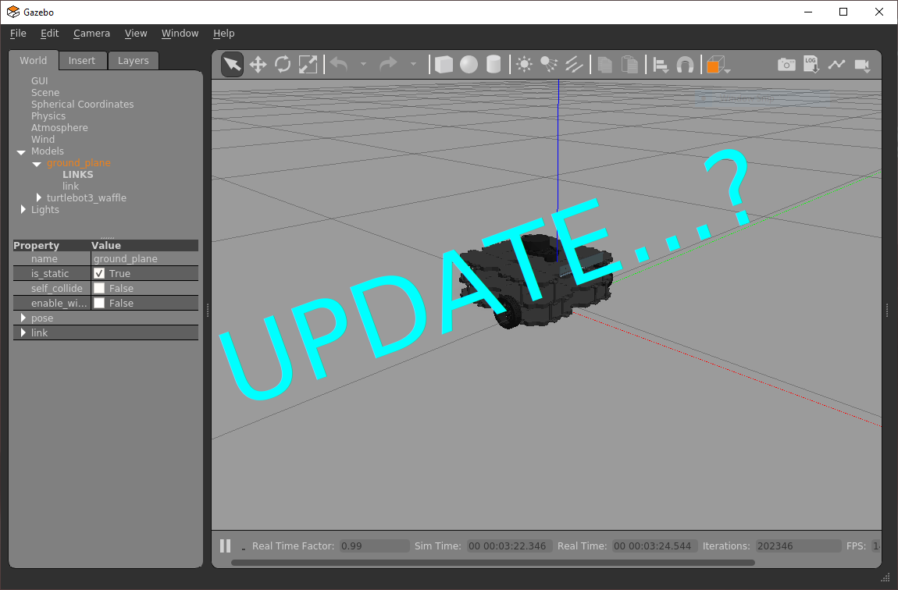
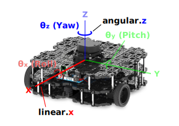
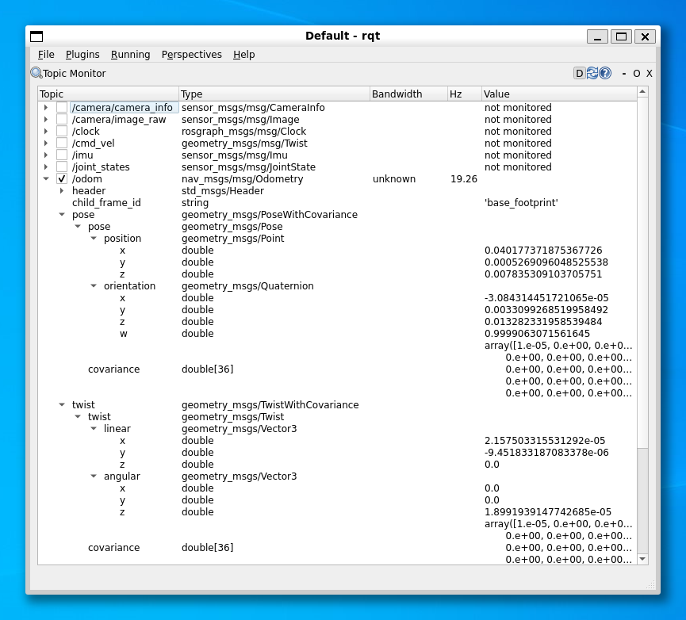

---  
title: "Part 2: Odometry & Navigation"  
description: In this session you'll learn about Odometry data, which informs us of a robot's position in an environment. You'll also learn how to control a ROS robot's velocity (and thus its position) using both open and closed-loop control methods.  
---

## Introduction

:material-pen: **Exercises**: X  
:material-timer: **Estimated Completion Time**: Y hours

### Aims

In Part 2 you will learn how to control a ROS robot's **position** and **velocity** from both the command line and through ROS Nodes. You will also learn how to interpret the data that allows us to monitor a robot's position in its physical environment (odometry).  The things you will learn here form the basis for all robot navigation in ROS, from simple open-loop methods to more advanced closed-loop control (both of which you will explore).

### Intended Learning Outcomes

By the end of this session you will be able to:

1. Interpret the Odometry data published by a ROS Robot and identify the parts of these messages that are relevant to a 2-wheeled differential drive robot (such as the TurtleBot3).
1. Develop Python nodes to obtain Odometry messages from an active ROS network and *translate* them to provide useful information about a robot's *pose* in a convenient, human-readable way.
1. Implement *open-loop velocity control* of a robot using ROS command-line tools.
1. Develop Python nodes that use open-loop velocity control methods to make a robot follow a pre-defined motion path.
1. Combine both publisher *&* subscriber communication methods into a single Python node to implement closed-loop (odometry-based) velocity control of a robot.
1. Explain the limitations of Odometry-based motion control methods. 

## Getting Started

TODO:

**Step 1: Launch your ROS Environment**

If you haven't done so already, launch your ROS environment now:

1. OPTION 1
1. OPTION 2
1. etc...

You should now have access to ROS via a Linux terminal instance. We'll refer to this terminal instance as **TERMINAL 1**.

**Step 2: Make Sure The Course Repo is Up-To-Date**

<a name="course-repo"></a>

In Part 1 you should have [downloaded and installed The Course Repo](./part1.md#course-repo) into your ROS environment. If you haven't done this yet then go back and do it now. If you *have* already done it, then it's worth just making sure it's all up-to-date, so run the following command now to do so:

***
**TERMINAL 1:**
```bash
cd ~/ros2_ws/src/tuos_ros/ && git pull
```

Then build with Colcon: 

```bash
cd ~/ros2_ws/ && colcon build
```

And finally, re-source your environment:

```bash
source ~/.bashrc
```
***

!!! warning
    If you have any other terminal instances open, then you'll need run `source ~/.bashrc` in these too, in order for any changes made by the Colcon build process to propagate through to these as well.

**Step 3: Launch a Waffle Simulation**

In **TERMINAL 1** enter the following command to launch a simulation of a TurtleBot3 Waffle in an empty world:  
        
***
**TERMINAL 1:**
```bash
ros2 launch turtlebot3_gazebo empty_world.launch.py
```
***

A Gazebo simulation window should open and within this you should see a TurtleBot3 Waffle in empty space:

<figure markdown>
  {width=800}
</figure>

<p align="center"><strong><em>You're all set up and ready to go!</em></strong></p>

## Position and Velocity

Two types of **Velocity Command** can be issued to any ROS Robot to make it move (and thus change its *position*):

* **Linear** Velocity: The velocity at which the robot moves *forwards* or *backwards* in one of its principal axes.
* **Angular** Velocity: The velocity at which the robot *rotates* about one of its principal axes.

### Principal Axes {#principal-axes}

The motion (i.e. the velocity) of any mobile robot can be defined in terms of **three** principal axes: `X`, `Y` and `Z`. In the context of our TurtleBot3 Waffle, these axes (and the motion about them) are as follows:

<figure markdown>
  {width=800}
</figure>

In theory then, a robot can move linearly or angularly about *any* of these three axes, as shown by the arrows in the figure. That's six *Degrees of Freedom* (DOFs) in total, achieved based on a robot's design and the actuators it is equipped with. 

Our TurtleBot3 Waffles, however, only have two motors, so they don't actually have six DOFs! These two motors can be controlled independently, which is known as a *"differential drive"* configuration, and ultimately provides it with a total of **two degrees of freedom** in total, as illustrated below.

<figure markdown>
  {width=800}
</figure>

It can therefore only move **linearly** in the **x**-axis (*Forwards/Backwards*) and **angularly** in the **z**-axis (*Yaw*).

It's also worth noting (while we're on the subject of motion) that our TurtleBot3 Waffles have **maximum velocity limits**:

<center>

| Velocity Component | Upper Limit | Units |
| :--- | :---: | :--- |
| *Linear* | 0.26 | m/s |
| *Angular* | 1.82 | rad/s |

</center>

### ROS Velocity Commands

In Part 1 you learnt about ROS Topics, and about how the `teleop_keyboard` node could be used to publish messages to a particular topic in order to control the velocity of the robot (and thus make it move around).

!!! question "Questions"
    1. Which topic is used to control the velocity of the robot?
    1. What *message type* does this topic use?

    [Return here if you need a reminder on how to find the answers to these questions (TODO: link to part 1)]().

In Part 1 you also learnt how to find out more about this particular message type, using the `ros2 interface show` command: 

``` { .txt .no-copy }
$ ros2 interface show geometry_msgs/msg/Twist
# This expresses velocity in free space broken into its linear and angular parts.

Vector3  linear
        float64 x
        float64 y
        float64 z
Vector3  angular
        float64 x
        float64 y
        float64 z
```

There are **six** *"fields"* that we can assign values to here: 

1. `linear`: `x`, `y` & `z`
1. `angular`: `x`, `y` & `z`

These relate to a robot's **six degrees of freedom** (about its three principal axes), as we discussed above. These topic messages are therefore formatted to give a ROS Programmer the ability to *ask* a robot to move in any one of its six DOFs. 

``` { .txt .no-copy }
Vector3  linear
        float64 x  <-- Forwards (or Backwards)
        float64 y  <-- Left (or Right)
        float64 z  <-- Up (or Down)
Vector3  angular
        float64 x  <-- Roll
        float64 y  <-- Pitch
        float64 z  <-- Yaw
```

As we also learnt above though, our Waffle Robots can only actually move with **linear** velocity in the **x**-axis and **angular** velocity in the **z**-axis. As a result then, only velocity commands issued to the `linear.x` (Forwards/Backwards) or `angular.z` (Yaw) parts of this message will have any effect.

### Robot Odometry

Let's take another look at *all* the topics that can be used to communicate with our robot:

```bash
ros2 topic list
```

Another topic of interest here is `/odom`. This topic contains *Odometry data*, which is also essential for robot navigation, giving us an approximation of a robot's location in its environment.

### What is Odometry? {#odometry}

We can learn more about Odometry data in ROS by using some of the same key ROS command line tools that we have already used previously (just applied to a different topic or message):

***
**TERMINAL 2:**
```bash
ros2 topic info /odom
```
***

This provides information about the *type* of message used by this topic:

``` { .txt .no-copy }
Type: nav_msgs/msg/Odometry
```

We can find out more about this message using the `ros2 interface show` command:

***
**TERMINAL 2:**
```bash
ros2 interface show nav_msgs/msg/Odometry
```
***

The output of this is quite complicated, but - to start with - we can look down the far left-hand side to identify the four *base fields* of the message (i.e. the fields that are not indented):

<center>

| # | Field *Name* | Field *Type* |
| :---: | :---: | :---: |
| 1 | `header` | `std_msgs/Header` |
| 2 | `child_frame_id` | `string` |
| 3 | `pose` | `geometry_msgs/PoseWithCovariance` |
| 4 | `twist` | `geometry_msgs/TwistWithCovariance` |

</center>

We won't worry to much about the first two, it's Items 3 and 4 that are of most interest to us...

#### Pose

``` { .txt .no-copy }
# Estimated pose that is typically relative to a fixed world frame.
geometry_msgs/PoseWithCovariance pose
        Pose pose
                Point position
                        float64 x
                        float64 y
                        float64 z
                Quaternion orientation
                        float64 x
                        float64 y
                        float64 z
                        float64 w
        float64[36] covariance
```

**Pose** tells us the *position* and *orientation* of our robot relative to an arbitrary reference point (typically where the robot was when it was turned on). The pose is determined from:

* Data from the Inertial Measurement Unit (IMU) on the OpenCR board
* Data from both the left and right wheel encoders
* A *kinematic model* of the robot

All the above information can then be used to calculate (and keep track of) the distance travelled by the robot from its pre-defined reference point (using a process called dead-reckoning).

*Position* data is important for determining the movement of our robot, and from this we can estimate its location in 3-dimensional space. This is expressed in units of **meters**.

<a name="euler_angs"></a>

*Orientation* is expressed in units of **Quaternions**, which is a mathematically convenient way to store data related to a robot's orientation, but it's a bit hard for us humans to understand and visualise[^quaternions].

[^quaternions]: [Quaternions are explained very nicely here](https://automaticaddison.com/how-to-convert-a-quaternion-to-a-rotation-matrix/#What_is_a_Quaternion), if you'd like to learn more.

Quaternions use **four values** to represent the orientation of something in 3 dimensional space, as we can observe from the structure of the `nav_msgs/msg/Odometry` ROS message:

``` { .txt .no-copy }
Quaternion orientation
        float64 x
        float64 y
        float64 z
        float64 w
```

For us, it's easier to think about the orientation of our robot in a **Euler Angle** representation, which tell us the degree of rotation about the *three principal axes* ([as discussed above](#principal-axes)):

* <code>&theta;<sub>x</sub></code>, aka: **"Roll"**
* <code>&theta;<sub>y</sub></code>, aka: **"Pitch"**
* <code>&theta;<sub>z</sub></code>, aka: **"Yaw"**

Fortunately, [the maths involved in converting between these two orientation formats is fairly straight forward](https://automaticaddison.com/how-to-convert-a-quaternion-into-euler-angles-in-python/).

Recall from earlier however, that our TurtleBot3 can only move in a 2D plane and so, actually, its pose can be fully represented by just 3 terms: `x`, `y` & <code>&theta;<sub>z</sub></code>, where `x` and `y` are the 2D coordinates of the robot in the `X-Y` plane, and <code>&theta;<sub>z</sub></code> is the angle of the robot about the `z` (*yaw*) axis.

#### Twist

**Twist** tells us the current linear and angular velocities of the robot, and this data comes directly from the wheel encoders.

Once again, all of this data is defined in terms of the principal axes, as illustrated in [the figure above](#principal-axes).

#### :material-pen: Exercise 1: Exploring Odometry Data {#ex1}

1. In **TERMINAL 2** launch `rqt`:

    ***
    **TERMINAL 2:**
    ```bash
    rqt
    ```
    ***

1. From the top menu select `Plugins` > `Topics` > `Topic Monitor`

    *Topic Monitor* should then present you with a list of active topics which matches the topic list from the `ros2 topic list` command that you ran earlier.

1. Check the box next to `/odom` and click the arrow next to it to expand the topic and reveal the four base fields that we talked about earlier.

1. Next, expand the `pose` > `pose` > **`position`** and **`orientation`** fields to reveal the data being published to the *three* position and *four* orientation values of this message.

1. Also expand the `twist` > `twist`, **`linear`** and **`angular`** fields to reveal the *six* values being published here too.

    <figure markdown>
      {width=600}
    </figure>

1. Next, launch a new terminal instance, we'll call this one **TERMINAL 3**. Arrange this next to the `rqt` window, so that you can see them both simultaneously.

1. In **TERMINAL 3** launch the `teleop_keyboard` node [as you did last time (TODO: link to part 1)](): <a name="teleop"></a>

    ***
    **TERMINAL 3:**
    ```bash
    ros2 run turtlebot3_teleop teleop_keyboard
    ```
    ***

1. Enter ++a++ a couple of times to make the robot rotate on the spot. Observe how the odometry data changes in the Topic Monitor.

    !!! question "Questions"
        1. Which `pose` fields are changing?
        1. Is there anything in the `twist` part of the message that corresponds to the `angular velocity` that is being published by the `teleop_keyboard` node in **TERMINAL 3**? 

1. Now press the ++s++ key to halt the robot, then press ++w++ a couple of times to make the robot drive forwards.

    !!! question "Questions"
        1. Which `pose` fields are changing *now*? How does this relate to the position of the robot in the simulated world?
        1. How does the `twist` part of the message *now* correspond to the `linear velocity` setting in **TERMINAL 3**?

1. Now press ++d++ a couple of times and your robot should start to move in a circle.

    !!! question "Questions"
        1. What linear and angular velocities are you requesting in **TERMINAL 3**, and how are these represented in the `twist` part of the `/odom` message?
        1. What about the `pose` part of the message? How is this data changing as your robot moves in a circular path.
        1. **What are `twist` and `pose` actually telling us?**
    
1. Press ++s++ in **TERMINAL 3** to stop the robot (but leave the `teleop_keyboard` node running).  Then, press ++ctrl+c++ in **TERMINAL 2** to close down `rqt`. 

1. Let's look at the Odometry data in a different way now. With the robot stationary, use `ros2 run` to run a Python node that we have created to illustrate just the `pose` data, and how it relates to the robot's position and orientation in its environment: 

    ***
    **TERMINAL 2:**
    ```bash
    ros2 run tuos_examples robot_pose
    ```
    ***
        
1. Now (using the `teleop_keyboard` node in **TERMINAL 3**) drive your robot around again, keeping an eye on the outputs that are being printed by the `robot_pose` node in **TERMINAL 2** as you do so.

    The output of the `robot_pose` node shows you how the robot's *position* and *orientation* (i.e. *"pose"*) are changing in real-time as you move the robot around. The `"initial"` column tells us the robot's pose when the node was first launched, and the `"current"` column show us what its pose currently is. The `"delta"` column then shows the difference between the two.
    
    !!! question
        Which pose parameters *haven't* changed, and is this what you would expect (considering [the robot's principal axes, as illustrated above](#principal-axes))?
    
1. Press ++ctrl+c++ in **TERMINAL 2** and **TERMINAL 3**, to stop the `robot_pose` and `teleop_keyboard` nodes. 

#### :material-pen: Exercise 2: Creating a Python node to process Odometry data {#ex2}

In Part 1 you learnt how to create a package and build simple nodes in Python to publish and subscribe to messages on a topic. In this exercise you will build a new subscriber node, much like you did in the previous session, but this one will subscribe to the `/odom` topic that we've been talking about above. You'll also create a new package called `part2_navigation` for this node to live in!

1. First, make sure you are in the `src` folder of the `ros2_ws` in your terminal:

    ```bash
    cd ~/ros2_ws/src/
    ```

1. Next, use the `ros2 pkg` tool to create your package:

    ```bash
    ros2 pkg create --build-type ament_python part2_navigation
    ```

1. Then navigate into the `ros2_ws/src/part2_navigation/part2_navigation` folder using the `cd` command again. For Python packages, this is where all executables (i.e. Python files) should be located.
    
    The subscriber that we will build here will be structured in much the same way as the subscriber that we built in Part 1. The difference now though is that this one will subscribe to the `/odom` topic (instead of `/chatter` (TODO: confirm topic message in Part 1)), and its callback function will therefore receive `Odometry` type messages (instead of `String` (TODO: confirm)), so we'll have to deal with those a bit differently. We've created a template for this to help you to get started. Download this from GitHub using the `wget` command:

    ```bash
    wget -O odom_subscriber.py \
    https://raw.githubusercontent.com/tom-howard/tuos_ros/humble/tuos_examples/tuos_examples/odom_subscriber_template.py
    ```
    (TODO: update to "main" once available)

1. Next, add some dependencies to your package's `package.xml` file, above the `<test_depend>` lines that should already be there:

    ```xml
    <exec_depend>rclpy</exec_depend>
    <exec_depend>nav_msgs</exec_depend>

    <test_depend>ament_copyright</test_depend>
    <test_depend>ament_flake8</test_depend>
    <test_depend>ament_pep257</test_depend>
    <test_depend>python3-pytest</test_depend>
    ```

1. Then open up the `setup.py` file and add an entry point for the `odom_subscriber` node:

    ```py
    entry_points={
        'console_scripts': [
            'odom_subscriber = part2_navigation.odom_subscriber:main',
        ]
    }
    ```

1. Finally, head back to the terminal and use Colon to build your new package and it's executable:

    ```bash
    cd ~/ros2_ws/ && colcon build --packages-select part2_navigation --symlink-install
    ```

1. Now we're ready to run this! Do so using `ros2 run` and see what it does:

    ```bash
    ros2 run part2_navigation odom_subscriber
    ```

1. Have a think about what's different between this and the subscriber from last time...
    
    In the Subscriber from Part 1 we were working with a `String` type message from the `std_msgs` package, whereas this time we're using an `Odometry` message from the `nav_msgs` package instead - notice how the imports and the callback function have changed as a result of this.

1. You need to add some additional code to the callback function now: 
    1. The node needs to print the robot's real-time odometry data to the terminal in the form: <code>(x,y,&theta;<sub>z</sub>)</code>.
    1. The format of the message has already been structured for you, but you need to add in the relevant variables that represent the correct elements of the robot's real-time pose.
    1. You'll need to use the `euler_from_quaternion` function (defined within the script) to convert the raw orientation values from Quaternions into Radians. If you need a hint, why not have a look back [at this bit from earlier](#euler_angs), or at the source code for the `robot_pose.py` node that we launched from the `tuos_examples` package in the [previous exercise](#ex1). 

1. Observe how the output (the formatted odometry data) changes whilst you move the robot around using the `teleop_keyboard` node in a new terminal instance (**TERMINAL 3**).
1. Stop your `odom_subscriber.py` node in **TERMINAL 2** and the `teleop_keyboard` node in **TERMINAL 3** by entering ++ctrl+c++ in each of the terminals.

## Basic Navigation: Open-loop Velocity Control

#### :material-pen: Exercise 3: Velocity Control from a Terminal {#ex3}

!!! warning
    Make sure that you've stopped the `teleop_keyboard` node before starting this exercise!

<a name="rostopic_pub"></a>We can use the `ros2 topic pub` command to *publish* data to a topic from a terminal by using the command in the following way:

``` { .bash .no-copy }
ros2 topic pub {topic_name} {message_type} {message_data}
```

[As we discovered earlier](#ros-velocity-commands), the `/cmd_vel` topic is expecting messages containing *linear* and *angular* velocity data, each with an `x`, `y` and `z` component. When publishing topic messages in a terminal the commands can get quite long and complicated, but we can use *autocomplete* functionality to help us format the full command correctly. In **TERMINAL 3** *type* the following, using the ++tab++ key where indicated to invoke autocompletion...

***
**TERMINAL 3:**

First, press ++tab++ to complete the *topic name* for you:

``` { .txt .no-copy }
ros2 topic pub /cmd_[TAB]
```

Then, press ++tab++ to format the *message type* correctly: 

``` { .txt .no-copy }
ros2 topic pub /cmd_vel g[TAB]
```

Finally, press ++tab++ again to obtain the format of the *message data*:

``` { .txt .no-copy }
ros2 topic pub /cmd_vel geometry_msgs/msg/Twist "l[TAB]
```

The full command will then be presented:

```txt
ros2 topic pub /cmd_vel geometry_msgs/msg/Twist "linear:
  x: 0.0
  y: 0.0
  z: 0.0
angular:
  x: 0.0
  y: 0.0
  z: 0.0"
```
***

!!! tip 
    You can use ++tab++ to autocomplete lots of terminal commands, experiment with it - it'll save you lots of time! 

1. Scroll back through the message using the ++left++ key on your keyboard and then edit the values of the various parameters, as appropriate. First, define some values that would make the robot **rotate on the spot**.  
    
1. Enter ++ctrl+c++ in **TERMINAL 3** to stop the message from being published.

    !!! warning
        What happens to the robot when you stop the `ros2 topic pub` command?

        ... it keeps on moving at the requested velocity!

        In order to make the robot actually stop, we need to publish a *new* message containing alternative velocity commands.

1. In **TERMINAL 3** press the ++up++ key on your keyboard to recall the previous command, but don't press ++enter++ just yet! Now press the ++left++ key to track back through the message and change the velocity values in order to now make the robot **stop**.

1. Once again, enter ++ctrl+c++ in **TERMINAL 3** to stop the publisher from actively publishing new messages, and then follow the same steps as above to compose *another* new message to now make the robot **move in a circle**.

1. Enter ++ctrl+c++ to again stop the message from being published, publish a further new message to stop the robot, and then compose (and publish) a message that would make the robot **drive in a straight line**.

1. Finally, **stop** the robot again!

#### :material-pen: Exercise 4: Creating a Python node to make the robot move in a circle {#ex4}

You will now learn how to control the velocity of the robot through a Python Node. In Pat 1 you built a simple publisher node, and this one will effectively be the same thing, this time however, we need to publish `Twist` type messages to the `/cmd_vel` topic instead... 

In **TERMINAL 2**, ensure that you're located within the `scripts` folder of your `part2_navigation` package (you could use `pwd` to check your current working directory).

If you aren't located here then navigate to this directory using `cd`.

1. Create a new file called `move_circle.py`:

    ***
    **TERMINAL 2:**
    ```bash
    touch move_circle.py
    ```
    ... and make this file executable using the `chmod` command.
    ***

1. Open up this file in VS Code. 

    Use this code template to get you started:

    ```python title="A template for the move_circle.py node"
    --8<-- "code_templates/move_circle.py"
    ```
    
    1. This is important, we always need to import the ROS Client Library for Python (`rclpy`), plus a `Node` class (to use as the basis for you own ROS node).
    2. What other imports might we need here in order to create and publish a message to make the robot move?
    3. Give your node a descriptive name - this is the name that it will be given when it is registered on the ROS network, and the one that you would see if you used the `ros2 node list` command.
    4. What do you need to add here in order to set up an appropriate publisher to the `/cmd_vel` topic?
    5. Define an appropriate rate at which to publish velocity messages, and use this to set up a timer.
    6. We'll use this to perform some important shutdown operations after a user has requested for the node to stop (using ++ctrl+c++), but before it actually does so. 
    
        !!! question
            What actions would be important to take here to make sure the node shuts down safely and the robot actually stops moving?

        We'll call this method from `main()` before ultimately terminating the node (see later on in the code).

    7. You're going to need to create a message here containing appropriate velocities for the robot to move at. Then you'll need to actually publish that message to `/cmd_vel` (via your `self.publisher`). Running this inside a *timer callback* means that it will execute the rate that we specified in the `__init__`
    
    8. What will you need to do here to instantiate your `Circle()` class?

    9. We call `rclpy.spin()` inside a Try - Except block, so that we can catch a `KeyboardInterrupt` (i.e. a ++ctrl+c++ input from the user) during execution of the node. All shutdown procedures are executed from within a `finally` block, which ensures that all of these vital steps take place when an exception is raised (whether that's a `KeyboardInterrupt` or otherwise).


