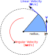

---  
title: "A Simple Velocity Control Node (Move Circle)"
---

## The Initial Code

Start by returning to the `publisher.py` file from your `part1_pubsub` package ([or return here](../part1/publisher.md)), and copy the contents into your new `move_circle.py` file. Then, adapt the code as follows.

## Creating the "Move Circle" Node

### Imports

Once again, `rclpy` and the `Node` class from the `rclpy.node` library are vital for any node we create, so the first two imports will remain the same.

We need to import the message type used by the `/cmd_vel` topic here though, in order to be able to format velocity command messages appropriately. We can find all the necessary information about this message type by using the `ros2 topic info` command:

``` { .bash .no-copy }
$ ros2 topic info /cmd_vel
Type: geometry_msgs/msg/Twist
...
```

And so our message import becomes:

```py
from geometry_msgs.msg import Twist # (1)!
```

1. In place of: `#!py from example_interfaces.msg import String`

### Change the Class Name

Previously our publisher class was called `#!python SimplePublisher()`, change this to `#!python Circle`:

```py
class Circle(Node):
```

### Initialising the Class

1. Initialise the node with an appropriate name:

    ```python
    super().__init__("move_circle")
    ```

1. Change the `create_publisher()` parameters:

    ```python
    self.my_publisher = self.create_publisher(
        msg_type=??, # (1)!
        topic=??, # (2)!
        qos_profile=10,
    )
    ```

    1. What message type are we using here?
    2. What's the topic name?

1. We'll need to publish velocity commands at a rate of at least 10 Hz, so set this here, and then set up a timer accordingly:

    ```py
    publish_rate = 10 # Hz
    self.timer = self.create_timer(
        timer_period_sec=1/publish_rate, 
        callback=self.timer_callback
    )
    ```

### Modifying the Timer Callback

Here, we'll publish our velocity commands:

```py
def timer_callback(self):
    radius = 0.5 # meters
    linear_velocity = 0.1 # meters per second [m/s]
    angular_velocity = ?? # radians per second [rad/s] # (1)!

    topic_msg = Twist() # (2)!
    topic_msg.linear.x = linear_velocity
    topic_msg.angular.z = angular_velocity
    self.my_publisher.publish(topic_msg) # (3)!
    
    self.get_logger().info( # (4)!
        f"Linear Velocity: {topic_msg.linear.x:.2f} [m/s], "
        f"Angular Velocity: {topic_msg.angular.z:.2f} [rad/s].",
        throttle_duration_sec=1, # (5)!
    )

```

1. Having defined the radius of the circle, and the *linear* velocity that we want the robot to move at, how would we calculate the *angular* velocity that should be applied?

    Consider the equation for angular velocity:

    <figure markdown>
      {width=200}
    </figure>

    $$
    \omega=\frac{v}{r}
    $$

2. `/cmd_vel` uses `Twist` messages, so we instantiate one here, and assign the linear and angular velocity values (as set above) to the relevant message fields. Remember, [we talked about all this here](../part2.md#velocity-commands).

3. Once the appropriate velocity fields have been set, publish the message.

4. Publish a ROS *Log* Message to inform us (in the terminal) of the velocity control values that are being published by the node.

5. [Remember in the Odometry Subscriber](./odom_subscriber.md#modifying-the-message-callback) how we used a counter (`#!py self.counter`) and an `#!py if()` statement to control the rate at which these log messages were generated?

    We can actually achieve exactly the same thing by simply supplying a `throttle_duration_sec` argument to the `get_logger().info()` call. Much easier, right?

### Updating "Main"

Once again, don't forget to update any relevant parts of the `main` function to ensure that we're instantiating the `Circle()` class, spinning and shutting it down correctly.

<p align="center">
  <a href="../../part2#move_circle_ret">&#8592; Back to Part 2</a>
</p>