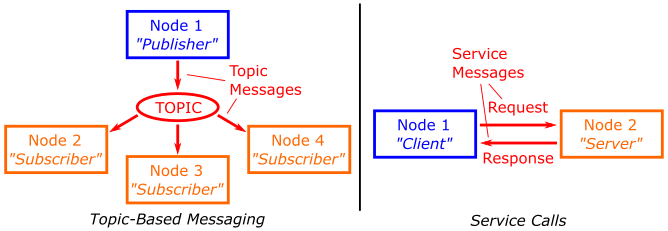

---  
title: "Part 4: ROS 2 Services"  
description: Learn how ROS Services can be combined with standard publisher/subscriber principles to enhance robot control for specific operations and gain the ability to create custom msgs and srv for tailored communication
---

## Introduction 

:material-pen: **Exercises**: X

:material-timer: **Estimated Completion Time**: Y hours

### Aims
In this part you will learn about ROS Services, a communication method that facilitates request-response interactions between nodes. You will understand how to use ROS services in combination with standard publisher/subscriber principles to enhance control for specific operations. Additionally, you'll create custom messages and services for tailored communication.

### Intended Learning Outcomes 
By the end of this session you will be able to:

1. Recognise how ROS Services differ from the standard topic-based publisher-subscriber approach, and identify appropriate use-cases for this type of messaging system.
1. Implement Python node pairs to observe services in action, and understand how they work.
1. Invoke different services using a range of service message types.
1. Develop Python Service nodes of your own to perform specific robotic tasks.
1. Harness Services, in combination with LiDAR data, to implement a basic obstacle avoidance behaviour 
1. Develop custom ROS messages and services (still need to think about the task for this) 
1. Demonstrate your understanding of ROS2 so far by developing a Python node which incorporates elements from this and previous parts of this course.


### Quick Links
* [Exercise 1: ](#ex1)

### Additional Resources
### Prerequisites
Before we begin, ensure that you have the following:

1. ROS2 Humble installed on your system
1. Cloned the tuos package from github
1. Basic understanding of ROS2 concepts like nodes and topics

### Getting Started
**Step 1: Launch your ROS Environment**

If you haven't done so already, launch your ROS environment now:

**Step 2: Restore your work (todo)**

**Step 3: Launch VS Code (todo)**  

**Step 4: Make Sure The Course Repo is Up-To-Date**

Once again, it's worth quickly checking that the Course Repo is up-to-date before you start on the Part 4 exercises. Go back to [Part 1](./part1.md#course-repo) if you haven't installed it yet (really?!). For the rest of us, [see here for how to update](../../extras/tuos-ros.md#updating).

**Step 5: Launch the Robot Simulation**

In **TERMINAL 1** enter the following command to launch a simulation of a TurtleBot3 Waffle in an empty world:  
        
***
**TERMINAL 1:**
```bash
ros2 launch turtlebot3_gazebo empty_world.launch.py
```
...and then wait for the Gazebo window to open:

***
<figure markdown>
  have to add an image here
</figure>

## An Introduction to Services

So far, we've learnt about ROS *topics* and *messages*, and how individual nodes can access data on a robot by simply *subscribing* to topics that are being published by any other node on the system.  In addition to this, we also learnt how any node can *publish* messages to any topic: this essentially broadcasts the data contained in the message across the ROS Network, making it available to any other node on the network that may wish to access it.

Another way to pass data between ROS Nodes is by using *Services*.  These are different to messages in that *"Service calls"* (that is, the process of requesting a service) occur *only* between one node and another:

* One node (a Service **Client**) sends a **Request** to another node.
* Another node (a Service **Server**) processes that request, performs an action and then sends back a **Response**.

<figure markdown>
  
</figure>

Services are *Synchronous* (or *sequential*): When a ROS node sends a request to a service (as a Service *Client*) it can't do anything else until the service has been completed and the Service *Server* has sent a response back. This can be useful for a few reasons:

1. **Discrete, short-duration actions**: A robot might need to do something before it can move on to something else, e.g.:
    
    * A robot needs to see something before it can move towards it.
    * High definition cameras generate large amounts of data and consume battery power, so you may wish to turn a camera on for a specific amount of time (e.g. until an image has been captured) and then turn it off again.

2. **Computations**: Remember that ROS is *network-based*, so you might want to offload some computations to a remote computer or a different device on a robot, e.g.:
    
    * A client might send some data and then wait for another process (the server) to process it and send back the result.

It's also worth noting that any number of ROS Client nodes can call a service, but you can only have a *single* Server providing that particular service at any one time.

<figure markdown>
  
</figure>

!!! question
    Can you think of any other scenarios where this type of communication protocol might be useful?

#### :material-pen: Exercise 1: Creating a Service *Server* in Python and calling it from the command-line {#ex1}

To start with, let's set up a service and learn how to make a call to it from the command-line to give you an idea of how this all works and why it might be useful.

1. First open up a new terminal instance (**TERMINAL 2**) and source your ROS2 environment as you did in [part 1](./part1.md#first-steps).

1. Now navigate into the `ros2_ws/src` directory created in [part 1](./part1.md#first-steps) and create the `part4_services` package. Define `python` as a build type and `rclpy`, `geometry_msgs` and `tuos_msgs` as dependencies.
        

    ***    
    **TERMINAL 2:**
        ```bash
        ros2 pkg create --build-type ament_cmake 
        ```
    ***

    Your terminal will return a message verifying the creation of your package.

    The `--dependencies` argument adds the necessary dependency lines to the `package.xml` file

    !!! Info
        `rclpy` is the Python library that provides the core functionality for interacting with ROS 2. It's the Python counterpart to the C++ client library, `rclcpp`.

1. Then navigate into the `ros2_ws/src/part4_services/part4_services` and create an empty file called `move_server.py` using `touch` command.
    ```bash
    touch move_server.py
    ```
    
1.  Then, open the file in VS Code, copy and paste [this code](./part4.md/move_server.md) and then save it. <a name="ex1_ret"></a> (todo: need to add the template)

    !!! note
        It's really important that you understand how the code above works, so that you know how to build your own service *Servers* in Python.
    
1. Updating the package.xml file (todo)
1. Next, open the setup.py file in your package directory and add an entry point for the `move_server` node:

    ```py
    entry_points={
        'console_scripts': [
            'move_server = part4_services.move_server:main',
        ]
    }
    ```
    ***
    **Build and run:**

1. It's a good practice to run `rosdep` in the root of your workspace (`ros2_ws`) to check for missing dependencies before building:

    ```bash
    rosdep install -i --from-path src --rosdistro humble -y
    ```

1. Finally, use Colcon to build your new package and its contents 

    ```bash
    cd ~/ros2_ws/ && colcon build --packages-select part4_services --symlink-install
    ```

1. Now, we are ready to run the node. Use `ros2 run` and observe what is displayed on the terminal 
   
    ```bash
    ros2 run part4_services move_server
    ```

1. Then open another terminal window (**TERMINAL 3**) and source the setup files from inside the root directory again. 

1. While the node is running, use `ros2 service` command to view all the currently active services on the system:

    ***
    **TERMINAL 3:**
    ```bash
    ros2 service list
    ```

    You should be able to see the service (todo)

    ***
    


#### :material-pen: Exercise 2: Creating a Python Service *Client* Node {#ex2}

As well as calling a service from the command-line we can also build Python nodes to do the same thing (i.e. we can build Python Service *Client* Nodes). In this exercise you will learn how this is done.

1. **TERMINAL 3** should be idle, so from here navigate to the `part4_service/` folder within the `part4_services` package that we created earlier:

    ***
    **TERMINAL 3:**
    ```bash
    cd ~/ros2_ws/src/part4_service/part4_services
    ```
    ***
1. Create a new file called `move_client.py`
1. Now as you did in the previous exercise, open the VS Code, copy and paste [this code](./part4.md/move_client.md) and then save it. <a name="ex2_ret"></a> (todo: need to add the template)

    !!! note
        Once again, be sure to read the code and understand how this Python Service Client Node works too!

1. Next, open the setup.py file (in VS Code) in your package directory and add another entry point for the `move_client` under the line where you added `move_server` previously:

    ```py
    entry_points={
        'console_scripts': [
            'move_server = part4_services.move_server:main',
            'move_client = part4_services.move_client:main',
        ]
    }
    ```

1.  Return to **TERMINAL 3** and launch the node using `ros2 run`:

    ```bash
    ros2 run part4_services move_client
    ```

***
TODO : ROS2 service call and creating a custom .msg and .srv

**Understanding key features** 
todo: ros2 service type
    ros2 service find
    ros2 interface show
    ros2 service call
***

#### :material-pen: Exercise 3: Learn to create custom messages and service {#ex3}


#### :material-pen: Exercise 4: Creating your own Service {#ex4}

In this exercise you will create your own service Server to make the Waffle perform a specific movement for a given amount of time and then stop.
