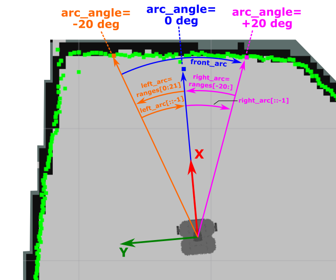

---  
title: A LaserScan Callback Function
---

# A LaserScan Callback Function

Based on what you have learnt throughout this course so far, you should now be able to set up a subscriber within your code to subscribe to the `/scan` topic:

```python
self.subscriber = rospy.Subscriber('/scan', LaserScan, self.callback)
```

The above assumes that you are using a Python Class structure in your code (which you really should be!), and we also assume that you have already imported the `LaserScan` message type correctly at the start of your code as well:

```python
from sensor_msgs.msg import LaserScan
```

You could then develop a callback function (called `callback()` in this case) using the approach illustrated below. 

!!! note
    This example requires the `numpy` Python library, which you'll need to import at the start of your code in the following way:
    ```python
    import numpy as np
    ```

The `callback()` could then be developed to obtain (for instance) a 40&deg; arc of `LaserScan` data ahead of the robot:

```python
def callback(self, scan_data: LaserScan):
    left_arc = scan_data.ranges[0:21]
    right_arc = scan_data.ranges[-20:]
    front_arc = np.array(left_arc[::-1] + right_arc[::-1])
    self.min_distance = front_arc.min()

    # Optional Extra:
    arc_angles = np.arange(-20, 21)
    self.object_angle = arc_angles[np.argmin(front_arc)]
```

The distance to the closest object in front of our robot is then available throughout our class, as an attribute called: `self.min_distance`.

What we're doing here is illustrated in the figure below:

<figure markdown>
  
</figure>

Let's talk through it too:

1. From the front of the robot, we obtain a 20&deg; arc of scan data either side of the x-axis:
    
    ``` python
    left_arc = scan_data.ranges[0:21]
    right_arc = scan_data.ranges[-20:]
    ```

1. Then, we combine the `left_arc` and `right_arc` data arrays, flip them so that the data is arranged from left (-20&deg;) to right (+20&deg;), and then convert to a `numpy` array:

    ```python
    front_arc = np.array(left_arc[::-1] + right_arc[::-1])
    ```

1. Then, we obtain the minimum distance value within the `front_arc` array, to tell us the distance to the closest thing up ahead:    
    
    ```python
    self.min_distance = front_arc.min()
    ```

1. Optionally, we can also determine the angular position of the closest object up ahead too...
    1. Create another `numpy` array to represent the angles (in degrees) associated with each of the data-points in the `front_arc` array above:
        ```python
        arc_angles = np.arange(-20, 21)
        ```
    1. Determine the angle at which the minimum distance value is located in front of the robot, using the `numpy.argmin()` method:
        ```python
        self.object_angle = arc_angles[np.argmin(front_arc)]
        ``` 

<p align="center">
  <a href="../../part4#ex4_ret">&#8592; Back to Part 4 - Exercise 4</a>
</p>