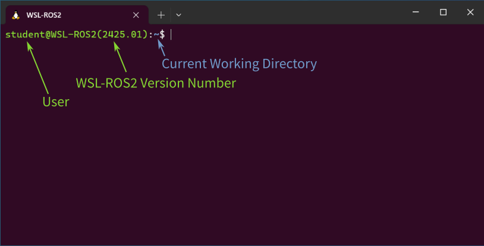

You'll work extensively with the Linux Terminal throughout this course. An *idle* WSL-ROS2 terminal instance will look like this:

<figure markdown>
  {width=700px}
</figure>

Here, the presence of the `$` symbol indicates that the terminal is ready to accept a command. Text before the `$` symbol has two parts separated by the `:` symbol:

* Text to the **left** of the `:` tells us the name of the Linux user ("student" in this case) followed by the WSL-ROS2 version that you are working with.

    !!! note
        The current WSL-ROS2 version is `2425`.

* Text to the **right** of the `:` tells us where in the Linux Filesystem we are currently located (`~` means *"The Home Directory"*, which is an alias for the path: `/home/student/`).

If you don't see the `$` symbol at all, then this means that a process is currently running. To stop any running process enter ++ctrl+c++ simultaneously on your keyboard.