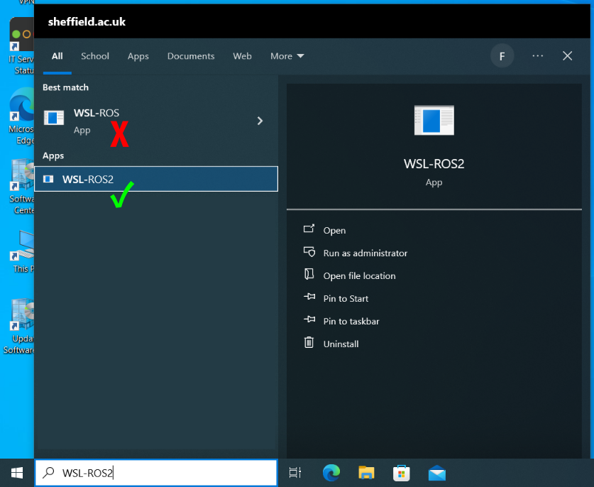
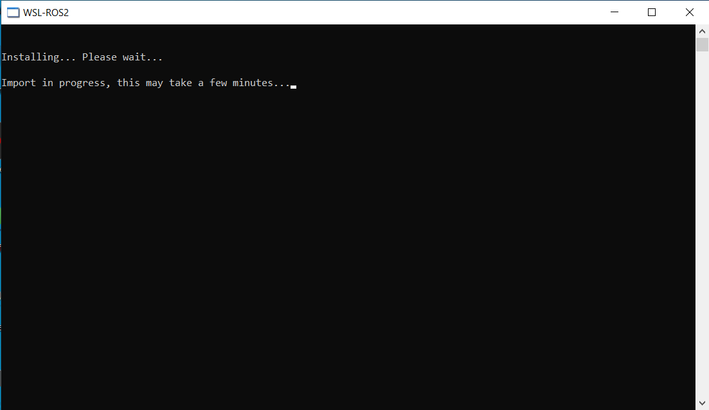
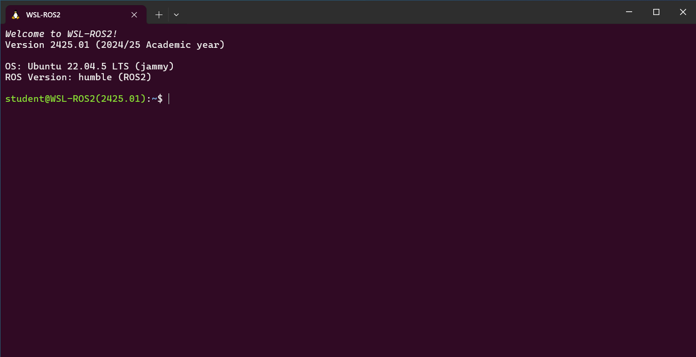
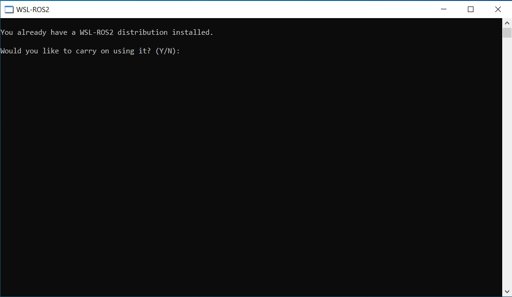

## Prerequisites

* [Accessing WSL-ROS2 on a University Managed Desktop Computer](../wsl-ros/man-win.md)

## Launching WSL-ROS2

1. Click the Windows Start Menu button: 
    
1. Then, start typing `wsl-ros` and click on the application shortcut that should appear in the list:

    <figure markdown>
      {width=700px}
    </figure>

    Make sure you select **WSL-ROS2**! 

    You'll then be presented with the following screen:

    <figure markdown>
      {width=700px}
    </figure>

    WSL-ROS2 is now being installed from our custom OS image, which may take a couple of minutes to complete.  Once it's done, the *Windows Terminal* should automatically launch:

    <figure markdown>
      {width=700px}
    </figure>

This is a **WSL-ROS2 Terminal Instance**!

## Configuring Visual Studio Code {#configure-vscode}

*Visual Studio Code* (or *"VS Code,"* for short) should be installed on all the University of Sheffield Managed Desktop Computers that have WSL-ROS2 pre-installed on. This is a great *Integrated Development Environment (IDE)* that we'll use extensively throughout the course. You'll first need to make sure it's set up correctly though, so [follow the instructions here](./vscode.md), in preparation for later.

!!! tip
    You should only ever need to do this bit once: the configurations should be saved to your user profile, and should be carried over to any other University Desktop Computer that you log into!

## Backing-Up (and Restoring) your Data

If you're working with WSL-ROS on a university managed desktop machine, the WSL-ROS Environment will only be preserved for a limited time on the machine that you installed it on. As such, any work that you do within WSL-ROS **will not be preserved** between sessions or across different machines automatically! It's therefore *really important* that you run a backup script before you close WSL-ROS down. To do so is very easy, simply run the command below from any WSL-ROS Terminal Instance:

```bash
wsl_ros backup
```

This will create an archive of your *Home Directory* ([more detail here](./linux-term.md)) and save it to your University `U:` Drive. Whenever you launch a *fresh* WSL-ROS2 Environment again on another day, or on a different machine, simply run the following command to restore your work to it:

```bash
wsl_ros restore
```

To make things a little easier, on launching WSL-ROS the system will check to see if a backup file already exists from a previous session. If it does, then you will be asked if you want to restore it straight away:

``` { .txt .no-copy }
It looks like you already have a backup from a previous session:
  U:\wsl-ros\ros2-backup-XXX.tar.gz
Do you want to restore this now? [y/n]
```

Enter ++y+enter++ to restore your data from this backup file, or ++n+enter++ to leave the backup file alone and work from fresh (none of your previous work will be restored). 

## Re-Launching the Environment

As discussed above, the WSL-ROS2 environment is not preserved on the university managed desktops indefinitely. If you log back in to the same machine within a few hours however, then it may still be there, and you'll be presented with the following message when you launch it:

<figure markdown>
  {width=700px}
</figure>

Enter ++y+enter++ to continue where you left things previously, or ++n+enter++ to start from a fresh installation.

!!! warning
    If you select ++n++ then any work that you have created in the existing environment will be deleted! Always make sure you back up your work using [the procedure outlined above](#backing-up-and-restoring-your-data)!
