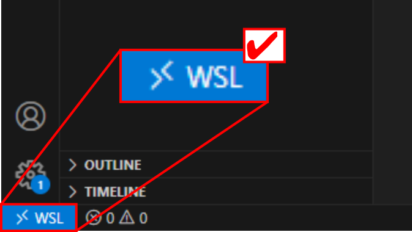

---  
title: "VS Code and WSL"  
---

## Launching VS Code from the Terminal {#the-top}

1. You can launch VS Code directly from a WSL-ROS2 terminal instance. Simply type `code .` at the terminal prompt and then hit ++enter++ :

    ```bash
    code .
    ```

1. A warning message may then pop up:

    <figure markdown>
      {width=500px}
    </figure>

    Check the box to "Permanently allow ..." and then click the `Allow` button.

1. VS Code should then launch, and you'll be presented with another trust dialogue:

    <figure markdown>
      {width=500px}
    </figure>

    Click the blue `Yes, I trust the authors` button.

## Installing the WSL Extension {#wsl-ext}

1. The first time you launch VS Code (as above) you should be presented with a pop-up in the bottom-right of the screen, asking if you would like to "install the recommended 'WSL' extension from Microsoft..."

    <figure markdown>
      {width=500px}
    </figure>

    Click on the blue "Install" button.

    ??? bug "Don't see the pop-up?" 
        
        You can also install the 'WSL' extension manually.
        
        Click on the "Extensions" icon in the left-hand toolbar (or hit ++ctrl+shift+x++ ), type "wsl" in the search box and hit the install button on the right extension, as show below:

        <figure markdown>
          {width=600px}
        </figure>

1. Once installed, close down VS Code, go back to the WSL-ROS2 terminal instance and re-launch it using the `code .` command again.
    
    This time, you'll be presented with *yet another* trust pop-up dialogue. Once again, check the box to "Trust the authors" and then click the blue `Yes, I trust the authors` button. 

1. You can now navigate the WSL-ROS2 filesystem in the explorer window on the left-hand side of the VS Code screen. You'll need to use this to locate the packages and scripts that you create throughout this course!

    <figure markdown>
      {width=800px}
    </figure>

## Always make sure that the "WSL" extension is enabled!! {#verify}

Check that your blue "Remote Window" icon in the bottom-left of the VS Code screen always looks like this:

<figure markdown>
  {width=400px}
</figure>

If not, then go back to [the top of this page](#the-top) and try again!
