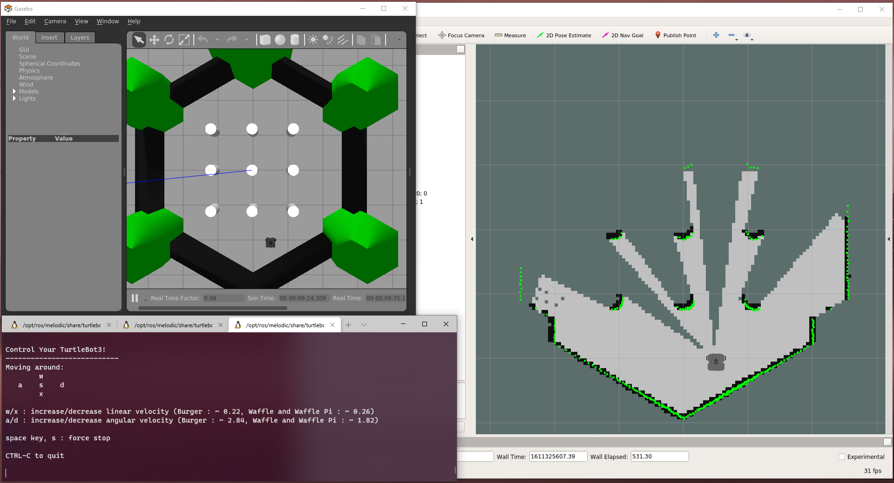

---  
title: "The WSL-ROS2 Simulation Environment"  
---  

# The WSL-ROS2 Simulation Environment

To support this course we've created a custom ROS2 (Humble) and Ubuntu (22.04) environment which runs on Windows 10 or 11 using the [Windows Subsystem for Linux (WSL)](https://docs.microsoft.com/en-us/windows/wsl/){target="_blank"}. We call this "**WSL-ROS2**," and you can find out more about it - and how to use it - here.

<figure markdown>
  {width=800px}
</figure>