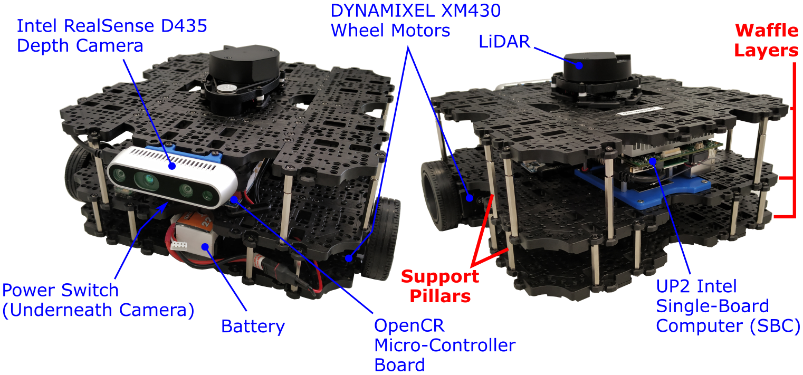

# Introduction

## Handling the Robots

!!! warning "Health and Safety"
    You must have completed a health and safety quiz before working with the robots for the first time. This quiz is available on Blackboard.

<figure markdown>
  {width=600px}
</figure>

As you can see from the figure above, the robots have lots of exposed sensors and electronics, so **you must take great care** when handling them to avoid the robots becoming damaged in any way.  When handling a robot, always hold it by either the black *Waffle Layers*, or the vertical *Support Pillars* (as highlighted in the figure above).

!!! important 
    Do not pick the robot up or carry it by the camera or LiDAR sensor! These are delicate devices that could be easily damaged!

A lot of the robot's electronics are housed on the middle waffle layer. Try not to touch any of the circuit boards, and take care not to pull on any of the cabling or try to remove or rehouse any of the connections. If you have any concerns with any of the electronics or cabling, if something has come loose, or if your robot doesn't seem to be working properly then ask a member of the teaching team to have a look for you.

The robots will be provided to you with a battery already installed and ready to go. **Don't try to disconnect or remove the battery yourselves**! The robot will beep when the battery is low, and if this happens ask a member of the team to get you a replacement (we have plenty).

## The Robot Laptops {#laptops}

You'll be provided with one of our pre-configured *Robot Laptops* in the lab when working with the real Waffles. These Laptops (and the Robots) run **Ubuntu 22.04** with **ROS 2 Humble**. 

There's a "student" user account already set up, and you'll need to use this when working in the lab. The laptop should log you into this user account automatically on startup, but we'll provide you with the account password as well, during the lab sessions, should you need it.

## Network

The Robots and Laptops must be able to connect to one another over an internet connection. The robots connect to a dedicated wireless network running in the Diamond called *'DIA-LAB'*. In order for the laptops to be able to "see" the robots, they must be connected to the university network using any of the following options:

1. A wired (ethernet) connection (**Recommended**)

    * *(subject to provision of network sockets in CR5 by February 2025)*
    
1. The *eduroam* WiFi SSID
1. The *DIA-LAB* WiFi SSID (**no internet access**!)

WiFi credentials for DIA-LAB and eduroam have already been set on the laptops, allowing you to connect to either network straight away, but speak to a member of the teaching team if you are having any issues.

## VS Code

*Visual Studio Code* is installed on the laptops for you to use when working on your ROS applications for the assignment tasks. Launch VS Code from any terminal by simply typing `code`. You can also launch it by clicking the icon in the favourites bar on the left-hand side of the screen:

<figure markdown>
  
</figure>
