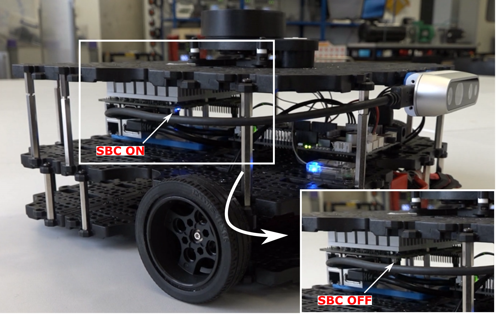

---  
title: Shutdown Procedures 
---

## Robots

The Waffles are powered by [a Single Board Computer (SBC)](../about/robots.md#our-waffles), which runs a full-blown operating system. As with any operating system, it's important to **shut it down properly**, rather than simply disconnecting the power, to avoid any data loss or other issues. 

Therefore, once you've finished working with a robot during a lab session, follow the steps below to shut it down.

1. Open a **new** terminal instance on the laptop (++ctrl+alt+t++), and enter the following:

    ``` { .bash .no-copy }
    waffle X off
    ```
    ... replacing `X` with the number of the robot that you have been working with.
    
1. You'll be asked to confirm that you want to shut the robot down: 

    ``` { .bash .no-copy }
    [INPUT] Are you sure you want to shutdown dia-waffleX? [y/n] >> 
    ```

    Enter ++y++ and hit ++enter++ and the robot's SBC will be shut down. 

1. Once the blue light on the corner of the SBC goes out, it's then safe to slide the power button to the **left** to completely turn off the device. 

    <figure markdown>
      {width=600px}
    </figure>

## Laptops

Once you've turned off the robot, **remember to shut down the laptop too**! Do this by clicking the battery icon in the top right of the desktop and selecting the "Power Off / Log Out" option in the drop-down menu.

<figure markdown>
  {width=300px}
</figure>

<center>

  **Hand your robot and laptop back to a member of the teaching team who will put it away for you!**

</center>